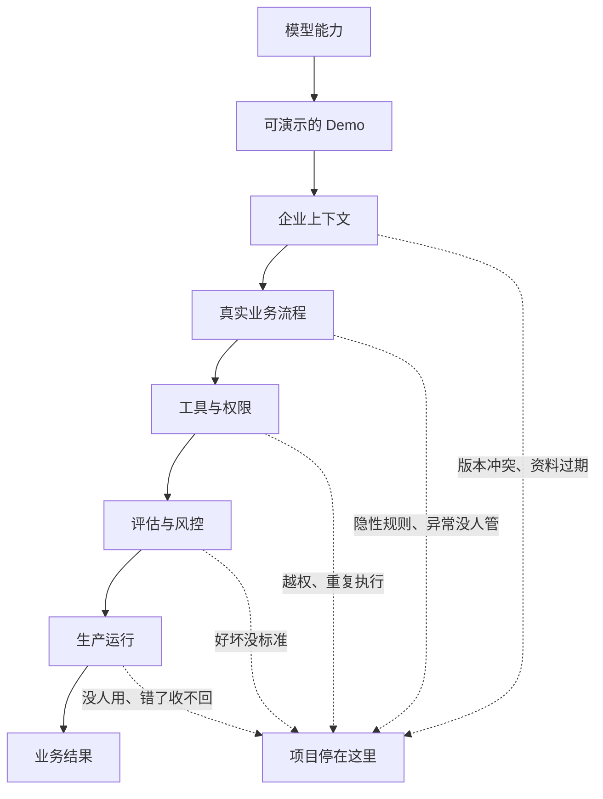
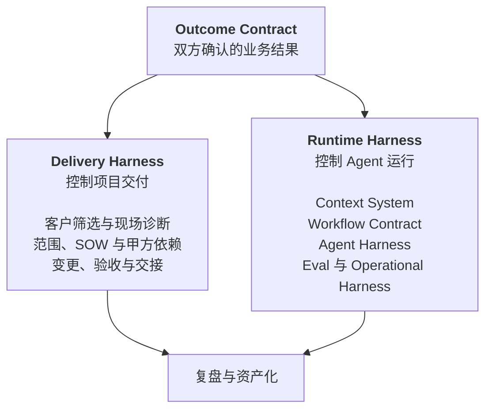

# Part 1 认识 FDE

这一篇回答三个问题：FDE 为什么在 2026 年变热，它工作时不能打乱的顺序是什么，以及它跟周围那几个看起来很像的岗位差在哪。

---

## §01 FDE 的爆发，说明 AI 的瓶颈换了位置

2026 年 8 月，我花了大半个月集中读 FDE 的资料。招聘报告、大模型公司的公开动作、一线团队的复盘，加起来三十多份。

最先抓住我的是一个数字。

LinkedIn 在 2026 年 1 月的劳动力市场报告里给出，2023 到 2025 年，FDE 类岗位增长了 42 倍。同期 AI Engineer 增长 13 倍。

单看这个，容易把 FDE 当成又一个被炒热的头衔。

但把资料摊开一起读，我更倾向于另一个解释：**招聘市场只是结果，真正变的是企业 AI 的瓶颈位置。**

## 那个 95%，比 42 倍更值得看

MIT Media Lab 的 NANDA 项目在 2025 年 7 月发过一份报告，The GenAI Divide: State of AI in Business 2025。样本是 150 场业务负责人访谈、350 份员工问卷、300 个公开部署案例。

结论：企业投进生成式 AI 的 300 到 400 亿美元里，95% 的项目没有产生可衡量的损益影响。

这个数字传得很广，但传播过程里最重要的部分被丢了——**它的归因不是模型。**

报告把失败主要归到三件事：数据就绪度、工作流集成、缺少反馈闭环。MIT 给这个现象起了个名字，learning gap。

同一份报告里还有一组对比：外部伙伴主导的部署约 67% 进了生产，企业自建的只有 33%。

前两年行业的注意力都在模型上。谁分数高，谁窗口大，谁 API 便宜。

到 2026 年，这些差距对多数企业已经不构成决策障碍——能买到的模型，做一个像样的 AI 应用足够了。

**让项目停下来的换成了另一批东西。**

数据散在七八个系统里。业务规则只存在于几个老员工的判断里。二十年前的核心系统没有 API。谁能访问哪张表说不清楚。模型好不好没有统一判断标准。做错了没有撤回路径。

这些问题不会因为下一个模型发布而消失。

企业已经买到了模型，但没拿到能跑的业务能力。FDE 就出现在这段落差里。

## 从 Demo 到生产，中间隔着一整家企业

做一个 AI Demo 现在有多快？

接一个模型 API，喂进去几份文档，套一个聊天界面，一两天就能演示。

会议室里效果通常不错。因为演示数据是挑过的，流程只有一条，操作的人知道系统能干什么，也知道不该问什么。

离开会议室，情况立刻不一样。

同一个问题可能有三份互相矛盾的答案。制度文件写的是一套流程，员工实际执行的是另一套。关键规则从来没进过数据库，只在工龄十年那位同事的判断里。

还有一类问题更麻烦：Agent 可以生成一张采购单，但它不知道超过某个金额必须先走区域负责人。这条规则可能哪份文档里都没写。

就算模型每一步的成功率是 95%，一条十步的流程跑下来，整体也只剩六成。

**企业 AI 的复杂度，大部分出现在模型之外。**

模型只占最上面那一格，企业买的是最下面那一格。

FDE 的工作，就是穿过中间这五道关。

> **核心判断**
>
> Demo 验证的是模型能力，生产系统验证的是企业能力。这两件事之间隔的不是一段开发工作，是一次小规模的组织改造。

## 大模型公司正在把「部署」变成核心能力

2026 年 5 月，OpenAI 宣布成立 Deployment Company，初始投入超过 40 亿美元，通过收购 Tomoro 引入约 150 名部署工程师。

它对这支团队的描述相当具体：进入企业，连接客户的数据、工具、控制系统和业务流程，把少量高价值场景做成能长期运行的生产系统。

一个月后，AWS 宣布投入 10 亿美元建 FDE 组织，计划把数千名工程师放进客户团队。

AWS 还提出了一个我觉得很值得抄的词——**Delivery Harness**。领域本体、Context Graph、评估框架、MCP Server、Agent 运维工具，装进同一套交付体系。每做完一个客户，这套东西厚一层。

Anthropic 走的是生态路线，自有 FDE、Applied AI Engineer 加上咨询伙伴，和 Accenture 的合作里包含约三万名 Claude 专业人员。

三家的方向一致：从卖模型和 API，往客户的工作流内部移动。

原因也不复杂。模型只有真正进入业务，调用量、续费和组织扩展才会发生。

对个人来说，这件事的含义是：**FDE 这个位置同时靠近客户的业务结果和 AI 公司的收入，中间没有隔层。**

## FDE 交付的是一段跑起来的业务流程

企业提出的 AI 需求，通常不能直接开发。

「我们想做一个企业知识库」「能不能来个客服 Agent」「AI 能不能替掉一部分重复岗位」——这些话说明企业愿意花钱，但没说明系统该长什么样。

FDE 的第一份工作是把它问下去。

这些活现在谁在干？每天多少次？输入来自哪几个系统？哪些判断有明文规则，哪些靠经验？做错了能不能撤销？第一阶段准备把哪个数字往哪个方向推？

拿 AI 客服举例。系统能回答问题，不代表项目成功。

真正要看的可能是首次解决率、人工转接率、平均处理时长、单张工单成本。

对高风险问题还得说清楚：哪些回复必须人工确认，哪些客户信息模型不能碰，回复错了怎么撤回，客户投诉之后谁接手。

这些答案凑齐了，才有一份能开发的东西。第 16 章会把它写成一份正式交付物，叫 Outcome Contract。

**FDE 最后交出去的，是一段已经在跑的业务流程：有人在用，异常有人管，结果能被衡量。**

## FDE 同时在建两套 Harness

看完这些资料，我发现只用"实施流程"解释 FDE 是不够的。

一名 FDE 实际上在建两套系统。一套保证项目能交出来，一套保证 AI 能稳定工作。

Delivery Harness 管项目边界：这个客户值不值得做，第一阶段做哪一块，甲方得先给什么人和什么权限，怎么算验收通过，需求变了范围和预算怎么动。

Runtime Harness 管系统边界：Agent 每一步能看到哪些信息，怎么调工具，状态存在哪，哪些动作必须人批，怎么验证它真的改变了业务状态。

两套靠 Outcome Contract 连起来。

少了这份契约，技术团队不知道该优化什么，客户也不知道该验收什么。项目可能做出一堆功能，却回答不了最简单的那个问题：这套 AI 到底改变了什么。

这两套 Harness 会分别占掉这本书的第五篇和第六篇。

## 判断标准：下一单会不会更容易

FDE 和传统驻场交付最容易混。

都进客户现场，都写代码，都接系统，都处理需求。区别在项目结束以后。

传统项目围着人天和验收单转。一个客户做完，下一个从头开始。代码散在各自的项目仓库里，现场发现的问题没进产品路线图。团队一扩大，交付成本同比例上涨。

FDE 模式要跑通另一条循环：现场踩的坑变成评估用例，重复出现的对接变成 Connector 或 MCP Server，业务规则沉成 Context Schema，稳定下来的实施流程变成 Harness Template。

客户拿到业务结果，产品团队拿到新的通用能力，下一位同事不用重新踩一遍。

**如果每一单都从空白开始，那就只是给传统交付换了个新名字。**

企业 AI 最后的胜负，我猜不会在模型排行榜上分出来。

更可能是在一间普通的会议室里：一个 FDE 坐在业务员旁边，看他同时开着五个系统，听他解释为什么制度写的是一套、实际操作是另一套。

模型已经准备好了，现在缺的是理解企业的人。

下一章讲 FDE 工作里唯一不能打乱的东西——顺序。

---

**本章引用**

- [The GenAI Divide: State of AI in Business 2025](https://cloudelligent.com/wp-content/uploads/2026/02/v0.1_State_of_AI_in_Business_2025_Report.pdf)，MIT Media Lab NANDA，2025-07
- [LinkedIn 劳动力市场报告](https://economicgraph.linkedin.com/content/dam/me/economicgraph/en-us/PDF/linkedIn-labor-market-report-building-a-future-of-work-that-works-jan-2026.pdf)，2026-01
- [OpenAI Deployment Company](https://openai.com/index/openai-launches-the-deployment-company/)
- [AWS Forward Deployed Engineering for Partners](https://aws.amazon.com/blogs/apn/introducing-forward-deployed-engineering-for-partners-winning-the-future-of-enterprise-ai/)
- [Anthropic × Accenture](https://www.anthropic.com/news/anthropic-accenture-partnership)
