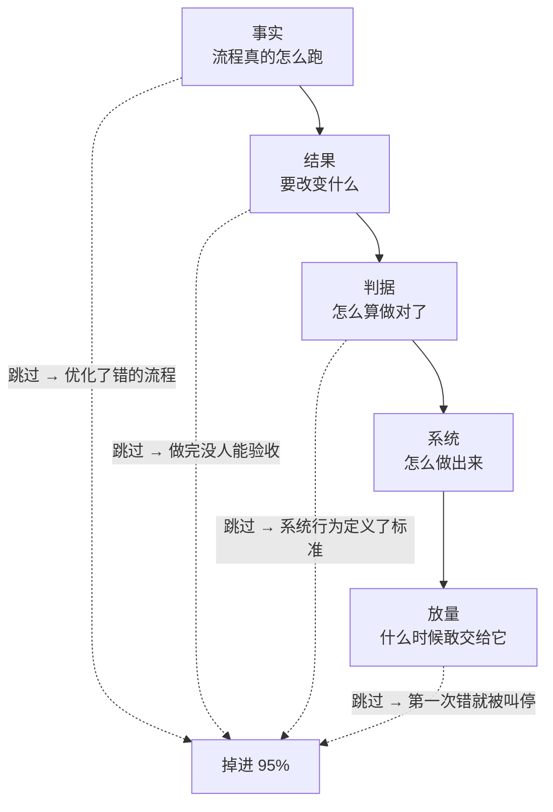

## §02 顺序：FDE 工作里唯一不能变的东西

这一章我写废过一版。

那一版叫"进场四周"，第 0 周干什么、第 1 周干什么，排得整整齐齐。写完自己看着就别扭。

因为它假设了一件不存在的事：所有企业的项目节奏是一样的。

一个客服工单分类，两周可能就够了。一个要动 ERP 的库存补货流程，八周只够把数据摸清楚。把周历写死，等于告诉读者一件他到现场第二天就会发现是假的事。

**真正固定下来的不是时长，是顺序。**

这一章讲的就是这个顺序，以及为什么它一被打乱，项目就会掉进那 95% 里。

## 先看那个 95%

MIT Media Lab 的 NANDA 项目在 2025 年 7 月发了一份报告，叫 The GenAI Divide: State of AI in Business 2025。样本是 150 场业务负责人访谈、350 份员工问卷、300 个公开部署案例。

结论是：企业砸进生成式 AI 的 300 到 400 亿美元里，**95% 的项目没有产生可衡量的损益影响。**

这个数字被传得很广，但传播过程中最重要的那部分被丢掉了——报告的归因。

它把失败主要归到三件事上：数据就绪度、工作流集成、缺少反馈闭环。模型本身不在主要原因里。MIT 给这个现象起了个名字，叫 learning gap，学习鸿沟。

还有一个对比我觉得更狠。同一份报告里，外部伙伴主导的部署有大约 67% 进了生产，企业自建的只有 33%，差了一倍。

你可能会说，这是卖服务的人爱引的数据。但把这两组数字放一起看，指向是一致的：**决定成败的不是谁的模型强，是有没有人真的把这套东西装进工作流。**

而数据就绪、工作流集成、反馈闭环这三件事，恰好是被跳过最多的三个前置步骤。

## 四个依赖，倒过来就出事

我把 FDE 的工作拆成四段，它们之间是依赖关系，不是时间关系。

这四段可以压缩，可以并行，但不能换序。

下面逐个讲为什么。

## 依赖一：事实先于结果

你没法给一个没看过的流程定义成功。

这句话听着像废话，但企业项目里跳过它是常态。常见形式是：客户在会议室里描述一遍流程，你记下来，回去就开始设计。

问题在于，会议室里的描述是制度版本，不是执行版本。

制度文件写的是流程应该怎么跑。实际执行里有大量没进过文档的东西：某个环节因为系统太慢被绕过去了、某类客户默认走特批、某个字段大家约定俗成填的是另一个意思。

**制度写的和实际做的之间那个差值，就是这个项目最危险的地方。**

要拿到这个差值，只能去看人怎么干活。坐在操作员旁边，看他处理真实案例，全程不打断。

看的时候，我认为有一个信号最值钱：**他在哪里停顿。**

流畅走完的步骤，说明有明确规则，AI 大概率能学。停下来想一下的、或者转头去问同事的，说明这里是隐性经验。这些地方就是后面 Agent 会出错的地方，也是评估集里最该覆盖的地方。

访谈也要做，但问题得挂在具体案例上。「这一单你为什么没走标准审批」能问出东西，「你们的审批流程是怎样的」只会拿回制度版本。

这一步做完，你手上有两样东西：真实流程长什么样，以及有多少种不正常的情况。

至于这需要三天还是三周，取决于流程有多复杂、能约到多少人。没有标准答案。

## 依赖二：结果先于系统

事实清楚了，接下来要定的是这个项目算不算成功。

这一步的产物我叫它 Outcome Contract，结果契约。它要回答的问题是固定的：

什么条件触发这件事。做完之后哪个业务状态发生了改变。谁是这个结果的负责人。做错一次的代价有多大。哪些动作必须人工批准。成功、失败、部分成功分别怎么判断。

注意这些问题里没有一个是技术问题。

**Outcome Contract 描述的是业务状态的改变，不是模型的行为。**

差别在哪？「Agent 能准确回答产品问题」是模型行为，「订单状态类工单的人工转接率从 X 降到 Y」是业务状态。前者做完了没人能验收，后者可以直接写进合同。

这一步同时要做的是把范围砍小。客户第一次提的需求，基本都是他们能想到的最大版本。你要从里面切一块出来，满足四个条件：发生得够频繁、结果能衡量、数据拿得到、做错了能恢复。

第四个条件最容易被忽略。**一个错误不可回滚的场景，不该作为第一个项目。** 不是因为技术上做不到，是因为你需要几个月的运行数据来建立信任，而不可回滚的场景不给你犯错的额度。

## 依赖三：判据先于优化

这一步最容易被跳过，我认为也最不该跳过。

多数团队的顺序是先把系统搭起来，跑通了再想怎么测。这个顺序在企业项目里会出一个很隐蔽的问题：

**系统一旦存在，它能做到的事会变成标准，它做不到的事会被解释成不重要。**

这不是谁不诚实，是人在有了具体对象之后就很难再回到抽象判断。所以判据要在系统之前定下来。

原料就是前面看到的真实案例，把它们和预期结果一起写成测试集。除了正常情况，还要补上这几类：

| 用例类型 | 检查什么 | 为什么 Demo 阶段测不到 |
|---|---|---|
| 边界 | 金额临界、时间临界、多条件叠加 | 演示数据是挑过的 |
| 信息缺失 | 关键字段没给的时候会不会瞎编 | 演示输入都是完整的 |
| 上下文冲突 | 两份文档说法不一致时选哪个 | 演示只放了一份文档 |
| 权限越界 | 请求超出该角色能看的范围 | 演示账号通常是管理员 |
| 必须拒绝 | 高风险请求会不会该停不停 | 演示不会故意问危险问题 |
| 下游失败 | 目标系统超时或报错时会不会重复写入 | 演示环境不会挂 |

后面四类是企业场景特有的。它们在 Demo 里永远不会出现，在生产环境里每天都出现。

还有一个判据本身的问题：**用什么来判断任务完成了。**

Anthropic 在讲 Agent 评估时举过一个例子，我觉得是整件事里最清楚的一个：订票 Agent 说"已为您预订"，你要去数据库里查有没有真的产生那张订单。

模型的自我陈述不能作为完成的证据。评估必须检查最终的环境状态。

这条在企业里的分量比在 Demo 里重得多，因为企业的下游系统会真的被写入。

## 依赖四：验证先于放量

系统能跑了，不等于可以交给它。

中间需要一段让它在真实数据上跑、但不产生任何对外影响的时间。真实请求进来，人正常处理，系统在旁边也处理一遍，两边结果存下来做对比。

这一段能暴露的东西，测试环境里几乎看不到：真实数据有多脏、请求的实际分布和你以为的差多少、高峰期的延迟、以及一批你在流程还原阶段压根没见过的情况。

跑出来的偏差要分类，不能一股脑拿去改提示词。

上下文缺失，去补 Context Registry。规则理解错，去改流程契约。工具调用出问题，去改 Agent Harness。模型确实做不到的，划出去交给人工。

**分类这一步决定了你是在修系统，还是在给系统打补丁。**

之后的放量也不是一个开关，而是逐级释放权限：只读建议、人工批准后执行、小流量自动执行、有条件自治。每一级都要有数字化的通过门槛，比如准确率、误操作率、人工介入率、成本和延迟。

关于失败模式，Lilian Weng 在 2026 年 7 月那篇讲 harness engineering 的文章里，引了 Trehan 和 Chopra 归纳的六种反复出现的模式：偏向训练数据的默认答案、执行压力下的实现漂移、记忆和上下文退化、过度乐观、领域知识不足、以及弱科学品味。

这六条是从编码 Agent 场景里总结的，我认为可以直接搬到企业场景，只要把"代码库"换成"企业业务系统"。尤其是"过度乐观"和"实现漂移"这两条——Agent 为了尽快结束任务而走捷径，在企业里的后果比在代码库里严重得多。

## 为什么大家总是倒着做

顺序讲完了。但真到项目里，绝大多数团队还是从最后一步往前做：先搭个能演示的东西，再补测试，再定目标，最后才发现流程理解错了。

原因不复杂。

**倒着做，每一步都有即时反馈；正着做，前三步都拿不出可以演示的东西。**

客户第二周就会问"能看到点什么吗"。你的老板第三周就会问"进度怎么样"。而这时候你手上只有一份流程地图和一份契约草稿，展示起来相当难看。

我认为这是 FDE 这个岗位真正难的地方。它需要的不是更强的技术，是在没有可展示成果的那几周里，顶住压力把事实搞清楚。

如果非要给一个折中，我的建议是把"事实"这一段本身做成交付物卖给客户——付费诊断。输出流程地图、数据可行性判断和收缩后的第一阶段范围。这份东西对客户独立有价值，就算后面不合作，他也拿到了一份能用的现状梳理。

它同时解决了另一个问题：免费做的诊断，客户不会认真配合，人也约不齐。

## 顺序对了，产物是自然长出来的

最后说交付物。

我不打算给一份"标准六件套"，因为不同项目该产出什么确实不一样。一个内部知识问答不需要写审批链，一个跨系统写入的 Agent 光权限矩阵就能写十页。

但如果顺序是对的，每一段会自然留下一样可检验的东西：

| 依赖段 | 自然产物 | 检验方式 |
|---|---|---|
| 事实 | 真实流程和异常清单 | 拿给一线操作员看，他认不认 |
| 结果 | Outcome Contract | 客户业务负责人愿不愿意签字 |
| 判据 | 评估集 | 里面有没有当前系统会答错的用例 |
| 系统 | 可跑通的链路 + 基线分数 | 有没有一个可比较的初始数字 |
| 放量 | 分级门槛 | 门槛是不是数字，而不是"效果不错" |

最后一列比第二列重要。产物本身很容易糊弄，一份 PPT 也能叫流程地图。检验方式糊弄不了。

**如果一线操作员看完流程图说"我们不这么干"，那前面的活就得重做，不管你已经写了多少代码。**

这一章讲的是顺序。下一章处理另一个绕不开的问题：这些活里有不少原本属于产品经理、解决方案架构师和咨询顾问，FDE 和他们的边界到底划在哪。

---

**本章引用**

- [The GenAI Divide: State of AI in Business 2025](https://cloudelligent.com/wp-content/uploads/2026/02/v0.1_State_of_AI_in_Business_2025_Report.pdf)，MIT Media Lab NANDA，2025-07
- [Demystifying Evals for AI Agents](https://www.anthropic.com/engineering/demystifying-evals-for-ai-agents)，Anthropic
- [Harness Engineering for Self-Improvement](https://lilianweng.github.io/posts/2026-07-04-harness/)，Lilian Weng，2026-07
