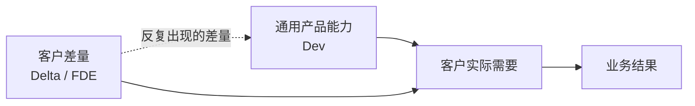

## §03 FDE 和它周围的五个岗位

上一章列的那些活——还原真实流程、写结果契约、建评估集、分级放量——单拎出来看，每一件都能在别的岗位职责里找到影子。

产品经理做需求调研，解决方案架构师画集成方案，实施顾问搞验收，测试工程师建用例集。

于是很多公司做了同一件事：把这些人凑一起，起名叫 FDE 团队。

然后发现项目还是卡在老地方。

**问题不在能力拼盘，在责任的完整性。**

## 六个岗位，各自停在哪一步

| 岗位 | 对什么负责 | 通常停在哪 | 我的判断 |
|---|---|---|---|
| 软件工程师 | 产品与技术系统 | 代码合入、服务上线 | 把系统做出来 |
| 产品经理 | 用户需求与产品范围 | 方案确定、迭代排期 | 决定做什么 |
| 售前 / 解决方案架构师 | 技术可行性与方案说服力 | 签约、方案确认 | 证明产品能卖 |
| 咨询顾问 | 问题诊断与路径建议 | 报告、路线图 | 说明应该怎么做 |
| 实施顾问 | 配置、培训、项目验收 | 项目按期结项 | 让已有产品落地 |
| FDE | 业务结果与持续运行 | 结果产生并稳定 | 把 AI 装进业务 |

关键在"停在哪"这一列。

前面五个岗位都有一个明确的完成信号：代码合了、方案定了、合同签了、报告交了、验收过了。

FDE 没有这样的信号。它的完成信号在客户那边——有人在用，指标在动，出问题有人接。

这带来一个很现实的后果：**FDE 是唯一一个在系统上线之后，工作量不下降的角色。**

维基百科上关于这个岗位的条目里，有一句挺实在的话：一些工程师对它评价负面，因为出差要求和"在相对短的时间里解决客户问题"的压力。

这句话我觉得该原样保留在书里。这个岗位现在被写得太光鲜了。

## Palantir 的 Dev / Delta 划分

FDE 这个词的原型来自 Palantir。它在 S-1 里把现场工程师直接算作研发的一部分——工程师在客户现场发现问题，再把经验写回平台。

它内部的角色划分更值得看。

Palantir 把工程分成两条线：Dev 做通用平台能力，Delta 在客户现场解决具体差量问题。

Delta 这个命名很准。**它说明现场工程师处理的是标准产品和这一家客户之间的差值。**

这个差值可能是数据结构不一样、审批链多一层、有个二十年的老系统必须对接、或者某个行业的监管要求。

这张图里那条虚线，是整套模式能不能成立的关键。

如果差量永远只留在项目里，Delta 的工作量会随客户数量线性增长，最后就是人力外包。

只有那条虚线跑通，反复出现的差量被吸收进通用产品，Delta 的单客户成本才会往下走。

第 31 章会专门讲这条虚线怎么建。这里先记住一件事：

**FDE 的组织归属，决定了这条虚线存不存在。**

挂在交付部门下面的 FDE，考核的是项目结项率。挂在产品线下面的 FDE，才有动机把现场问题推回路线图。

## FDE 和产品经理的分工

这两个角色在企业 AI 项目里最容易打架，因为都在做需求。

我的划法是按对象分。

产品经理面向一群客户的共性需求，判断标准是"这个功能有多少客户会用"。

FDE 面向一个客户的具体结果，判断标准是"这一家的这个流程有没有跑起来"。

输出物也不同。产品经理写 PRD，描述功能行为。FDE 写 Outcome Contract，描述业务状态的改变。

一份好的 Outcome Contract 里可能一个功能名词都没有，全是触发条件、状态变化、判定规则和责任人。

有个信号可以用来判断分工是不是错位了：**如果 FDE 大部分时间在跟产品经理争功能优先级，说明范围没砍够；如果大部分时间在跟客户的业务负责人确认规则，说明分工是对的。**

## FDE 和咨询顾问的分工

咨询交的是判断，FDE 交的是运行中的系统。

这句话听起来简单，实际操作里有一段重叠区：诊断阶段。

上一章提过我的做法——把诊断本身做成第一个交付物，而且收费。输出真实流程、数据可行性判断、收缩后的第一阶段范围。

跟纯咨询的区别在结论的形式。

咨询会给出"建议优先建设知识中台"这类判断。FDE 给出的是"订单查询类工单可以做到自动回复，前提是你们提供 A 系统的只读 API 和三个月的历史工单，预计覆盖三分之一的工单量"。

**后者可以直接变成合同。**

顺带一提，MIT 那份报告里"外部伙伴主导的部署 67% 进生产、企业自建只有 33%"，我认为很大程度上就差在这一步。

外部团队被迫把话说到能签合同的精度，内部团队没有这个约束，项目常常带着模糊目标一路走到交付。

## FDE 不负责什么

责任边界如果只往外扩不往里收，这个岗位会被拖垮。

有几件事我认为该明确划出去。

**FDE 不负责客户的组织变革。** 流程要改、岗位职责要调、有人要被换掉，这些必须由客户的业务负责人推动。FDE 可以提供数据和方案，但不能代替客户做这个决定。

项目里如果出现"让 FDE 去说服业务部门改流程"，说明业务负责人这个位置是空的。这是启动条件没满足，不是 FDE 能力不行。

**FDE 不负责无限期的运维。** 上线之后需要一个明确的交接点：谁监控、谁处理告警、谁维护评估集、谁批准规则变更。

这些写不进 SOW，项目就会变成永久驻场。

**FDE 不负责所有需求。** 有些需求现在就不该做——错误代价高但无法回滚的、数据根本拿不到的、流程每个月都在变的、没有业务负责人的。第 15 章会给一张筛选表。

学会说"这个现在不建议做"，我认为是 FDE 比会写代码更重要的能力。

**FDE 也不负责一次性的技术选型。** 模型选哪家、向量库用什么、要不要自建，这些在企业项目里的重要性远低于大家的想象。

真正决定成败的是上下文准不准、异常有没有覆盖、权限设得对不对。MIT 那份报告的归因里，一个模型相关的原因都没有。

## 一句话定义

综合前面三章，我给 FDE 的定义是：

> FDE 进入客户的真实环境，把模糊的业务问题翻译成可运行的 AI 系统，对采用率和业务结果负责，并把现场经验转化成可复用的产品能力。

这句话有四个可以逐个验证的部分：进入真实环境、翻译成可运行系统、对结果负责、经验回流。

四个都成立才是 FDE。

下一章我给六个具体问题，用来当场判断一个岗位或一个团队，这四条到底占了几条。

---

**本章引用**

- [Palantir S-1](https://www.sec.gov/Archives/edgar/data/1321655/000119312520239121/d904406ds1a.htm)
- [Dev versus Delta: Demystifying Engineering Roles at Palantir](https://blog.palantir.com/dev-versus-delta-demystifying-engineering-roles-at-palantir-ad44c2a6e87)
- [Forward Deployed Engineer（维基百科）](https://en.wikipedia.org/wiki/Forward_Deployed_Engineer)
- [The GenAI Divide: State of AI in Business 2025](https://cloudelligent.com/wp-content/uploads/2026/02/v0.1_State_of_AI_in_Business_2025_Report.pdf)，MIT Media Lab NANDA
