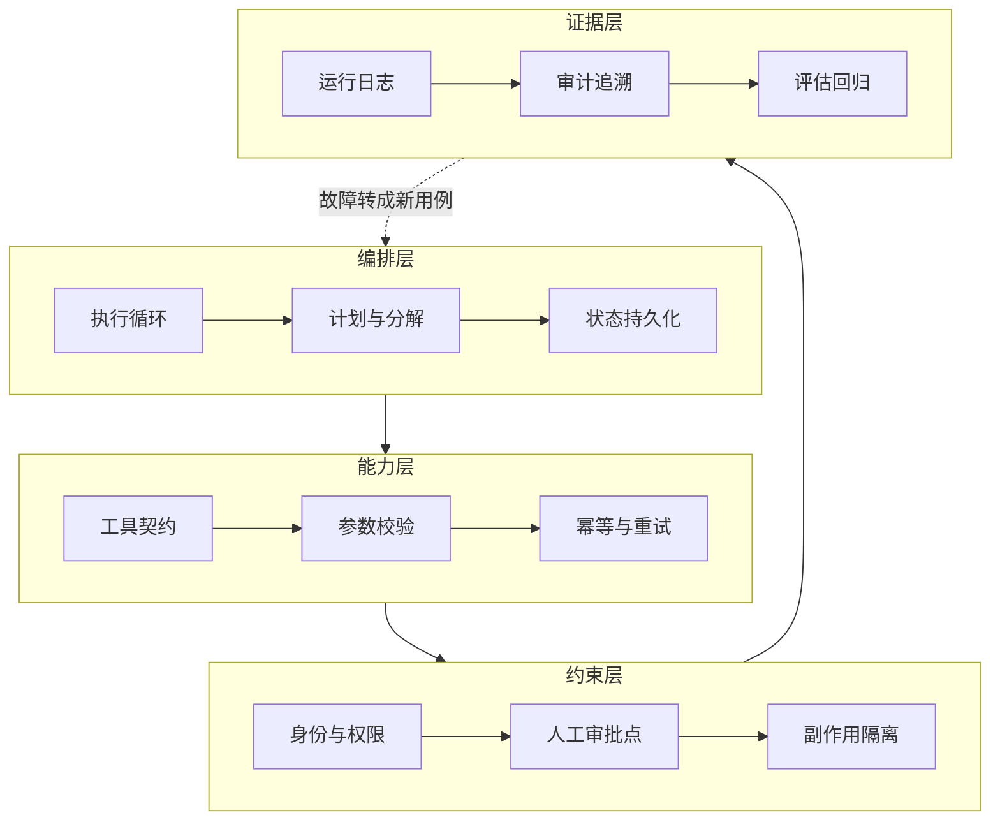

## §11 Harness Engineering：决定模型怎么持续工作

这个词这两年才开始被认真讨论。

Lilian Weng 在 2026 年 7 月那篇文章里给的定义是：

> Harness 是围绕基础模型的那套系统，它编排执行，决定模型如何思考和规划、如何调用工具和行动、如何感知和管理上下文、如何存储产物、如何评估结果。

Harness 本来指马具，套在马身上那套东西。模型是马，Harness 决定它往哪使劲。

对 FDE 来说，这个概念的价值在于它把"Agent 做不好"这件事从模型身上挪开了。

**模型能力决定上限，Harness 决定这个上限能不能在真实企业里稳定释放。**

## 七个可编辑的部件

Lilian Weng 那篇文章列了七个可以被改动的 harness 部件：

系统提示词、工具描述、工具实现、中间件、Skill、子 Agent 配置、长期记忆。

这七个的价值在于，它给了你一张"出问题时可以动哪里"的清单。

第 7 章讲过 bad case 的分类。那张表其实就是在问：这次该动这七个里的哪一个。

多数团队只会动第一个（往系统提示词里加规则），而问题往往出在第二、三、七个。

## 企业场景要额外加的四件事

上面七个部件是通用的，主要从编码 Agent 场景总结出来。

进企业以后，我认为还得加四样，它们在编码场景里可选，在企业场景里必需。

**第一，身份与权限。**

Agent 用谁的身份访问系统，能操作哪些资源，越权时会发生什么。

编码 Agent 在自己的沙箱里跑，企业 Agent 在客户的生产系统里跑。这是完全不同的风险等级。

**第二，副作用隔离与幂等。**

Agent 调一次接口和调三次接口，结果必须一样。

这条在企业里的分量特别重，因为下游是真的会被写入的：真的会发邮件、真的会生成采购单、真的会改订单状态。

第 9 章讲过多步流程的成功率坍塌。坍塌之后的重试，如果没有幂等保护，会造成比失败更糟的结果。

**第三，人工接管点。**

哪些动作必须人批，批的人看到什么信息，不批会怎样，超时怎么办。

我的判断是：**人工审批不是一个界面功能，它是系统架构的一部分。**

因为它决定了流程在哪里可以被中断、状态怎么保存、恢复后从哪一步继续。这些事后加不上去。

**第四，审计与可追溯。**

出了问题，要能回答：当时模型看到了什么上下文、调了哪些工具、返回了什么、谁批准的。

企业里这条经常是法务和风控的硬要求，不是加分项。

## 一张 Harness 的分层图

四层的顺序有讲究。

多数团队从上往下做，做到第二层就上线了。第三层等安全部门提要求才补，第四层等出事才补。

我认为正确的做法是**从下往上验收**：证据层没有，就无法判断约束层是否生效；约束层没有，能力层的每一次调用都是风险。

## Harness 不能越做越厚

有一个观察值得单独说：模型能力提升之后，原来为了弥补模型缺陷而搭的脚手架，可能反过来变成限制。

这个道理在个人工具上已经有人踩过。为旧模型写的一大堆规则和绕路逻辑，换到新模型上变成纯负担。

企业项目里这个问题更严重，因为客户不会主动删东西。规则只进不出，三年后没人敢动。

我的建议是把"删"也写进流程：

每次模型升级后重跑评估集，标出哪些约束已经没有正收益。

每个季度审一次系统提示词，把已经被上下文或工具契约覆盖的规则删掉。

保留一份"为什么加这条"的记录，否则三年后谁都不敢删。

**Harness 里每一个部件，都编码了一条"模型自己做不到什么"的假设。模型变了，假设就该重审。**

## Harness 和 Context 的分工

这两个概念容易混。我的划法是：

**Context 管信息，Harness 管行为。**

模型该看到哪些信息，是 Context 的事。模型看到信息之后能做什么、做错了怎么办，是 Harness 的事。

落到 bad case 上就很好判断了：

模型答错是因为没拿到某条信息 → Context 问题。

模型拿到了正确信息但做了不该做的动作 → Harness 问题。

这两类的修法完全不同，混在一起改是很多项目越改越乱的原因。

下一章讲企业软件底座，Harness 的第三层和第四层要落在上面。

---

**本章引用**

- [Harness Engineering for Self-Improvement](https://lilianweng.github.io/posts/2026-07-04-harness/)，Lilian Weng，2026-07
