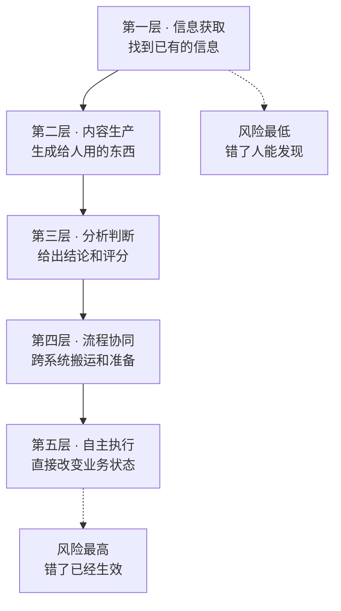
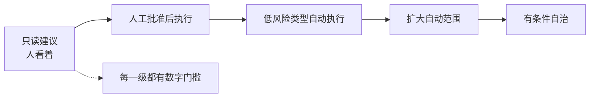

# Part 4 需求篇：企业到底需要什么 AI

这一篇回答三个问题：企业的 AI 需求有哪些类型，这些需求背后反复出现的问题是什么，以及哪些需求现在不该做。

---

## §13 企业 AI 需求的五层分类

企业需求最常见的分类方式是按部门：市场要什么、客服要什么、财务要什么。

我认为这种分法对 FDE 没什么用。

因为**同一个部门的两个需求，实施难度可能差十倍。**

客服部门要一个"话术查询助手"和要一个"能直接改订单的自动处理 Agent"，前者两周，后者半年，而且风险等级完全不同。

更有用的分法是按 AI 的介入深度。

## 五层，深度递增

| 层级 | 典型需求 | 输出交给谁 | 错误代价 |
|---|---|---|---|
| 一、信息获取 | 知识库问答、制度查询、文档检索 | 人 | 低，人会核对 |
| 二、内容生产 | 客服回复草稿、报告初稿、营销文案 | 人 | 低到中，人会改 |
| 三、分析判断 | 工单分类、线索评分、风险识别、异常检测 | 人或系统 | 中，可能影响决策 |
| 四、流程协同 | 跨系统取数、材料准备、状态同步、待办生成 | 系统，但需人确认 | 中到高 |
| 五、自主执行 | 直接发邮件、改订单、生成采购单、完成端到端流程 | 系统，直接生效 | 高，已经发生了 |

分层的价值在于，**每往下一层，对 Context、Harness、Eval 和权限的要求都会跳一级，不是线性增加。**

## 每一层真正的难点

**第一层的难点不是检索，是知识治理。**

多数团队以为这层最简单，接个向量库就完事。

实际卡住的地方是第 10 章讲的那些：哪份文档是有效版本、两份说法冲突听谁的、这个用户有没有权限看这条。

检索准确率和业务事实正确，是两个指标。找到信息是检索的事，判断这份信息值不值得信是 FDE 的事。

**第二层的难点是采用率。**

技术上不难，草稿质量也够用。但上线后经常发生的是：员工试了几次，觉得改草稿比自己写还慢，就不用了。

这层的成败取决于它嵌进工作流的位置。让人跳到另一个系统去生成再复制回来，基本没人会用。

**第三层的难点是判据。**

分类和评分需要一个标准答案，而企业里的标准答案经常是不存在的——同一个工单，三个老员工可能分成三类。

所以这层的第一件事不是训模型，是先让人达成一致。这个过程本身对客户就有价值。

**第四层的难点是状态和异常。**

跨系统流程有中间状态，会失败在任何一步。第 11 章讲的幂等、重试、状态持久化，从这层开始变成硬需求。

**第五层的难点是信任和治理。**

技术上第五层和第四层的差距，比大多数人以为的小。真正的差距在组织：谁批准它自动执行、错了谁负责、怎么撤销、审计怎么交代。

## 一个我认为重要的判断

很多企业开口就要第五层。

我的建议是：**除非有非常明确的理由，第一个项目不要从第五层开始。**

理由不是技术做不到，是信任建立需要时间。

你需要几个月的运行数据，才能让客户相信这套东西可以自动执行。而第五层不给你犯错的额度——它错一次，可能整个项目就被叫停了。

更可行的路径是同一个场景从低层往高层爬：

这条路径在第 22 章会展开。这里先记住：**层级是可以爬的，但不能跳。**

## 需求所在层级 vs 客户以为的层级

现场经常出现的一个错位是：客户描述的是第五层，实际需要的是第三层。

「我们想要一个能自动处理退款的 AI」——追问下去可能会发现，退款审批本身有明确规则，人工只需要 30 秒，真正耗时的是判断这个退款申请属于哪一类、要调哪些证据。

那么真实的需求是第三层（分类 + 材料准备），把 30 秒的审批留给人。

这个错位是常态，不是客户不专业。因为**客户描述的是他想摆脱的痛苦，不是他需要的系统。**

FDE 的工作就是把前者翻译成后者。翻译的方法是第 2 章那套顺序：先看真实流程，找到时间实际花在哪。

## 这一层分类怎么用

我建议在诊断结束时，对每个候选场景标三件事：

它在第几层。客户以为它在第几层。第一阶段建议做到第几层。

这三个数字如果不一致，说明有一次预期管理需要做。而且要在报价之前做，不是在验收时做。

下一章讲这五层背后反复出现的七类问题。

---

**本章引用**

- [Effective Context Engineering for AI Agents](https://www.anthropic.com/engineering/effective-context-engineering-for-ai-agents)，Anthropic
