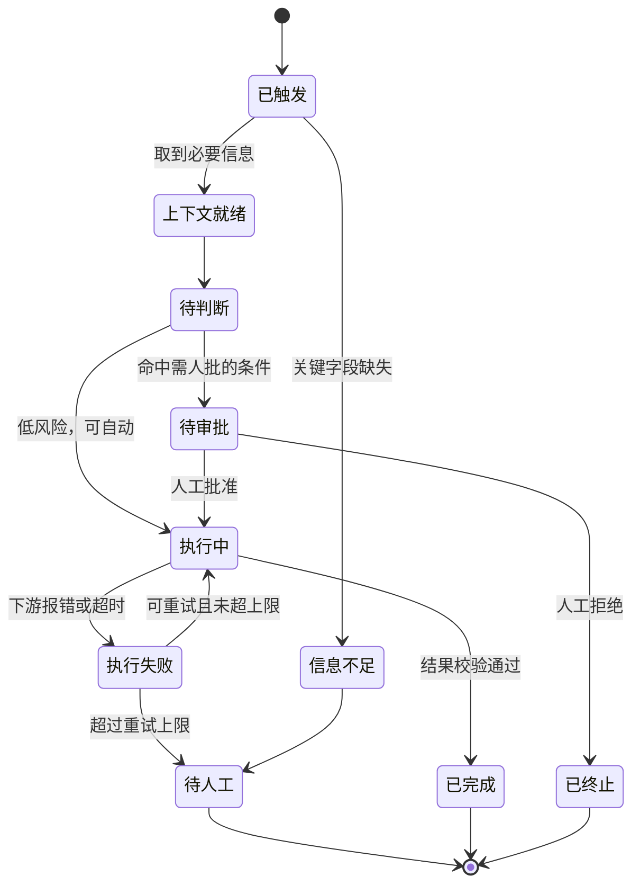

## §18 Workflow Contract：把流程写成状态机

这一章对应第 14 章的第三类问题：SOP 只写正常路径。

上一章拿到的流程图是描述性的。这一章要把它变成可计算的。

差别在于：**描述性的流程回答"一般怎么走"，状态机回答"任何时刻系统在哪、下一步由什么决定"。**

## 为什么必须写成状态机

三个理由。

第一，Agent 会失败在任何一步。没有状态定义，失败之后不知道从哪恢复。

第二，人工接管需要接管点。接管点就是状态。没有状态划分，人接手时不知道当前进行到哪。

第三，第 9 章讲的多步坍塌问题需要在每一步验证。验证的对象就是状态转移是否合法。

**用一句话说：状态机是给中断和恢复用的，不是给正常流程用的。**

正常流程根本不需要状态机，顺着走就行了。

## 一个流程契约的基本结构

这张图是通用骨架，具体项目要按实际流程改。

这张图里有四个终态：已完成、已终止、待人工、以及隐含的部分完成。

第 16 章说过，部分成功是企业流程里最常见的情况，必须提前定义。

## 要写清楚的六件事

| 要素 | 内容 | 不写的后果 |
|---|---|---|
| 状态清单 | 系统可能处于的所有状态 | 失败后不知道从哪恢复 |
| 转移条件 | 每条边由什么触发 | 行为不可预测 |
| 决策规则 | 判断点用什么依据 | 规则藏在提示词里，没人能审 |
| 异常矩阵 | 每类异常的分类和处理 | 异常全部落到人工 |
| 人工升级路径 | 什么时候交给人，交给谁 | 人不知道自己该接什么 |
| 外部副作用 | 每一步会改变哪些外部系统 | 回滚时不知道要撤销什么 |

最后一条最容易漏。

**副作用清单是回滚设计的前提。** 你必须知道每一步动了什么，才能在出错时撤回来。

## 异常矩阵怎么写

上一章观察到的异常，在这里要分类。

我建议按"处理方式"分，而不是按"原因"分。因为处理方式直接映射到状态转移。

| 异常类别 | 处理方式 | 例子 |
|---|---|---|
| 可自动恢复 | 重试，有上限 | 下游超时、限流 |
| 需要补信息 | 向上游或用户索取 | 关键字段缺失 |
| 需要人判断 | 升级到人工，带上下文 | 规则冲突、金额超限 |
| 必须拒绝 | 终止并记录 | 越权请求、明确禁止的操作 |
| 未知 | 保守停止，报警 | 没见过的情况 |

最后一类必须有。

**没有"未知"分支的系统，会把没见过的情况错误地归到某个已知分支里。** 那比停下来危险得多。

## 决策规则要放在提示词外面

这是我认为流程契约最重要的一条实践。

判断规则——什么条件下走哪个分支——应该写成显式的配置或代码，不是藏在提示词里让模型自己判断。

三个理由：

规则写在外面，业务方能看懂、能审、能确认。写在提示词里，只有你能看。

规则写在外面，改动有版本记录。写在提示词里，改了没人知道。

规则写在外面，评估可以直接测。写在提示词里，只能测最终输出。

第 7 章讲过往提示词里堆规则的后果：三个月后一份两千字的提示词，几十条规则互相打架，谁也不敢删。

**能用条件判断表达的，不要交给模型判断。** 把模型用在真正需要理解和归纳的地方。

## 人工接管点的设计

第 11 章说过，人工审批是架构的一部分，不是界面功能。

设计接管点时要回答：

在什么状态下触发。接管的人是谁（角色，不是姓名）。他看到什么信息才够判断。他有哪些选项（批准、拒绝、修改后批准）。超时不处理会怎样。批准之后从哪个状态继续。

第四条容易被简化成"批准/拒绝"两个按钮。

但实际业务里"修改后批准"非常常见——人看了 Agent 的方案，改了一个字段，然后放行。

**如果系统不支持这个选项，人就会跳出系统去手工处理，你的流程数据就断了。**

## 这一步的产物和检验

产物：状态机定义、转移条件、决策规则表、异常矩阵、人工接管点定义、副作用清单。

检验方式：**拿异常矩阵去问一线，问他们还有没有见过别的情况。**

以及一个更硬的检验：把状态机里的每一个终态，对应到 Outcome Contract 里的成功、失败、部分成功。

如果有状态对应不上，说明契约不完整，要回去补。

下一章讲上下文系统，也就是状态机每一步需要什么信息、从哪来。
