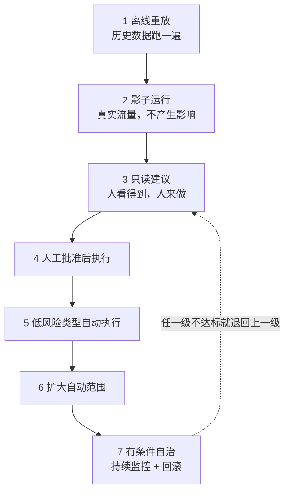

## §22 Operational Harness：从影子运行到有条件自治

第 13 章说过，层级可以爬，但不能跳。

这一章讲怎么爬。

## 七级放量

每一级都要有明确的进入门槛和退出条件。

不是所有项目都要爬到第七级。**很多场景停在第四级就已经产生了足够价值，而且风险可控。**

第 13 章说过，客户开口要第五层，实际需要的可能是第三层。放量级别也是一样。

## 各级要做什么

**一、离线重放。** 用历史数据跑，和当时的真实处理结果对比。

价值是成本低、能大批量跑。局限是历史数据里没有 Agent 造成的新情况。

**二、影子运行。** 真实流量进来，人正常处理，系统在旁边也处理一遍，结果只记录不生效。

这一级能暴露的东西，测试环境里看不到：真实数据有多脏、请求的实际分布和你以为的差多少、高峰期延迟、以及一批没见过的情况。

我认为**这一级不能省**。它是唯一一个既有真实性、又零风险的阶段。

**三、只读建议。** 结果给到人，人决定用不用。

这一级开始有采用率数据了——人有多少比例采纳了建议。这个数字比准确率更接近业务价值。

**四、人工批准后执行。** 人批准，系统执行。

和第三级的区别是执行由系统做，所以第 20 章那些工具契约、幂等、副作用记录，从这一级开始真正生效。

**五到六、部分自动执行。** 按第 18 章的异常矩阵，把低风险、规则明确的类型放开。

放开的顺序按"错误代价"排，不按"发生频率"排。

**七、有条件自治。** 大部分情况自动，异常和高风险仍走人工。

注意是"有条件"。**我不认为企业场景存在无条件自治**，因为第 18 章那个"未知"分支永远需要人。

## 偏差分类：这一步决定你是在修还是在补

第 2 章和第 7 章都提过，这里给完整的分类表。

| 偏差表现 | 归属 | 修法 | 对应章节 |
|---|---|---|---|
| 缺少某条信息 | Context | 补 Registry、改注入策略 | §19 |
| 用了过期或错误的信息 | Context | 改权威级别、加有效期 | §19 |
| 规则理解错 | Workflow | 把规则从提示词移到显式判断 | §18 |
| 状态流转错 | Workflow | 补状态定义和转移条件 | §18 |
| 工具调用参数错 | Harness | 加参数校验 | §20 |
| 重复执行 | Harness | 加幂等 | §20 |
| 该转人工没转 | Harness | 补接管点触发条件 | §20 |
| 模型确实做不到 | 范围 | 划出去交人工，改契约 | §16 |

**最后一行最难做，但必须做。**

承认某类情况模型做不到，要放弃一部分自动化率，在项目压力下很难开口。

但不承认的代价是系统在这类情况持续出错，最后拖垮所有人对它的信任。而信任一旦没了，前面所有工作都白做。

## 监控要盯什么

技术监控（延迟、错误率、成本）是基础，这里不展开。

FDE 要额外盯的是这几个：

**采用率。** 有多少人在用，趋势是涨还是跌。跌了要立刻查原因。

**建议采纳率。** 第三级之后一直有效。人不采纳，说明质量或者时机有问题。

**人工介入率。** 太高说明自动化价值不足，太低要警惕是不是该介入的没介入。

**逃逸率。** 人绕过系统去手工处理的比例。这个指标最容易被忽略，但它直接说明系统在实际工作里好不好用。

第 18 章说过，如果系统不支持"修改后批准"，人就会跳出系统。逃逸率就是在测这件事。

**业务指标本身。** Outcome Contract 里定的那个数字，对比基线。

## 回滚

第 12 章说过：能回滚代码，不等于能回滚业务后果。

要提前定义的：

关掉 AI 之后，人工流程能不能立刻接上（这要求人工流程没有被拆掉）。

已经产生的错误动作怎么处理，哪些能自动撤销，哪些要手工修。

谁有权决定回滚，什么条件下触发。

回滚之后，怎么判断可以重新放量。

**第一条最容易出事。** 有些项目上线后为了显示决心，把人工流程的工具和岗位撤了。一旦系统出问题，退无可退。

我的建议是：至少在达标观察期结束前，人工流程要保持可用。

## 达标观察期

第 16 章的 Outcome Contract 里有这一项。

它的作用是防止用短期数据下结论。一周达标可能是运气，也可能是那周恰好没有复杂案例。

观察期要覆盖业务的完整周期。有月结的业务至少跨一个月结，有季节性的业务要考虑淡旺季。

Part 5 到这里结束。

七章走完，一个 AI 系统从模糊需求变成了在生产环境里运行、被监控、能回滚的东西。

但这只解决了一半问题。**技术上的完成，不等于交付完成。**

下一篇讲另一半：项目怎么才算真的交出去了。
