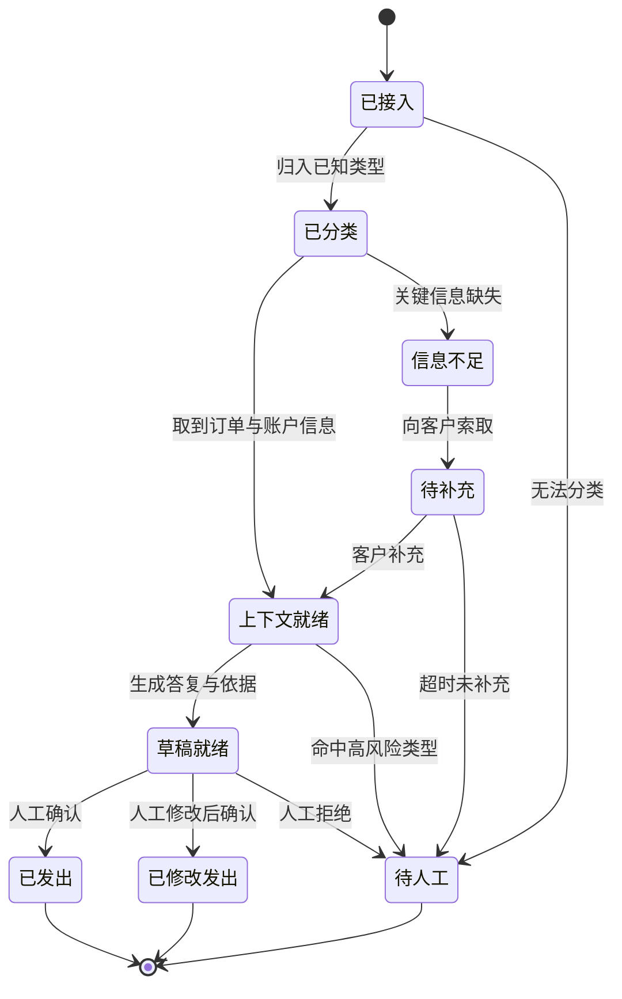

## §29 推演二：客服处理 Agent

## 客户最初的说法

"客服人力不够，想让 AI 把简单工单直接处理掉。"

比上一个推演具体，但仍然缺三样：哪些算简单、处理到什么程度、错了怎么办。

## 第一步：拆开这个需求

第 13 章说过，客户描述的层级和实际需要的层级经常不一致。

"直接处理掉"听起来是第五层（自主执行），但拆开看，一张工单的处理其实包含好几段：

读懂客户问什么。判断属于哪一类。调取相关信息（订单、账户、历史记录）。决定怎么答复。执行动作（回复、改状态、发起退款、转人工）。

前四段是第三层（分析判断）和第四层（流程协同），最后一段才是第五层。

**而真正耗时的往往是中间三段，不是最后那一下。**

按第 2 章的顺序，这个判断要靠第 17 章的现场观察得出——看客服处理二十张工单，时间实际花在哪。

## 第二步：范围收缩

按第 24 章的四个条件切。

一个可能的切法：**只处理某一类规则明确的工单，且只做到"生成答复草稿 + 附上依据"，人点确认后发出。**

这样切之后：

频率够（这类工单占比高）。结果可衡量（单张处理时长、草稿采纳率）。数据可获得（工单系统 + 订单系统只读）。错误可恢复（人在发出前会看一眼）。

第五层的部分留到后面。第 13 章说过，层级可以爬，但不能跳。

## 第三步：这个场景的核心是流程契约

上一个推演的核心是 Context，这一个的核心是第 18 章的 Workflow Contract。

因为客服流程有大量分支和异常，而 SOP 里通常只写了正常路径。

现场观察会发现的异常可能包括：客户描述不清、订单信息与客户描述不符、涉及多个订单、客户情绪激烈、请求超出政策范围、需要跨部门协调、系统查不到记录。

这些在人手里是自然处理的，AI 接手后会突然变得可见。

## 第四步：状态机和异常矩阵

按第 18 章的骨架，这个场景的状态机大致是：

**"已修改发出"这个状态必须有。**

第 18 章说过，如果系统不支持"修改后批准"，人就会跳出系统去手工处理，流程数据就断了。

而且这个状态是最有价值的数据来源——**人改了什么，就是系统还差什么。**

异常矩阵按第 18 章的分类方式：

| 异常 | 类别 | 处理 |
|---|---|---|
| 客户描述不清 | 需要补信息 | 生成澄清问题，转待补充 |
| 订单信息与描述不符 | 需要人判断 | 转人工，附上两边的差异 |
| 涉及多个订单 | 需要人判断 | 本期不处理，直接转人工 |
| 客户情绪激烈 | 需要人判断 | 转人工，标记优先级 |
| 超出政策范围 | 必须拒绝 | 转人工，不生成草稿 |
| 系统查不到记录 | 未知 | 保守停止，报警 |

"涉及多个订单"这一行体现的是第 24 章的范围收缩——**明确写出本期不处理，比勉强处理要好。**

## 第五步：决策规则要写在外面

第 18 章那条实践在这个场景里特别重要。

哪类工单算高风险、什么金额以上必须人工、哪些客户等级有特殊政策——这些都是条件判断，应该写成显式配置。

**理由是业务方要能自己改。**

客服政策变化很频繁。如果每次调整都要改提示词、重新测试、重新发版，这个系统很快就跟不上业务了。

第 27 章讲的"让客户具备自主运营能力"，第一条就是能自己改规则。

## 第六步：评估集

这个场景的评估比上一个复杂，因为要检查的是状态转移是否正确，不只是文本质量。

按第 21 章的七类：

**正常**——各类工单的典型案例，检查分类是否正确、草稿是否引用了正确的订单信息。

**边界**——金额刚好在人工审批线上下的案例。

**信息缺失**——客户只说了"我的订单有问题"，检查是否生成澄清问题而不是猜测。

**上下文冲突**——客户说的和系统记录不一致，检查是否转人工而不是选一边相信。

**权限越界**——用一个客服的身份查另一个区域的订单，检查是否拒绝。

**必须拒绝**——客户要求超出政策的补偿，检查是否转人工而不是自行答应。

**下游失败**——工单系统写入超时，检查是否重复发送答复。

最后一类在这个场景里代价很高。**同一条答复发两次给客户，是真实可见的事故。**

所以第 20 章讲的幂等在这里是硬要求。

## 第七步：放量路径

按第 22 章：

离线重放历史工单 → 影子运行（生成草稿但不给人看，只做对比）→ 只读建议（草稿给客服看）→ 人工确认后发出 → 某几类低风险工单自动发出。

**每一级的门槛要按工单类型分别设，不看整体平均。**

第 21 章说过，平均分会掩盖问题。整体 95% 的系统，可能在"必须拒绝"那类上只有 60%。

## 这个推演里最容易踩的坑

**第一，用整体准确率作为上线门槛。** 上面说过。

**第二，忽略采纳率和逃逸率。** 草稿准确率很高，但客服嫌改起来麻烦，全部自己重写——第 22 章讲的逃逸率就是在测这个。

**第三，把异常全部丢给人工。** 转人工的比例过高，自动化价值就没了。要按第 22 章的偏差分类逐类分析，哪些是可以收回来的。

**第四，没有留"人改了什么"的数据。** 这是最可惜的一种浪费，因为这份数据是改进系统最直接的原料。

## 可以沉淀什么

客户特有的是工单分类体系、政策规则、话术风格。

可复用的是这套状态机骨架、异常分类方式、"修改后批准"的实现、按类型分别设门槛的评估框架、工单系统的连接器。

下一个推演进入第五层。
