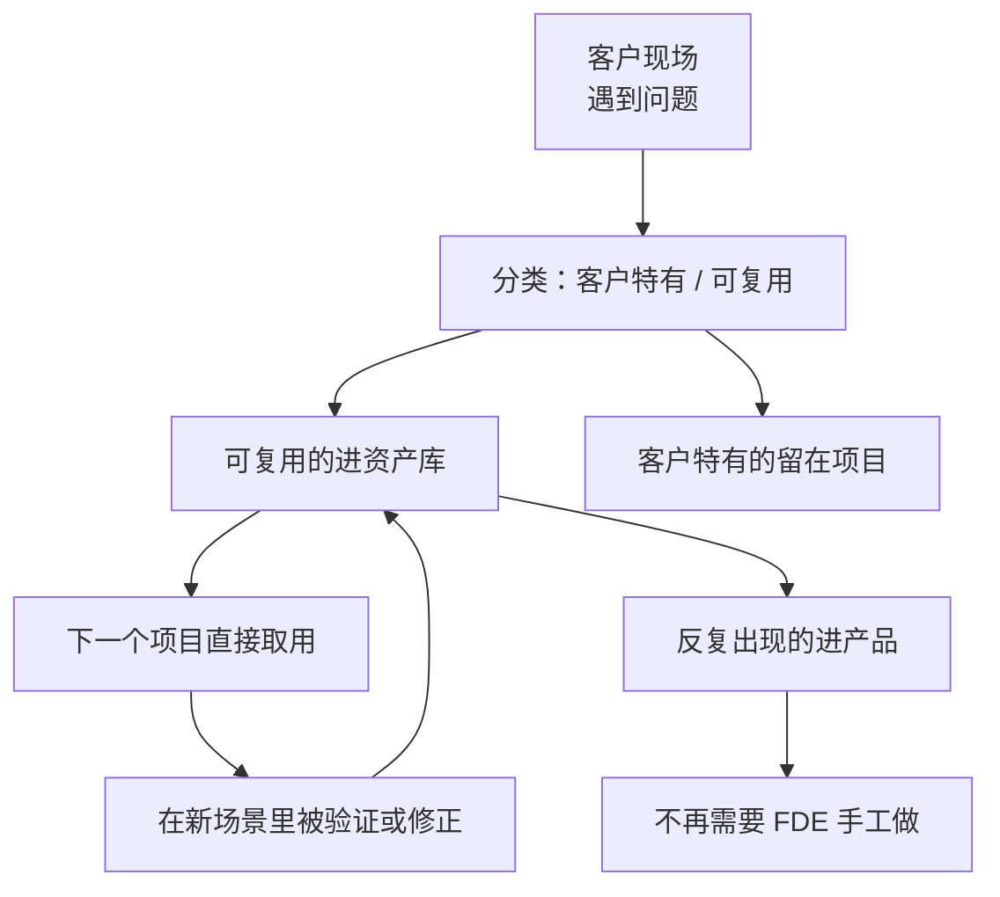

# Part 8 资产篇：让下一单不从零开始

前七篇讲的是怎么把一个项目做成。

这一篇讲的是怎么让第二个项目比第一个便宜。

**这是 FDE 模式和传统驻场交付的分界线，也是这本书最后要落的地方。**

---

## §31 复利循环：把项目变成能力

## 先看清楚这件事有多重要

第 3 章讲过 Palantir 的 Dev / Delta 划分，以及那条虚线：反复出现的差量要被吸收进通用产品。

第 4 章的六个问题里，有三个（代码进哪个仓库、岗位归谁管、问题怎么进产品）都在问这条虚线。

第 1 章提过 AWS 用了 Delivery Harness 这个词，把领域本体、Context Graph、评估框架、MCP Server、Agent 运维工具装进同一套交付体系，每做完一个客户就厚一层。

三个地方指向同一件事：**如果每一单都从空白开始，FDE 就是昂贵的人力外包。**

而且成本还在上升，因为这个岗位要求的能力比传统实施顾问高。

## 每个项目结束时，把产出分成两堆

这是最关键的一个动作，而且必须在项目还热的时候做，不能等三个月后。

| 类别 | 内容 | 去处 |
|---|---|---|
| 客户特有 | 业务规则、术语、权限模型、专属集成、话术风格 | 留在客户项目里 |
| 可复用 | 连接器、工具契约、Context 模板、评估用例类型、异常分类、状态机骨架、部署清单 | 进资产库或产品 |

分类的判断标准很简单：**换一个客户，这个东西还成不成立。**

产品参数表不成立，是客户特有的。"信息缺失时不许编造"这一类评估用例的构造方式成立，是可复用的。

## 六种最值得沉淀的东西

按我的判断排序。

**第一，评估用例的类型库。**

不是具体用例，是类型和构造方法。第 21 章那七类，每一类怎么造、断言什么，这套方法在所有项目里通用。

我认为这是价值最高的资产，因为它直接决定了新项目能不能快速建立判据——而判据是第 2 章那个顺序里最容易被跳过的一环。

**第二，连接器和 MCP Server。**

企业常见系统就那么几类。同一个系统接第二次，不该重写。

**第三，Context Registry 模板和权威规则。**

第 19 章那张表的结构是通用的。第二个项目直接拿去填，省下的不只是时间，还有"想不到要问这一列"的风险。

**第四，状态机骨架和异常分类。**

第 18 章和第 29 章的那套骨架，换个业务改改就能用。异常的五种分类（可自动恢复、需补信息、需人判断、必须拒绝、未知）几乎是通用的。

**第五，实施流程本身。**

也就是第 2 章那个顺序，加上每一步的产物和检验方式。这套东西写下来，新人上手会快很多。

**第六，故障库。**

每一次线上故障，除了转成回归用例，还要记下它属于第 22 章偏差分类表的哪一类、最后怎么修的。

**故障库是新人最快的学习材料，也是判断"这个坑我们踩过没有"的唯一依据。**

## 循环怎么转起来

注意最下面那条：**反复出现的可复用资产，最终要进产品。**

资产库只是中转站。如果一个东西在五个项目里都用到了，它就该变成产品能力，而不是继续躺在资产库里靠人复制粘贴。

第 3 章说过，这条路径通不通，取决于组织归属。

## 三个会让循环转不起来的原因

**第一，合同把所有成果都给了客户。**

第 24 章说过，SOW 里的知识产权条款要区分：客户特有的归客户，通用组件保留使用权。

这件事签合同时不谈，事后补不上。

**第二，没有复盘的时间。**

项目一结束就开下一个，复盘永远排不上。三个月后再回忆，细节已经丢了。

我的建议是把复盘写进项目计划，作为项目的最后一个里程碑，而不是"有空再做"。

**第三，资产没人维护。**

资产库最常见的结局是：建了、放了几样东西、然后腐化。半年后没人敢用，因为不知道还能不能跑。

对策是给每份资产一个负责人和一个"最后验证时间"——和第 19 章 Context Registry 的思路一样。

**没有维护机制的资产库，和没有资产库的区别不大。**

## 怎么衡量循环转得好不好

我认为有几个可以量化的信号：

同类型项目的第二次交付周期，比第一次短多少。

新项目里可复用资产的占比是多少。

上一年沉淀的资产里，有多少在今年被实际用过（没被用过的说明抽象错了）。

有多少资产已经毕业进了产品。

**最后一个是终极指标。** 因为它意味着这部分工作不再需要 FDE 手工做了。

## 一个提醒：不要过早抽象

前面讲的都是要沉淀，这里说反面。

**一个东西只出现过一次，不要抽象。**

过早抽象的代价是：抽象出来的东西带着第一个客户的假设，到第二个客户那里发现不适用，改起来比重写还麻烦。

我的经验判断是：**同一个东西在两个客户那里出现过，才考虑抽象；三次以上，考虑进产品。**

在此之前，先老实复制粘贴。复制粘贴的成本是可见的，错误抽象的成本是隐藏的。

下一章是这本书的最后一章，讲什么时候不需要 FDE。

---

**本章引用**

- [AWS Forward Deployed Engineering for Partners](https://aws.amazon.com/blogs/apn/introducing-forward-deployed-engineering-for-partners-winning-the-future-of-enterprise-ai/)
- [Dev versus Delta: Demystifying Engineering Roles at Palantir](https://blog.palantir.com/dev-versus-delta-demystifying-engineering-roles-at-palantir-ad44c2a6e87)
