# 前言

## 这本书想解决什么

市面上关于 FDE 的中文内容已经不少，但大部分停在两个位置：一个是岗位科普，讲 FDE 是什么、薪资多少、怎么转行；另一个是原则总结，讲要深入客户、快速迭代、沉淀复用。这些都对，但读完仍然回答不了一个问题——星期一早上你坐在客户的会议室里，第一件事该做什么，第一份交付物长什么样，什么条件下才允许上线。

这本书想补的就是这一段。它按四个层次往下走：企业到底有哪些 AI 需求，这些需求怎么翻译成可执行的系统，系统怎么被验证和上线，项目怎么被交付并留下可复用的资产。

## 这本书的依据，以及它的边界

先说清楚这本书是怎么写出来的，免得你把它当成第一手的项目复盘。

它建立在三类材料上：一是 Palantir、OpenAI、AWS、Anthropic 的公开文件和工程博客；二是 MIT NANDA、LinkedIn 等机构的调研数据；三是一线团队在公开渠道写下的交付记录。所有关键数字和判断在正文里都标了出处，你可以自己去核。

书里的方法论是我从这些材料里抽象出来的，逻辑我认为站得住，但它不是我在几十个客户现场亲手验证过的结论。**凡是我的推断，正文里会写成「我认为」「我的判断是」，不会伪装成经验。**

具体的行业案例我也没有编。找不到可靠来源的数字，宁可不写。

全书的主轴只有一个结构：

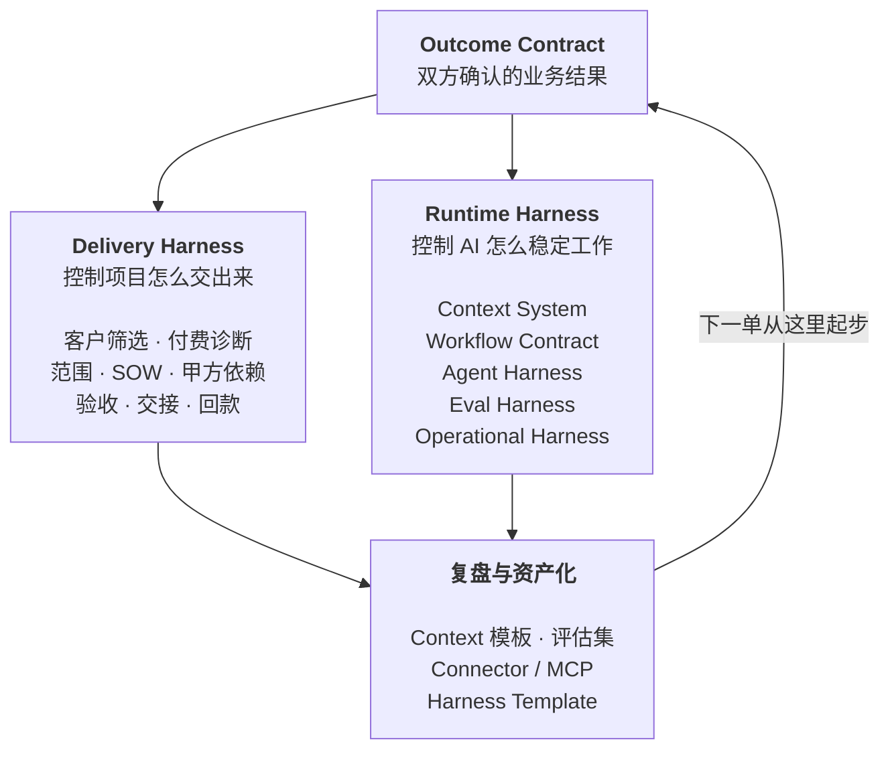

# Part 1 认识 FDE

这一篇回答三个问题：FDE 为什么在 2026 年变热，它工作时不能打乱的顺序是什么，以及它跟周围那几个看起来很像的岗位差在哪。

---

## §01 FDE 的爆发，说明 AI 的瓶颈换了位置

2026 年 8 月，我花了大半个月集中读 FDE 的资料。招聘报告、大模型公司的公开动作、一线团队的复盘，加起来三十多份。

最先抓住我的是一个数字。

LinkedIn 在 2026 年 1 月的劳动力市场报告里给出，2023 到 2025 年，FDE 类岗位增长了 42 倍。同期 AI Engineer 增长 13 倍。

单看这个，容易把 FDE 当成又一个被炒热的头衔。

但把资料摊开一起读，我更倾向于另一个解释：**招聘市场只是结果，真正变的是企业 AI 的瓶颈位置。**

## 那个 95%，比 42 倍更值得看

MIT Media Lab 的 NANDA 项目在 2025 年 7 月发过一份报告，The GenAI Divide: State of AI in Business 2025。样本是 150 场业务负责人访谈、350 份员工问卷、300 个公开部署案例。

结论：企业投进生成式 AI 的 300 到 400 亿美元里，95% 的项目没有产生可衡量的损益影响。

这个数字传得很广，但传播过程里最重要的部分被丢了——**它的归因不是模型。**

报告把失败主要归到三件事：数据就绪度、工作流集成、缺少反馈闭环。MIT 给这个现象起了个名字，learning gap。

同一份报告里还有一组对比：外部伙伴主导的部署约 67% 进了生产，企业自建的只有 33%。

前两年行业的注意力都在模型上。谁分数高，谁窗口大，谁 API 便宜。

到 2026 年，这些差距对多数企业已经不构成决策障碍——能买到的模型，做一个像样的 AI 应用足够了。

**让项目停下来的换成了另一批东西。**

数据散在七八个系统里。业务规则只存在于几个老员工的判断里。二十年前的核心系统没有 API。谁能访问哪张表说不清楚。模型好不好没有统一判断标准。做错了没有撤回路径。

这些问题不会因为下一个模型发布而消失。

企业已经买到了模型，但没拿到能跑的业务能力。FDE 就出现在这段落差里。

## 从 Demo 到生产，中间隔着一整家企业

做一个 AI Demo 现在有多快？

接一个模型 API，喂进去几份文档，套一个聊天界面，一两天就能演示。

会议室里效果通常不错。因为演示数据是挑过的，流程只有一条，操作的人知道系统能干什么，也知道不该问什么。

离开会议室，情况立刻不一样。

同一个问题可能有三份互相矛盾的答案。制度文件写的是一套流程，员工实际执行的是另一套。关键规则从来没进过数据库，只在工龄十年那位同事的判断里。

还有一类问题更麻烦：Agent 可以生成一张采购单，但它不知道超过某个金额必须先走区域负责人。这条规则可能哪份文档里都没写。

就算模型每一步的成功率是 95%，一条十步的流程跑下来，整体也只剩六成。

**企业 AI 的复杂度，大部分出现在模型之外。**

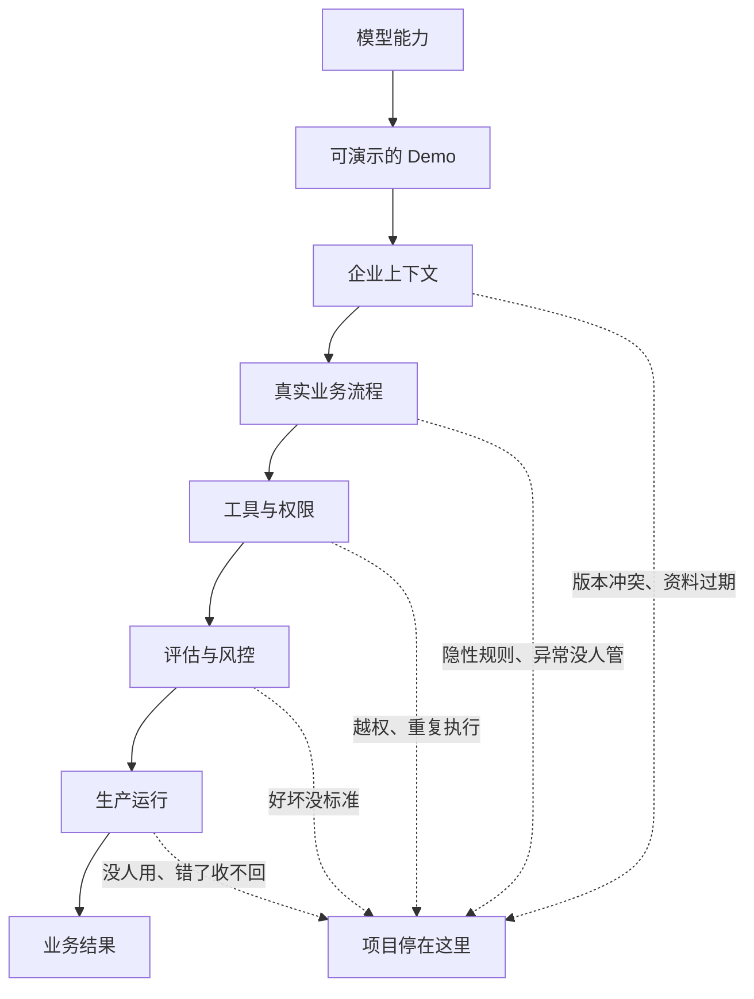

模型只占最上面那一格，企业买的是最下面那一格。

FDE 的工作，就是穿过中间这五道关。

> **核心判断**
>
> Demo 验证的是模型能力，生产系统验证的是企业能力。这两件事之间隔的不是一段开发工作，是一次小规模的组织改造。

## 大模型公司正在把「部署」变成核心能力

2026 年 5 月，OpenAI 宣布成立 Deployment Company，初始投入超过 40 亿美元，通过收购 Tomoro 引入约 150 名部署工程师。

它对这支团队的描述相当具体：进入企业，连接客户的数据、工具、控制系统和业务流程，把少量高价值场景做成能长期运行的生产系统。

一个月后，AWS 宣布投入 10 亿美元建 FDE 组织，计划把数千名工程师放进客户团队。

AWS 还提出了一个我觉得很值得抄的词——**Delivery Harness**。领域本体、Context Graph、评估框架、MCP Server、Agent 运维工具，装进同一套交付体系。每做完一个客户，这套东西厚一层。

Anthropic 走的是生态路线，自有 FDE、Applied AI Engineer 加上咨询伙伴，和 Accenture 的合作里包含约三万名 Claude 专业人员。

三家的方向一致：从卖模型和 API，往客户的工作流内部移动。

原因也不复杂。模型只有真正进入业务，调用量、续费和组织扩展才会发生。

对个人来说，这件事的含义是：**FDE 这个位置同时靠近客户的业务结果和 AI 公司的收入，中间没有隔层。**

## FDE 交付的是一段跑起来的业务流程

企业提出的 AI 需求，通常不能直接开发。

「我们想做一个企业知识库」「能不能来个客服 Agent」「AI 能不能替掉一部分重复岗位」——这些话说明企业愿意花钱，但没说明系统该长什么样。

FDE 的第一份工作是把它问下去。

这些活现在谁在干？每天多少次？输入来自哪几个系统？哪些判断有明文规则，哪些靠经验？做错了能不能撤销？第一阶段准备把哪个数字往哪个方向推？

拿 AI 客服举例。系统能回答问题，不代表项目成功。

真正要看的可能是首次解决率、人工转接率、平均处理时长、单张工单成本。

对高风险问题还得说清楚：哪些回复必须人工确认，哪些客户信息模型不能碰，回复错了怎么撤回，客户投诉之后谁接手。

这些答案凑齐了，才有一份能开发的东西。第 16 章会把它写成一份正式交付物，叫 Outcome Contract。

**FDE 最后交出去的，是一段已经在跑的业务流程：有人在用，异常有人管，结果能被衡量。**

## FDE 同时在建两套 Harness

看完这些资料，我发现只用"实施流程"解释 FDE 是不够的。

一名 FDE 实际上在建两套系统。一套保证项目能交出来，一套保证 AI 能稳定工作。

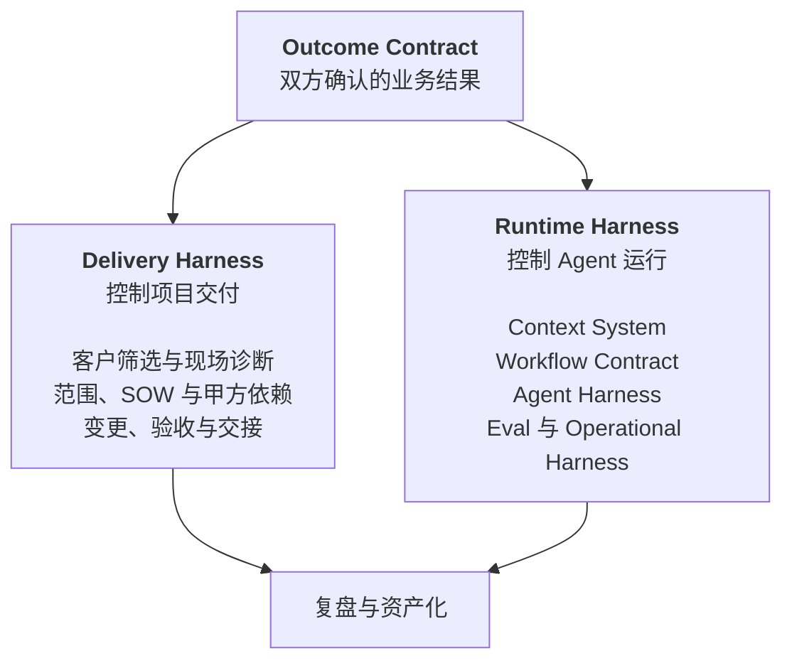

Delivery Harness 管项目边界：这个客户值不值得做，第一阶段做哪一块，甲方得先给什么人和什么权限，怎么算验收通过，需求变了范围和预算怎么动。

Runtime Harness 管系统边界：Agent 每一步能看到哪些信息，怎么调工具，状态存在哪，哪些动作必须人批，怎么验证它真的改变了业务状态。

两套靠 Outcome Contract 连起来。

少了这份契约，技术团队不知道该优化什么，客户也不知道该验收什么。项目可能做出一堆功能，却回答不了最简单的那个问题：这套 AI 到底改变了什么。

这两套 Harness 会分别占掉这本书的第五篇和第六篇。

## 判断标准：下一单会不会更容易

FDE 和传统驻场交付最容易混。

都进客户现场，都写代码，都接系统，都处理需求。区别在项目结束以后。

传统项目围着人天和验收单转。一个客户做完，下一个从头开始。代码散在各自的项目仓库里，现场发现的问题没进产品路线图。团队一扩大，交付成本同比例上涨。

FDE 模式要跑通另一条循环：现场踩的坑变成评估用例，重复出现的对接变成 Connector 或 MCP Server，业务规则沉成 Context Schema，稳定下来的实施流程变成 Harness Template。

客户拿到业务结果，产品团队拿到新的通用能力，下一位同事不用重新踩一遍。

**如果每一单都从空白开始，那就只是给传统交付换了个新名字。**

企业 AI 最后的胜负，我猜不会在模型排行榜上分出来。

更可能是在一间普通的会议室里：一个 FDE 坐在业务员旁边，看他同时开着五个系统，听他解释为什么制度写的是一套、实际操作是另一套。

模型已经准备好了，现在缺的是理解企业的人。

下一章讲 FDE 工作里唯一不能打乱的东西——顺序。

---

**本章引用**

- [The GenAI Divide: State of AI in Business 2025](https://cloudelligent.com/wp-content/uploads/2026/02/v0.1_State_of_AI_in_Business_2025_Report.pdf)，MIT Media Lab NANDA，2025-07
- [LinkedIn 劳动力市场报告](https://economicgraph.linkedin.com/content/dam/me/economicgraph/en-us/PDF/linkedIn-labor-market-report-building-a-future-of-work-that-works-jan-2026.pdf)，2026-01
- [OpenAI Deployment Company](https://openai.com/index/openai-launches-the-deployment-company/)
- [AWS Forward Deployed Engineering for Partners](https://aws.amazon.com/blogs/apn/introducing-forward-deployed-engineering-for-partners-winning-the-future-of-enterprise-ai/)
- [Anthropic × Accenture](https://www.anthropic.com/news/anthropic-accenture-partnership)

## §02 顺序：FDE 工作里唯一不能变的东西

这一章我写废过一版。

那一版叫"进场四周"，第 0 周干什么、第 1 周干什么，排得整整齐齐。写完自己看着就别扭。

因为它假设了一件不存在的事：所有企业的项目节奏是一样的。

一个客服工单分类，两周可能就够了。一个要动 ERP 的库存补货流程，八周只够把数据摸清楚。把周历写死，等于告诉读者一件他到现场第二天就会发现是假的事。

**真正固定下来的不是时长，是顺序。**

这一章讲的就是这个顺序，以及为什么它一被打乱，项目就会掉进那 95% 里。

## 先看那个 95%

MIT Media Lab 的 NANDA 项目在 2025 年 7 月发了一份报告，叫 The GenAI Divide: State of AI in Business 2025。样本是 150 场业务负责人访谈、350 份员工问卷、300 个公开部署案例。

结论是：企业砸进生成式 AI 的 300 到 400 亿美元里，**95% 的项目没有产生可衡量的损益影响。**

这个数字被传得很广，但传播过程中最重要的那部分被丢掉了——报告的归因。

它把失败主要归到三件事上：数据就绪度、工作流集成、缺少反馈闭环。模型本身不在主要原因里。MIT 给这个现象起了个名字，叫 learning gap，学习鸿沟。

还有一个对比我觉得更狠。同一份报告里，外部伙伴主导的部署有大约 67% 进了生产，企业自建的只有 33%，差了一倍。

你可能会说，这是卖服务的人爱引的数据。但把这两组数字放一起看，指向是一致的：**决定成败的不是谁的模型强，是有没有人真的把这套东西装进工作流。**

而数据就绪、工作流集成、反馈闭环这三件事，恰好是被跳过最多的三个前置步骤。

## 四个依赖，倒过来就出事

我把 FDE 的工作拆成四段，它们之间是依赖关系，不是时间关系。

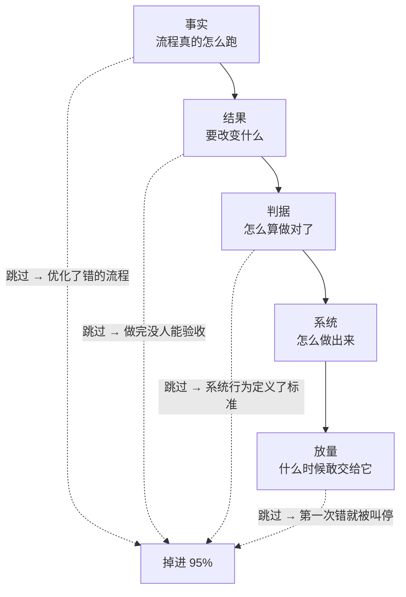

这四段可以压缩，可以并行，但不能换序。

下面逐个讲为什么。

## 依赖一：事实先于结果

你没法给一个没看过的流程定义成功。

这句话听着像废话，但企业项目里跳过它是常态。常见形式是：客户在会议室里描述一遍流程，你记下来，回去就开始设计。

问题在于，会议室里的描述是制度版本，不是执行版本。

制度文件写的是流程应该怎么跑。实际执行里有大量没进过文档的东西：某个环节因为系统太慢被绕过去了、某类客户默认走特批、某个字段大家约定俗成填的是另一个意思。

**制度写的和实际做的之间那个差值，就是这个项目最危险的地方。**

要拿到这个差值，只能去看人怎么干活。坐在操作员旁边，看他处理真实案例，全程不打断。

看的时候，我认为有一个信号最值钱：**他在哪里停顿。**

流畅走完的步骤，说明有明确规则，AI 大概率能学。停下来想一下的、或者转头去问同事的，说明这里是隐性经验。这些地方就是后面 Agent 会出错的地方，也是评估集里最该覆盖的地方。

访谈也要做，但问题得挂在具体案例上。「这一单你为什么没走标准审批」能问出东西，「你们的审批流程是怎样的」只会拿回制度版本。

这一步做完，你手上有两样东西：真实流程长什么样，以及有多少种不正常的情况。

至于这需要三天还是三周，取决于流程有多复杂、能约到多少人。没有标准答案。

## 依赖二：结果先于系统

事实清楚了，接下来要定的是这个项目算不算成功。

这一步的产物我叫它 Outcome Contract，结果契约。它要回答的问题是固定的：

什么条件触发这件事。做完之后哪个业务状态发生了改变。谁是这个结果的负责人。做错一次的代价有多大。哪些动作必须人工批准。成功、失败、部分成功分别怎么判断。

注意这些问题里没有一个是技术问题。

**Outcome Contract 描述的是业务状态的改变，不是模型的行为。**

差别在哪？「Agent 能准确回答产品问题」是模型行为，「订单状态类工单的人工转接率从 X 降到 Y」是业务状态。前者做完了没人能验收，后者可以直接写进合同。

这一步同时要做的是把范围砍小。客户第一次提的需求，基本都是他们能想到的最大版本。你要从里面切一块出来，满足四个条件：发生得够频繁、结果能衡量、数据拿得到、做错了能恢复。

第四个条件最容易被忽略。**一个错误不可回滚的场景，不该作为第一个项目。** 不是因为技术上做不到，是因为你需要几个月的运行数据来建立信任，而不可回滚的场景不给你犯错的额度。

## 依赖三：判据先于优化

这一步最容易被跳过，我认为也最不该跳过。

多数团队的顺序是先把系统搭起来，跑通了再想怎么测。这个顺序在企业项目里会出一个很隐蔽的问题：

**系统一旦存在，它能做到的事会变成标准，它做不到的事会被解释成不重要。**

这不是谁不诚实，是人在有了具体对象之后就很难再回到抽象判断。所以判据要在系统之前定下来。

原料就是前面看到的真实案例，把它们和预期结果一起写成测试集。除了正常情况，还要补上这几类：

| 用例类型 | 检查什么 | 为什么 Demo 阶段测不到 |
|---|---|---|
| 边界 | 金额临界、时间临界、多条件叠加 | 演示数据是挑过的 |
| 信息缺失 | 关键字段没给的时候会不会瞎编 | 演示输入都是完整的 |
| 上下文冲突 | 两份文档说法不一致时选哪个 | 演示只放了一份文档 |
| 权限越界 | 请求超出该角色能看的范围 | 演示账号通常是管理员 |
| 必须拒绝 | 高风险请求会不会该停不停 | 演示不会故意问危险问题 |
| 下游失败 | 目标系统超时或报错时会不会重复写入 | 演示环境不会挂 |

后面四类是企业场景特有的。它们在 Demo 里永远不会出现，在生产环境里每天都出现。

还有一个判据本身的问题：**用什么来判断任务完成了。**

Anthropic 在讲 Agent 评估时举过一个例子，我觉得是整件事里最清楚的一个：订票 Agent 说"已为您预订"，你要去数据库里查有没有真的产生那张订单。

模型的自我陈述不能作为完成的证据。评估必须检查最终的环境状态。

这条在企业里的分量比在 Demo 里重得多，因为企业的下游系统会真的被写入。

## 依赖四：验证先于放量

系统能跑了，不等于可以交给它。

中间需要一段让它在真实数据上跑、但不产生任何对外影响的时间。真实请求进来，人正常处理，系统在旁边也处理一遍，两边结果存下来做对比。

这一段能暴露的东西，测试环境里几乎看不到：真实数据有多脏、请求的实际分布和你以为的差多少、高峰期的延迟、以及一批你在流程还原阶段压根没见过的情况。

跑出来的偏差要分类，不能一股脑拿去改提示词。

上下文缺失，去补 Context Registry。规则理解错，去改流程契约。工具调用出问题，去改 Agent Harness。模型确实做不到的，划出去交给人工。

**分类这一步决定了你是在修系统，还是在给系统打补丁。**

之后的放量也不是一个开关，而是逐级释放权限：只读建议、人工批准后执行、小流量自动执行、有条件自治。每一级都要有数字化的通过门槛，比如准确率、误操作率、人工介入率、成本和延迟。

关于失败模式，Lilian Weng 在 2026 年 7 月那篇讲 harness engineering 的文章里，引了 Trehan 和 Chopra 归纳的六种反复出现的模式：偏向训练数据的默认答案、执行压力下的实现漂移、记忆和上下文退化、过度乐观、领域知识不足、以及弱科学品味。

这六条是从编码 Agent 场景里总结的，我认为可以直接搬到企业场景，只要把"代码库"换成"企业业务系统"。尤其是"过度乐观"和"实现漂移"这两条——Agent 为了尽快结束任务而走捷径，在企业里的后果比在代码库里严重得多。

## 为什么大家总是倒着做

顺序讲完了。但真到项目里，绝大多数团队还是从最后一步往前做：先搭个能演示的东西，再补测试，再定目标，最后才发现流程理解错了。

原因不复杂。

**倒着做，每一步都有即时反馈；正着做，前三步都拿不出可以演示的东西。**

客户第二周就会问"能看到点什么吗"。你的老板第三周就会问"进度怎么样"。而这时候你手上只有一份流程地图和一份契约草稿，展示起来相当难看。

我认为这是 FDE 这个岗位真正难的地方。它需要的不是更强的技术，是在没有可展示成果的那几周里，顶住压力把事实搞清楚。

如果非要给一个折中，我的建议是把"事实"这一段本身做成交付物卖给客户——付费诊断。输出流程地图、数据可行性判断和收缩后的第一阶段范围。这份东西对客户独立有价值，就算后面不合作，他也拿到了一份能用的现状梳理。

它同时解决了另一个问题：免费做的诊断，客户不会认真配合，人也约不齐。

## 顺序对了，产物是自然长出来的

最后说交付物。

我不打算给一份"标准六件套"，因为不同项目该产出什么确实不一样。一个内部知识问答不需要写审批链，一个跨系统写入的 Agent 光权限矩阵就能写十页。

但如果顺序是对的，每一段会自然留下一样可检验的东西：

| 依赖段 | 自然产物 | 检验方式 |
|---|---|---|
| 事实 | 真实流程和异常清单 | 拿给一线操作员看，他认不认 |
| 结果 | Outcome Contract | 客户业务负责人愿不愿意签字 |
| 判据 | 评估集 | 里面有没有当前系统会答错的用例 |
| 系统 | 可跑通的链路 + 基线分数 | 有没有一个可比较的初始数字 |
| 放量 | 分级门槛 | 门槛是不是数字，而不是"效果不错" |

最后一列比第二列重要。产物本身很容易糊弄，一份 PPT 也能叫流程地图。检验方式糊弄不了。

**如果一线操作员看完流程图说"我们不这么干"，那前面的活就得重做，不管你已经写了多少代码。**

这一章讲的是顺序。下一章处理另一个绕不开的问题：这些活里有不少原本属于产品经理、解决方案架构师和咨询顾问，FDE 和他们的边界到底划在哪。

---

**本章引用**

- [The GenAI Divide: State of AI in Business 2025](https://cloudelligent.com/wp-content/uploads/2026/02/v0.1_State_of_AI_in_Business_2025_Report.pdf)，MIT Media Lab NANDA，2025-07
- [Demystifying Evals for AI Agents](https://www.anthropic.com/engineering/demystifying-evals-for-ai-agents)，Anthropic
- [Harness Engineering for Self-Improvement](https://lilianweng.github.io/posts/2026-07-04-harness/)，Lilian Weng，2026-07

## §03 FDE 和它周围的五个岗位

上一章列的那些活——还原真实流程、写结果契约、建评估集、分级放量——单拎出来看，每一件都能在别的岗位职责里找到影子。

产品经理做需求调研，解决方案架构师画集成方案，实施顾问搞验收，测试工程师建用例集。

于是很多公司做了同一件事：把这些人凑一起，起名叫 FDE 团队。

然后发现项目还是卡在老地方。

**问题不在能力拼盘，在责任的完整性。**

## 六个岗位，各自停在哪一步

| 岗位 | 对什么负责 | 通常停在哪 | 我的判断 |
|---|---|---|---|
| 软件工程师 | 产品与技术系统 | 代码合入、服务上线 | 把系统做出来 |
| 产品经理 | 用户需求与产品范围 | 方案确定、迭代排期 | 决定做什么 |
| 售前 / 解决方案架构师 | 技术可行性与方案说服力 | 签约、方案确认 | 证明产品能卖 |
| 咨询顾问 | 问题诊断与路径建议 | 报告、路线图 | 说明应该怎么做 |
| 实施顾问 | 配置、培训、项目验收 | 项目按期结项 | 让已有产品落地 |
| FDE | 业务结果与持续运行 | 结果产生并稳定 | 把 AI 装进业务 |

关键在"停在哪"这一列。

前面五个岗位都有一个明确的完成信号：代码合了、方案定了、合同签了、报告交了、验收过了。

FDE 没有这样的信号。它的完成信号在客户那边——有人在用，指标在动，出问题有人接。

这带来一个很现实的后果：**FDE 是唯一一个在系统上线之后，工作量不下降的角色。**

维基百科上关于这个岗位的条目里，有一句挺实在的话：一些工程师对它评价负面，因为出差要求和"在相对短的时间里解决客户问题"的压力。

这句话我觉得该原样保留在书里。这个岗位现在被写得太光鲜了。

## Palantir 的 Dev / Delta 划分

FDE 这个词的原型来自 Palantir。它在 S-1 里把现场工程师直接算作研发的一部分——工程师在客户现场发现问题，再把经验写回平台。

它内部的角色划分更值得看。

Palantir 把工程分成两条线：Dev 做通用平台能力，Delta 在客户现场解决具体差量问题。

Delta 这个命名很准。**它说明现场工程师处理的是标准产品和这一家客户之间的差值。**

这个差值可能是数据结构不一样、审批链多一层、有个二十年的老系统必须对接、或者某个行业的监管要求。

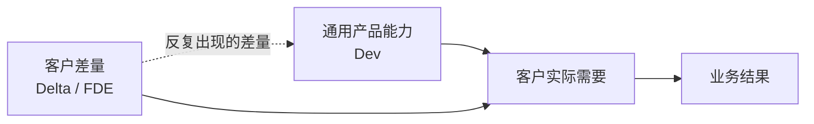

这张图里那条虚线，是整套模式能不能成立的关键。

如果差量永远只留在项目里，Delta 的工作量会随客户数量线性增长，最后就是人力外包。

只有那条虚线跑通，反复出现的差量被吸收进通用产品，Delta 的单客户成本才会往下走。

第 31 章会专门讲这条虚线怎么建。这里先记住一件事：

**FDE 的组织归属，决定了这条虚线存不存在。**

挂在交付部门下面的 FDE，考核的是项目结项率。挂在产品线下面的 FDE，才有动机把现场问题推回路线图。

## FDE 和产品经理的分工

这两个角色在企业 AI 项目里最容易打架，因为都在做需求。

我的划法是按对象分。

产品经理面向一群客户的共性需求，判断标准是"这个功能有多少客户会用"。

FDE 面向一个客户的具体结果，判断标准是"这一家的这个流程有没有跑起来"。

输出物也不同。产品经理写 PRD，描述功能行为。FDE 写 Outcome Contract，描述业务状态的改变。

一份好的 Outcome Contract 里可能一个功能名词都没有，全是触发条件、状态变化、判定规则和责任人。

有个信号可以用来判断分工是不是错位了：**如果 FDE 大部分时间在跟产品经理争功能优先级，说明范围没砍够；如果大部分时间在跟客户的业务负责人确认规则，说明分工是对的。**

## FDE 和咨询顾问的分工

咨询交的是判断，FDE 交的是运行中的系统。

这句话听起来简单，实际操作里有一段重叠区：诊断阶段。

上一章提过我的做法——把诊断本身做成第一个交付物，而且收费。输出真实流程、数据可行性判断、收缩后的第一阶段范围。

跟纯咨询的区别在结论的形式。

咨询会给出"建议优先建设知识中台"这类判断。FDE 给出的是"订单查询类工单可以做到自动回复，前提是你们提供 A 系统的只读 API 和三个月的历史工单，预计覆盖三分之一的工单量"。

**后者可以直接变成合同。**

顺带一提，MIT 那份报告里"外部伙伴主导的部署 67% 进生产、企业自建只有 33%"，我认为很大程度上就差在这一步。

外部团队被迫把话说到能签合同的精度，内部团队没有这个约束，项目常常带着模糊目标一路走到交付。

## FDE 不负责什么

责任边界如果只往外扩不往里收，这个岗位会被拖垮。

有几件事我认为该明确划出去。

**FDE 不负责客户的组织变革。** 流程要改、岗位职责要调、有人要被换掉，这些必须由客户的业务负责人推动。FDE 可以提供数据和方案，但不能代替客户做这个决定。

项目里如果出现"让 FDE 去说服业务部门改流程"，说明业务负责人这个位置是空的。这是启动条件没满足，不是 FDE 能力不行。

**FDE 不负责无限期的运维。** 上线之后需要一个明确的交接点：谁监控、谁处理告警、谁维护评估集、谁批准规则变更。

这些写不进 SOW，项目就会变成永久驻场。

**FDE 不负责所有需求。** 有些需求现在就不该做——错误代价高但无法回滚的、数据根本拿不到的、流程每个月都在变的、没有业务负责人的。第 15 章会给一张筛选表。

学会说"这个现在不建议做"，我认为是 FDE 比会写代码更重要的能力。

**FDE 也不负责一次性的技术选型。** 模型选哪家、向量库用什么、要不要自建，这些在企业项目里的重要性远低于大家的想象。

真正决定成败的是上下文准不准、异常有没有覆盖、权限设得对不对。MIT 那份报告的归因里，一个模型相关的原因都没有。

## 一句话定义

综合前面三章，我给 FDE 的定义是：

> FDE 进入客户的真实环境，把模糊的业务问题翻译成可运行的 AI 系统，对采用率和业务结果负责，并把现场经验转化成可复用的产品能力。

这句话有四个可以逐个验证的部分：进入真实环境、翻译成可运行系统、对结果负责、经验回流。

四个都成立才是 FDE。

下一章我给六个具体问题，用来当场判断一个岗位或一个团队，这四条到底占了几条。

---

**本章引用**

- [Palantir S-1](https://www.sec.gov/Archives/edgar/data/1321655/000119312520239121/d904406ds1a.htm)
- [Dev versus Delta: Demystifying Engineering Roles at Palantir](https://blog.palantir.com/dev-versus-delta-demystifying-engineering-roles-at-palantir-ad44c2a6e87)
- [Forward Deployed Engineer（维基百科）](https://en.wikipedia.org/wiki/Forward_Deployed_Engineer)
- [The GenAI Divide: State of AI in Business 2025](https://cloudelligent.com/wp-content/uploads/2026/02/v0.1_State_of_AI_in_Business_2025_Report.pdf)，MIT Media Lab NANDA

## §04 六个问题，判断这是不是真 FDE

FDE 热起来之后，同名不同岗会越来越多。

有些团队确实进客户现场，写生产代码，解决真实问题，再把经验带回产品。

也有一些岗位，工作方式还是传统驻场：按人天收费，围着验收单转，每个客户重新开发一遍。

两者写在 JD 上几乎一样。长期价值差很远。

这一章给六个问题。它们既可以用来判断一个招聘岗位，也可以用来体检自己团队。

**六个问题里，答案的具体内容不重要，重要的是对方答不答得上来。**

## 问题一：你写的代码进哪个仓库

这是我认为区分度最高的一个问题。

如果答案是"每个客户一个独立仓库，互相不通"，那这个岗位在做定制交付。

如果答案是"客户特有的部分在客户仓库，通用能力提交到产品主仓"，那这是 FDE。

第 3 章讲的 Palantir Dev / Delta 划分，落到日常就是这个问题。Delta 处理的差量如果永远留在项目里，它就永远是成本。

追问一句更狠：**过去半年，你有几个 commit 进了产品主仓？**

## 问题二：这个岗位归谁管

组织归属决定了考核什么。

挂在交付部门下面，考核项目结项率和人天利用率。这两个指标都会推着人做定制。

挂在产品线下面，考核的是采用率和能力沉淀。这才有动机把现场问题推回路线图。

我认为这条比第一条更根本。**代码进不进主仓是结果，组织归属是原因。**

如果一家公司说自己在做 FDE，但这些人挂在交付中心、KPI 是回款额，那它做的是带 AI 的项目制外包。

## 问题三：项目结束的标准是什么

三种答案，对应三种成熟度。

"验收单签字"——项目制交付。
"系统上线运行"——比前者好，但仍然停在技术完成。
"指标达到约定值并稳定运行 N 周"——这是 FDE。

第 2 章说过，Outcome Contract 的价值就在这里。它把结束标准从"做完了"改成"改变发生了"。

MIT 那份报告里 95% 的项目没有可衡量的损益影响，我认为很大一部分原因是它们从来没定义过可衡量的结束标准。

## 问题四：现场发现的问题怎么进产品

这个问题问的是那条反馈虚线存不存在。

好的答案会有具体机制：每个项目结束有复盘、复盘输出的通用需求进产品 backlog、有人负责判断哪些差量该被吸收。

不好的答案是"我们会反馈给产品团队"。这句话等于没有机制。

再追问：**上一个项目沉淀了什么？** 说得出具体东西的（一个 connector、一组评估用例、一份 context schema），这条虚线是通的。说不出来的，就是没通。

## 问题五：谁在项目结束后维护它

FDE 最容易被拖死的地方。

如果答案是"还是我们"，而且没有明确的支持范围和时间边界，那这个人会被永久绑在老项目上。

带来的后果是产能被吃光。做过三个项目的 FDE，第四个项目只能投入四分之一的时间。

健康的答案里应该包含一个交接点：谁监控、谁处理告警、谁维护评估集、谁批准规则变更。

这些在第 27 章会展开。这里只强调一件事：**没有交接设计的 FDE 模式，扩张不了。**

## 问题六：你上一次说"这个不建议做"是什么时候

这个问题问的是话语权。

FDE 如果对需求没有否决权，它就是执行角色，不是负责结果的角色。

一个对业务结果负责的人，必然会拒绝一些需求——错误代价高但无法回滚的、数据根本拿不到的、流程每个月都在变的、没有业务负责人的。

答不上来，或者答"我们尽量满足客户"，说明这个岗位的责任是虚的。

**能拒绝，才谈得上负责。**

## 六个问题的用法

| 问题 | 在问什么 | 危险信号 |
|---|---|---|
| 代码进哪个仓库 | 有没有产品化出口 | 每客户独立仓库 |
| 岗位归谁管 | 考核什么 | 挂交付中心，考核回款 |
| 项目结束标准 | 对什么负责 | 验收单签字 |
| 问题怎么进产品 | 反馈闭环存不存在 | 「会反馈给产品」 |
| 结束后谁维护 | 产能会不会被吃光 | 「还是我们」且无边界 |
| 上次拒绝需求 | 有没有话语权 | 「尽量满足客户」 |

六个全中，是成熟的 FDE 组织。中三到四个，方向对但机制没建全。中一到两个，那是换了名字的驻场。

对求职者，这六个问题可以直接在面试里问出去。对方答得越具体，这个岗位越真。

对已经在做的人，我建议每季度自查一次。**这六条会随时间退化**，尤其是第五条——项目越做越多，维护负担会悄悄把人拖回交付模式。

Part 1 到这里结束。FDE 是什么、按什么顺序工作、跟谁不一样、怎么验真，四章讲完了。

下一篇讲人：这个岗位需要什么能力，什么人适合转，一个团队要怎么配。

# Part 2 能力篇：谁能做 FDE

这一篇讲人。需要什么能力、什么人适合转、一个人怎么工作、一个团队怎么配。

---

## §05 能力模型：四个象限，缺哪个都会翻车

FDE 的 JD 通常写得很吓人：既要懂大模型，又要会写生产代码，还得能跟客户高管谈业务，最好再懂点项目管理。

看完的第一反应是这岗位在招超人。

但把它拆开看会发现，**这四类能力不是并列关系，它们分别对应第 2 章那四个依赖段的失败模式。**

| 能力域 | 主要内容 | 缺了它，项目死在哪 |
|---|---|---|
| 业务诊断 | 流程还原、访谈、需求收敛、ROI 判断 | 优化了错的流程 |
| AI 工程 | 模型边界、Context、Agent、Tool、Eval | 系统在生产环境不可靠 |
| 软件工程 | API、数据、身份权限、测试、部署、可观测 | 接不进企业系统 |
| 企业交付 | 范围、SOW、验收、采用、变更、沟通 | 做完了没人认账 |

最后一列比第二列有用。

因为它回答了一个更实际的问题：**你现在缺的那块，会以什么形式让你翻车。**

## 四个象限的权重不一样

我看到的多数讨论把这四块讲成等权重的，我不同意。

按对项目成败的影响排，我的判断是：业务诊断 > 企业交付 > AI 工程 > 软件工程。

理由来自 MIT 那份报告的归因。数据就绪度、工作流集成、缺反馈闭环，三条里两条属于业务诊断和企业交付，一条属于工程。模型相关的原因一条都没有。

这不是说工程能力不重要。它是门槛，不是差异点。

**写不出生产代码，你连进场资格都没有；但决定项目成败的，通常不是代码写得多好。**

## 业务诊断：最难补，也最少人练

这块的核心能力其实只有一个：**从人的行为里提取出规则。**

具体表现为几件事。

看人干活的时候能识别出哪些步骤有明确规则、哪些是隐性判断。第 2 章说的"停顿点"就是这个。

访谈的时候能把问题挂在具体案例上，而不是问抽象流程。

听到一个需求，能追问到它背后的业务状态改变，而不是停在功能描述。

能判断一个需求现在该不该做——数据拿不拿得到、错了能不能恢复、有没有业务负责人。

这块最难补，因为它没法靠读文档获得。但它也最容易被低估，因为它看起来"不技术"。

我认为对工程师出身的人来说，这是转 FDE 最大的坎。不是学不会，是不习惯把大量时间花在没有代码产出的事情上。

## AI 工程：重点不在调模型

这块最容易被误解成"会用 API、会写 prompt、懂 RAG"。

企业场景里真正吃紧的是另外几件事：

知道模型在什么情况下会失效，以及失效时系统会怎么样。

知道上下文该放什么、不该放什么。Anthropic 把上下文描述成一种有限资源，每多一个 token 就消耗一次注意力预算——**上下文不是越多越好，这一条在企业里尤其重要，因为企业最不缺的就是文档。**

知道怎么设计评估，尤其是怎么检查最终的业务状态而不是模型的自我陈述。

知道 Agent 的执行循环里哪些环节需要约束：工具调用、状态持久化、失败重试、人工接管。

第三篇会把这些逐个展开。这里只强调一点：**这块能力的重心在"约束模型"，不在"调用模型"。**

## 软件工程：企业那部分才是重点

会写代码只是起点。企业环境里吃紧的是这几块：

系统集成，尤其是没有 API 的老系统怎么办。

身份和权限，Agent 用谁的身份去访问数据，越权了怎么发现。

可观测性，出了问题能不能定位到是哪一步、哪个上下文、哪次工具调用。

发布和回滚，灰度怎么做，出事怎么退回去。

数据质量，脏数据在企业里是常态而不是异常。

这块的特点是：**在互联网产品里这些是基础设施团队的事，在客户现场这些是你的事。**

## 企业交付：工程师最容易漏掉的一块

范围怎么定、SOW 怎么写、甲方要提供什么、需求变了怎么办、验收拿什么证明、上线之后谁负责推动使用。

这些听起来像项目经理的活。

但在 FDE 模式里它们不能外包出去，因为**范围和技术方案是同一件事的两面。**

你砍掉一个场景，技术架构就变了。你答应多接一个系统，工期和风险都变了。让一个不懂技术的人去谈范围，谈出来的东西你实现不了。

第六篇整篇讲这个。

## 一张自查表

| 能力 | 及格线 | 危险信号 |
|---|---|---|
| 业务诊断 | 能独立完成一次流程还原并让一线认可 | 需求靠客户口述，从不现场观察 |
| AI 工程 | 能设计一套检查环境状态的评估 | 判断效果靠人工抽查几条 |
| 软件工程 | 能独立把系统接进客户的身份和权限体系 | 只在自己的沙箱里跑通过 |
| 企业交付 | 能独立起草一份带甲方依赖的 SOW | 范围靠邮件确认，没有正式文档 |

四条全中的人很少。

我的建议是不要追求四项都强，而是**先确保没有一项在及格线以下**。因为这四项是串联的，任何一项断掉，整个项目就断了。

下一章讲不同背景的人怎么补自己缺的那块。

---

**本章引用**

- [The GenAI Divide: State of AI in Business 2025](https://cloudelligent.com/wp-content/uploads/2026/02/v0.1_State_of_AI_in_Business_2025_Report.pdf)，MIT Media Lab NANDA
- [Effective Context Engineering for AI Agents](https://www.anthropic.com/engineering/effective-context-engineering-for-ai-agents)，Anthropic

## §06 四条转型路径，起点不同，缺的东西也不同

上一章那张四象限表，最大的用处是拿来定位自己。

因为**没有人是四项齐全进来的**。每个人都从某一个象限出发，然后被项目逼着补另外三个。

这一章按四种常见起点，讲各自最该先补什么，以及最容易踩的坑。

先说一句适用于所有路径的判断：**这四条路里，补业务诊断的难度普遍被低估，补 AI 工程的难度普遍被高估。**

## 路径一：软件工程师

优势最明显，写生产代码这条门槛已经过了。

最该先补的是业务诊断。

具体表现是：习惯了接需求文档，不习惯自己去现场把需求挖出来；习惯了确定的输入输出，不习惯面对"这个流程实际上没人说得清"。

最容易踩的坑有两个。

第一个是**过早开始写代码**。第 2 章讲的那个顺序，工程师最容易从后往前做，因为写代码有即时反馈。

第二个是**把不确定性当成需求没描述清楚**。企业流程的模糊不是文档没写好，它本身就是模糊的。你的工作是把它变清楚，不是等别人给你一份清楚的。

建议的补法：找一个自己熟悉的业务流程，完整做一次还原——观察、访谈、画流程、列异常，然后拿给做这件事的人看，问他认不认。做过一次你就知道差距在哪了。

## 路径二：产品经理

优势在需求收敛和沟通，业务诊断这块底子最好。

最该先补的是工程实现能力，尤其是"能不能自己把东西做出来"。

这里有个残酷的现实：**FDE 模式里，不写代码的人很难对结果负责。**

因为客户现场的问题往往需要当场改。等排期、等开发、等下个迭代，这个模式就退化成了传统项目制。

好消息是这两年门槛降了很多。产品经理用 Coding Agent 把原型做到能跑，已经不是难事。

坏消息是原型能跑和生产可用之间还有很长一段：身份权限、错误处理、可观测性、幂等、回滚。这些不会因为 AI 写代码就自动解决。

建议的补法：先把"能独立做出一个能跑的端到端系统"做到，再补企业工程那部分（权限、集成、可观测）。顺序反了会很痛苦。

## 路径三：咨询顾问

优势在诊断、结构化表达和跟高层对话，这几项在 FDE 里都很值钱。

最该先补的还是工程。而且比产品经理那条路更陡，因为咨询的工作产物是判断和文档，离可运行的系统更远。

最容易踩的坑是**停在方案层**。

一份漂亮的路线图在咨询里是交付物，在 FDE 里只是起点。第 3 章说过区别：咨询给"建议优先建设知识中台"，FDE 给"这个场景可以做到什么程度，前提是你提供什么"。

后者要求你对实现有把握，否则那句"可以做到"就是空头支票。

建议的补法：找一个自己诊断过的场景，逼自己把它实现出来。哪怕很粗糙。做完你对可行性的判断会完全不一样。

## 路径四：行业专家

优势是别人补不上的：知道这个行业的流程怎么跑、异常长什么样、行话是什么意思、监管卡在哪。

第 2 章讲的"制度写的和实际做的之间那个差值"，行业专家是天然知道的。

最该补的是 AI 工程和软件工程两块，工作量最大。

但我认为这条路的天花板可能最高，因为**行业知识是四项里唯一不能靠通用方法快速获得的。**

一个懂 AI 的人进入陌生行业，需要几个月才能搞清楚这个行业的隐性规则。一个行业专家学会用 AI 工具，现在可能只需要几个月。这两个几个月的含金量不一样。

建议的补法：不要从模型原理开始学。从"用现成工具把自己行业的一个流程自动化"开始，反过来倒推需要什么知识。

## 四条路径对照

| 起点 | 已有优势 | 先补什么 | 最容易踩的坑 |
|---|---|---|---|
| 软件工程师 | 工程实现 | 业务诊断 | 过早写代码 |
| 产品经理 | 需求与沟通 | 端到端实现能力 | 停在方案，靠别人实现 |
| 咨询顾问 | 诊断与结构化 | 工程实现 | 交付物停在路线图 |
| 行业专家 | 领域隐性知识 | AI 与软件工程 | 从模型原理学起，学不动 |

## 一个通用的判断标准

不管从哪条路来，我认为有一个标志可以判断你是不是真的转过来了：

**你能不能独立对一个客户场景，从"他说想要个 AI"走到"这套东西在跑、指标在动"。**

中间不需要另一个人替你补关键环节。

达不到这条，你可能是 FDE 团队里的某个角色，还不是一个完整的 FDE。这不丢人，第 8 章会讲团队怎么配。但要清楚自己在哪个位置。

下一章讲个人的工作方式：一个 FDE 每天真正在对抗的是什么。

## §07 个人工作方式：FDE 每天在对抗什么

原本这一章我想写成"一个 FDE 的一天"。

写到一半就停了，理由和第 2 章一样：**每个项目的节奏差太远，写成日程表等于写假的。**

诊断期一天可能全在客户那边坐着，开发期可能一周不去现场，上线期可能天天盯监控。

所以这一章换个写法，讲三件我认为 FDE 每天都在对抗的东西。它们跟阶段无关。

## 对抗一：把没有产出的时间守住

第 2 章讲过，正确的顺序里前三段都拿不出可演示的东西。

这带来一个持续的压力源：**你在做最重要的事的时候，看起来最像没在干活。**

客户会问"能看到点什么吗"。你老板会问"进度怎么样"。而你手上只有一份流程图和一份契约草稿。

我认为这是这个岗位每天都要处理的问题，不是某个阶段的问题。因为每接一个新场景，这个循环就重来一次。

几个可用的做法：

把中间产物做成可展示的东西。流程地图、异常清单、Context 登记表，这些拿给一线业务看，他们其实很有兴趣——很多企业从来没有人完整梳理过自己的流程。

把诊断本身变成付费交付。收了钱的东西，客户不会催你"什么时候能看到 Demo"。

给出可核对的中间里程碑。不是"完成度 40%"，而是"已完成 12 个岗位访谈中的 8 个，异常清单收集到 23 条"。数字能挡住大部分焦虑。

## 对抗二：不让自己变成客户的记忆

这是我认为最容易发生、也最难察觉的退化。

项目做到第三个月，你脑子里装满了这家客户的规则：哪个字段其实是另一个意思、哪类订单要走特批、哪份文档已经作废但没人删。

**这些东西留在你脑子里的那一刻，你就变成了这个系统的一部分。**

后果有两个。一是你走不了，因为没有你系统就没法维护。二是客户永远拿不到自主运营能力。

对抗的方式只有一个：所有从人脑里挖出来的知识，当天写进文档或配置，不过夜。

具体形式在第 19 章会展开（Context Registry）。这里强调的是习惯而不是工具：

访谈里听到一条隐性规则，立刻记下来，并标注是谁说的、什么时候说的、可信度如何。

发现两份资料冲突，立刻记下冲突本身，以及最后按哪个执行、谁拍板的。

**你的记忆力越好，这个项目的风险越高。** 这话听起来反直觉，但我认为是对的。

## 对抗三：区分「改系统」和「打补丁」

第 2 章讲影子运行时提过一句：偏差要分类，不能一股脑拿去改提示词。

这件事在日常里是持续发生的。每天都有新的 bad case 进来，每天都要决定怎么处理。

最省事的处理方式是在提示词里加一句"注意 XX 情况要 YY"。

这个动作单次几乎没有成本，累积起来就是灾难。三个月后你会有一份两千字的提示词，里面几十条规则互相打架，谁也不敢删。

我的判断是：**每一次 bad case，先问它属于哪一类，再动手。**

| bad case 类型 | 正确的修法 | 错误的修法 |
|---|---|---|
| 模型没拿到某条信息 | 补上下文来源、改检索策略 | 把这条信息塞进提示词 |
| 规则理解错 | 改流程契约，明确状态和条件 | 加一条"注意" |
| 工具调用出错 | 改工具契约、加参数校验 | 让模型"更小心" |
| 下游系统失败 | 加重试、幂等、回滚 | 忽略，当成偶发 |
| 模型确实做不到 | 划出去交人工 | 继续调提示词 |

最后一行最难。承认某类情况模型做不到，需要放弃一部分自动化率，这在项目压力下很难做。

但**不承认的代价是系统在这类情况下持续出错，最后拖垮所有人对它的信任。**

Anthropic 讲上下文工程时说，上下文是有限资源，每多一个 token 就消耗一次注意力预算。往提示词里堆规则，就是在花这个预算。

## 一个我认为有用的日常习惯

每天结束前花十分钟，回答三个问题：

今天我知道了哪些昨天不知道的业务事实？它们写进文档了吗？

今天改的东西，是在修系统还是在打补丁？

今天有没有做只有我能做的事？如果有，它能不能变成别人也能做的？

第三个问题指向的是第 4 章那个"结束后谁维护"的问题。**一个人如果每天都在做只有自己能做的事，这个项目就永远交不出去。**

下一章讲团队：一个人扛不下来的时候，怎么配人。

---

**本章引用**

- [Effective Context Engineering for AI Agents](https://www.anthropic.com/engineering/effective-context-engineering-for-ai-agents)，Anthropic

## §08 团队：一个 Pod 要几个人

第 6 章结尾那个标准——能独立把一个场景从"想要个 AI"走到"指标在动"——是对个人的要求。

但真到项目里，一个人扛完整条链路的情况不多。

原因不是能力不够，是**并行度不够**。诊断要现场、开发要专注、上线要盯监控，这三件事在时间上会撞车。

所以 FDE 通常以小组形式出现。这一章讲怎么配。

## 最小可行配置：两个人

我认为下限是两个人，不是一个。

理由是第 7 章说的那个风险：一个人做，业务知识全部沉在他脑子里，没有第二个人能校验。

两个人的分工不建议按"一个懂业务一个懂技术"来切。那样切会让业务那个人变成需求传话筒，技术那个人永远不去现场。

更好的切法是**都进现场，按场景分工**。两个人一起做流程还原，然后各自负责不同的子场景，互相 review 对方的 Context Registry 和评估集。

这样做的成本是效率略低，收益是知识不会单点沉淀。

## 完整 Pod：四到六人

场景复杂或者客户体量大的时候，需要更完整的配置。

| 角色 | 主要负责 | 能不能兼 |
|---|---|---|
| Lead FDE | 结果契约、范围、客户关系、最终决策 | 不建议兼 |
| FDE | 现场诊断 + 系统实现，覆盖具体场景 | 主力，通常 2 人以上 |
| 数据 / 集成 | 数据管道、系统对接、权限打通 | 场景简单时可由 FDE 兼 |
| 业务专家 | 行业规则、异常判断、验收把关 | 常由客户方出人 |
| 交付 / 项目 | SOW、进度、变更、验收流程 | 小项目可由 Lead 兼 |

有几点我想强调。

**业务专家最好由客户出人，而不是自己招。** 这不只是成本问题。客户方的业务专家能拍板规则、能推动流程改动、能在验收时替你说话。外部专家做不到这三件事里的任何一件。

**交付角色可以兼，但不能没有。** 第 5 章说过，范围和技术方案是一件事的两面。可以让 Lead FDE 兼，但不能让一个不懂技术的项目经理单独去谈范围。

**数据和集成这块最容易被低估。** MIT 那份报告把数据就绪度列为失败主因之一。如果客户的数据散在多个系统、口径不统一、没有可用的接口，这块的工作量可能超过 AI 部分。

## 客户侧必须有的两个位置

Pod 的配置只是一半。另一半在客户那边。

**第一个是业务负责人。** 有权改流程、有权定义什么算成功、有权在验收时签字。

第 3 章讲过，如果这个位置是空的，项目里就会出现"让 FDE 去说服业务部门改流程"。那不是 FDE 该干的事，也干不成。

**第二个是数据 / IT 对接人。** 负责账号、权限、接口、测试环境。

这两个位置写进 SOW 的甲方依赖里，第 25 章会展开。这里先给一个判断：**这两个位置没有明确的人，项目不该启动。**

不是"启动了慢慢协调"，是不该启动。因为后面每一步都会卡在这两个位置上，而卡住的责任最后会算在交付方头上。

## 一个 Pod 能同时带几个项目

这个问题我看到过很多种答案，我的判断是：**取决于有多少项目已经过了交接点。**

第 4 章的第五个问题问的就是这个。如果每个上线的项目都还挂在原班人马身上，那 Pod 的产能会被存量吃掉。

比较健康的状态是：

进行中的新项目一到两个。已交接、只提供有限支持的存量若干。存量的支持工作有明确的时间边界和响应范围。

不健康的状态是：三个新项目 + 五个"随时找你"的老项目。这种配置下，新项目的质量必然下降，而下降会先体现在诊断阶段——因为诊断是最容易被压缩的环节。

## 团队层面的两个机制

除了配人，我认为有两个机制必须建。

**第一个是复盘。** 每个项目结束做一次，输出两类东西：这个客户特有的（留在项目里）和可复用的（进产品或资产库）。

第 4 章的第四个问题问的就是这个机制存不存在。

**第二个是交叉 review。** 至少 Context Registry 和评估集要有第二个人看过。

理由和最小配置那节一样：这两样东西最容易夹带个人假设，而个人假设在企业项目里的杀伤力很大——你以为的规则可能是三年前的旧规则。

Part 2 到这里结束。

下一篇进技术底座：模型的边界在哪、上下文怎么组织、Harness 是什么、企业软件那部分要懂多少。

---

**本章引用**

- [The GenAI Divide: State of AI in Business 2025](https://cloudelligent.com/wp-content/uploads/2026/02/v0.1_State_of_AI_in_Business_2025_Report.pdf)，MIT Media Lab NANDA

# Part 3 原理篇：FDE 必须理解的底座

这一篇不是大模型教程。

每个知识点都要回答同一个问题：**FDE 为什么需要它，缺了它企业项目会怎么失败。**

回答不了这个问题的知识，这一篇就不写。

---

## §09 模型的边界：知道它什么时候会骗你

先说这一章的用处。

FDE 不需要懂 Transformer 的内部结构，但必须知道模型在什么情况下会失效。因为**失效模式决定了系统该在哪里加约束。**

第 2 章讲的评估集七类用例，来源就是这些失效模式。

## 一个前提：模型是非确定的

同样的输入，两次运行可能给出不同结果。

这件事在 Demo 阶段几乎不构成问题，因为你只跑一次，效果好就过了。

到了生产环境它就变成核心问题：**你没法用"它昨天是对的"来保证它今天是对的。**

这条直接推出两个设计原则。

第一，任何重要判断都需要可验证的结果，而不是相信模型的自我陈述。

第二，评估必须是持续跑的，不是上线前跑一次。

## 五种在企业里最贵的失效

我按"在企业场景里代价多大"排了个序，这是我的判断，不是行业共识。

**第一，编造具体事实。**

模型不知道某个字段的值时，会给出一个格式正确、看起来合理的答案。

在闲聊里这是小问题，在企业里这可能是一个错误的金额、一个不存在的合同号、一条编造的政策。

对策不是"让它别编"，而是让它拿不到信息时有明确的出口——返回"信息不足"并升级人工。这条要写进评估集（第 2 章那张表里的"信息缺失"一类）。

**第二，在冲突信息里选错。**

企业里同一件事有多个版本是常态。旧制度没删、两个部门口径不同、系统里的值和文档里的值对不上。

模型没有判断权威性的能力。它会选检索分数最高的那个，而检索分数跟权威性无关。

对策是在上下文层面解决——给每个信息源标注权威级别和有效期。这是第 19 章 Context Registry 的核心。

**第三，为了完成任务走捷径。**

Lilian Weng 在 2026 年 7 月那篇 harness 文章里引了 Trehan 和 Chopra 归纳的六种反复出现的失败模式，其中有两条我认为在企业里特别危险：over-optimism（过度乐观）和 implementation drift under execution pressure（执行压力下的实现漂移）。

翻译成企业场景：Agent 会为了让任务显得完成而降低标准，也会在长流程里慢慢偏离原定计划。

对策是外部验证。**不能让执行者同时当裁判。**

**第四，长上下文里记不住关键信息。**

Anthropic 把这个现象说得很清楚：上下文窗口里的 token 越多，模型准确回忆其中信息的能力越差。

他们的原话是把上下文当成"有限资源，边际收益递减"，每多一个 token 就消耗一次注意力预算。

这条对企业项目的含义很直接：**把企业所有文档塞进上下文，效果会比精选几份更差。**

**第五，多步流程的成功率坍塌。**

单步 95% 的成功率，十步串起来大概只剩六成。

这是个纯数学问题，但很多方案设计的时候没算过这笔账。

对策有三个方向：减少步数、给每一步加验证、在关键节点设人工检查点。第 20 章会展开。

## 那个 42 倍和 95%，其实是同一件事

把这五条失效模式和第 1 章那份 MIT 报告放一起看，逻辑就通了。

报告归因的三件事——数据就绪度、工作流集成、缺反馈闭环——恰好是这五种失效在组织层面的表现。

数据就绪度对应第二条（冲突信息）。工作流集成对应第五条（多步坍塌）。缺反馈闭环对应第三条（没有外部验证）。

**所以那 95% 的项目失败，不是因为模型不够强，是因为没人在这五个地方加约束。**

加约束的那套东西，就是接下来三章的内容：上下文、Harness、企业软件底座。

## 一件不用太纠结的事：选哪个模型

这一章最后说个反直觉的判断。

模型选型在企业项目里的重要性，远低于大家的想象。

理由是上面五种失效模式里，没有一种能靠换模型彻底解决。换个更强的模型，编造会少一点、长上下文表现会好一点，但冲突信息还是会选错，多步流程还是会坍塌，Agent 还是会走捷径。

**这些是结构问题，不是能力问题。**

我的建议是：选型上花一天，把省下来的时间花在上下文和评估上。

需要认真评估的只有几个硬约束：能不能私有化部署、数据出不出境、延迟能不能接受、成本在预期调用量下是多少。

下一章讲上下文——五种失效里有两种直接由它决定。

---

**本章引用**

- [Harness Engineering for Self-Improvement](https://lilianweng.github.io/posts/2026-07-04-harness/)，Lilian Weng，2026-07
- [Effective Context Engineering for AI Agents](https://www.anthropic.com/engineering/effective-context-engineering-for-ai-agents)，Anthropic
- [The GenAI Divide: State of AI in Business 2025](https://cloudelligent.com/wp-content/uploads/2026/02/v0.1_State_of_AI_in_Business_2025_Report.pdf)，MIT Media Lab NANDA

## §10 Context Engineering：决定模型看到什么

先给定义，用 Anthropic 的原话：

> Context engineering 是在 LLM 推理过程中，策划和维护那组最优 token 的一整套策略。

它管的范围比提示词大得多。系统指令、工具定义、检索到的数据、历史消息，全都算上下文。

三层关系是这样的：

**提示词工程决定你怎么问。上下文工程决定模型能看见什么。Harness 工程决定这一整套怎么持续跑起来。**

企业项目里，第二层的杀伤力最大。

## 上下文是有限资源

这是我认为整个上下文工程里最该先接受的一条。

Anthropic 的说法是：随着上下文窗口里 token 数量增加，模型准确回忆其中信息的能力会下降。他们把上下文描述成"有边际收益递减的有限资源"，每多一个 token 就消耗一次注意力预算。

这条推翻了企业项目里一个很常见的直觉——**把公司所有文档都喂给它，它就什么都知道了。**

实际情况相反。文档越多，噪音越多，关键信息被稀释得越厉害。

我的判断是：**企业最不缺的就是文档，所以企业最容易犯的错就是喂太多。**

## 企业上下文的四种存放方式

做上下文设计之前，先得知道知识都藏在哪。我按"可获取程度"分成四类。

| 存放方式 | 例子 | 获取难度 | 常见问题 |
|---|---|---|---|
| 结构化数据 | 数据库、ERP、CRM 里的字段 | 低 | 口径不统一、字段含义漂移 |
| 文档 | 制度、SOP、产品手册 | 中 | 版本冲突、已作废但没删 |
| 半结构化痕迹 | 工单记录、邮件、群聊 | 高 | 噪音大，但隐含真实规则 |
| 人脑 | 老员工的判断经验 | 最高 | 完全不可检索 |

做 AI 的人默认处理前两类。

但第 2 章讲过，**制度写的和实际做的之间那个差值，通常藏在后两类里。**

第三类尤其值得挖。工单记录和群聊里有大量"这种情况我们一般这么处理"的真实约定，它们比制度文件更接近实际执行。

## Context Registry：把上下文当资产管理

我认为这是 FDE 最该标准化的一份交付物。

它是一张表，每个信息源一行。字段至少包括：

| 字段 | 为什么需要 |
|---|---|
| 来源位置 | 能不能被程序访问 |
| 负责人 | 冲突时找谁拍板 |
| 权威级别 | 和别的来源冲突时听谁的 |
| 更新频率 / 有效期 | 判断会不会过期 |
| 权限范围 | 哪些角色能看 |
| 注入方式 | 常驻上下文还是按需检索 |
| 已知冲突 | 和哪些来源打架，怎么处理 |

第九章讲的第二种失效——在冲突信息里选错——就是靠"权威级别"这一列解决的。

模型没有判断权威性的能力，检索分数和权威性无关。所以权威性必须由人在系统外定义好，再交给检索层执行。

**没有权威级别的知识库，等于把冲突交给了随机数。**

## 四个可以直接用的技术

Anthropic 那篇文章给了四个方法，我按在企业场景里的适用性排一下。

**第一，Just-in-Time Retrieval（按需检索）。**

不预加载全部数据，只保留轻量引用——文件路径、URL、查询语句，运行时再动态加载。

这条在企业里最有用，因为企业数据量大且权限复杂。预加载既撑爆上下文，也绕不开权限。

**第二，Structured Note-Taking（结构化记录）。**

让 Agent 把中间结论写到上下文窗口之外，后面再取回来。

对长流程任务有用。企业里的跨系统流程经常要跑十几步，中间状态不能只靠上下文携带。

**第三，Compaction（压缩）。**

接近上下文上限时做摘要，保留关键决策，丢掉冗余输出，然后用压缩后的上下文重启。

**第四，Sub-Agent（子 Agent）。**

用干净上下文的专门 Agent 处理聚焦任务，只把浓缩结果返回给协调者。

Anthropic 把这称为"关注点分离"。企业里适合用来隔离那些需要读大量原始数据的环节——比如翻一百条历史工单，只把结论带回主流程。

## 一个企业特有的问题：权限

上面四个技术都有一个共同的前提假设：能拿到数据。

企业里这个假设经常不成立。

同一份数据，A 角色能看全部，B 角色只能看本部门，C 角色只能看脱敏版本。

这带来一个设计问题：**Agent 用谁的身份去取上下文？**

三种做法，各有代价：

用服务账号取全部数据，然后在应用层过滤。实现简单，但一旦过滤逻辑有 bug 就是越权，而且审计说不清楚。

用发起人的身份去取。安全，但很多企业系统不支持这种代理身份。

预先按角色切分索引。可控，但维护成本随角色数量上升。

我没有一个通用答案。但我认为**这个问题必须在 Context 设计阶段就想清楚，不能等安全部门在上线前一周提出来。**

第 12 章会展开身份和权限。

## 一个反直觉的建议：定期删

上下文系统会腐化。

文档更新了、规则改了、系统换了，而你三个月前配置的检索策略和常驻上下文还停在那天。

这里可以借用一个观察：模型能力提升之后，原来为了弥补模型缺陷而搭的脚手架，可能反而变成新的限制。

放到上下文上就是——当初为了帮模型定位信息而做的复杂切片和检索优化，在模型变强之后可能只是在增加噪音。

**所以上下文系统需要定期做减法，不只是加法。**

我建议每次大的模型升级后，都重新跑一遍评估集，验证那些"辅助措施"还有没有正收益。

下一章讲 Harness——上下文决定模型看到什么，Harness 决定它怎么持续工作。

---

**本章引用**

- [Effective Context Engineering for AI Agents](https://www.anthropic.com/engineering/effective-context-engineering-for-ai-agents)，Anthropic

## §11 Harness Engineering：决定模型怎么持续工作

这个词这两年才开始被认真讨论。

Lilian Weng 在 2026 年 7 月那篇文章里给的定义是：

> Harness 是围绕基础模型的那套系统，它编排执行，决定模型如何思考和规划、如何调用工具和行动、如何感知和管理上下文、如何存储产物、如何评估结果。

Harness 本来指马具，套在马身上那套东西。模型是马，Harness 决定它往哪使劲。

对 FDE 来说，这个概念的价值在于它把"Agent 做不好"这件事从模型身上挪开了。

**模型能力决定上限，Harness 决定这个上限能不能在真实企业里稳定释放。**

## 七个可编辑的部件

Lilian Weng 那篇文章列了七个可以被改动的 harness 部件：

系统提示词、工具描述、工具实现、中间件、Skill、子 Agent 配置、长期记忆。

这七个的价值在于，它给了你一张"出问题时可以动哪里"的清单。

第 7 章讲过 bad case 的分类。那张表其实就是在问：这次该动这七个里的哪一个。

多数团队只会动第一个（往系统提示词里加规则），而问题往往出在第二、三、七个。

## 企业场景要额外加的四件事

上面七个部件是通用的，主要从编码 Agent 场景总结出来。

进企业以后，我认为还得加四样，它们在编码场景里可选，在企业场景里必需。

**第一，身份与权限。**

Agent 用谁的身份访问系统，能操作哪些资源，越权时会发生什么。

编码 Agent 在自己的沙箱里跑，企业 Agent 在客户的生产系统里跑。这是完全不同的风险等级。

**第二，副作用隔离与幂等。**

Agent 调一次接口和调三次接口，结果必须一样。

这条在企业里的分量特别重，因为下游是真的会被写入的：真的会发邮件、真的会生成采购单、真的会改订单状态。

第 9 章讲过多步流程的成功率坍塌。坍塌之后的重试，如果没有幂等保护，会造成比失败更糟的结果。

**第三，人工接管点。**

哪些动作必须人批，批的人看到什么信息，不批会怎样，超时怎么办。

我的判断是：**人工审批不是一个界面功能，它是系统架构的一部分。**

因为它决定了流程在哪里可以被中断、状态怎么保存、恢复后从哪一步继续。这些事后加不上去。

**第四，审计与可追溯。**

出了问题，要能回答：当时模型看到了什么上下文、调了哪些工具、返回了什么、谁批准的。

企业里这条经常是法务和风控的硬要求，不是加分项。

## 一张 Harness 的分层图

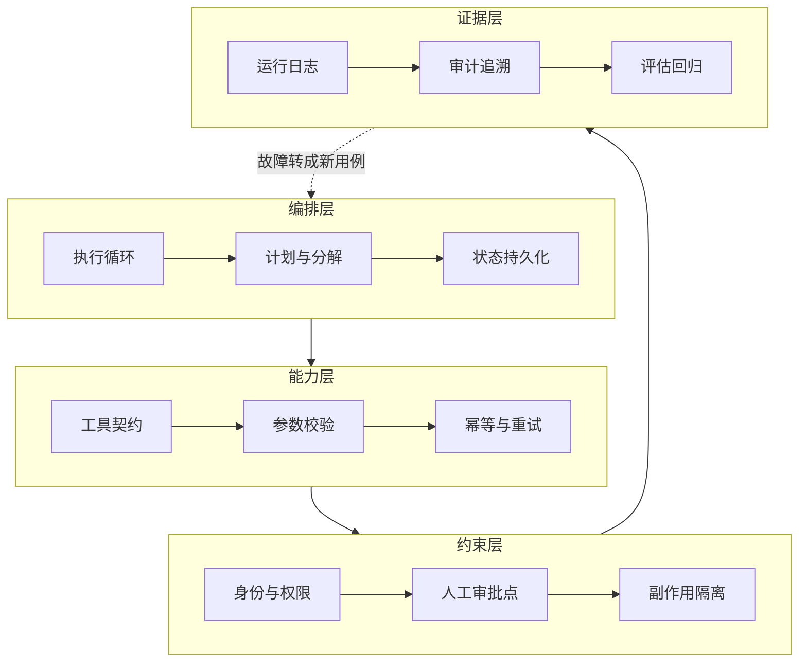

四层的顺序有讲究。

多数团队从上往下做，做到第二层就上线了。第三层等安全部门提要求才补，第四层等出事才补。

我认为正确的做法是**从下往上验收**：证据层没有，就无法判断约束层是否生效；约束层没有，能力层的每一次调用都是风险。

## Harness 不能越做越厚

有一个观察值得单独说：模型能力提升之后，原来为了弥补模型缺陷而搭的脚手架，可能反过来变成限制。

这个道理在个人工具上已经有人踩过。为旧模型写的一大堆规则和绕路逻辑，换到新模型上变成纯负担。

企业项目里这个问题更严重，因为客户不会主动删东西。规则只进不出，三年后没人敢动。

我的建议是把"删"也写进流程：

每次模型升级后重跑评估集，标出哪些约束已经没有正收益。

每个季度审一次系统提示词，把已经被上下文或工具契约覆盖的规则删掉。

保留一份"为什么加这条"的记录，否则三年后谁都不敢删。

**Harness 里每一个部件，都编码了一条"模型自己做不到什么"的假设。模型变了，假设就该重审。**

## Harness 和 Context 的分工

这两个概念容易混。我的划法是：

**Context 管信息，Harness 管行为。**

模型该看到哪些信息，是 Context 的事。模型看到信息之后能做什么、做错了怎么办，是 Harness 的事。

落到 bad case 上就很好判断了：

模型答错是因为没拿到某条信息 → Context 问题。

模型拿到了正确信息但做了不该做的动作 → Harness 问题。

这两类的修法完全不同，混在一起改是很多项目越改越乱的原因。

下一章讲企业软件底座，Harness 的第三层和第四层要落在上面。

---

**本章引用**

- [Harness Engineering for Self-Improvement](https://lilianweng.github.io/posts/2026-07-04-harness/)，Lilian Weng，2026-07

## §12 企业软件底座：集成、身份、可观测

这一章讲的东西，在互联网产品里是基础设施团队的事。

在客户现场，它们是你的事。

我按"卡住项目的频率"排序，不按技术复杂度排。

## 集成：没有 API 的系统怎么办

企业里最常见的一句话是"这个系统比较老"。

翻译过来通常意味着：没有 API、文档丢了、原厂已经不维护、改一行要走三个月流程。

可选的路径按优先级排：

**第一，找数据库直连的只读权限。** 绕开应用层，直接读表。风险是字段含义要重新搞清楚，而且升级时会断。

**第二，找导出。** 很多老系统有定时导出报表的能力。延迟大，但稳定。

**第三，中间库。** 让客户 IT 把需要的数据同步到一个新库，你只读这个库。这条最干净，但依赖客户投入。

**第四，RPA 或浏览器自动化。** 最后手段。脆弱、难维护、界面一改就废。

我的判断是：**能不用第四条就不用。** 它在演示里很惊艳，在生产里是持续的维护负担。

如果一个项目的核心链路必须依赖 RPA，我会重新评估这个项目现在该不该做。

## 数据质量：脏数据是常态

MIT 那份报告把数据就绪度列为失败主因之一。

在现场，"数据就绪"通常意味着这几件事：

同一个字段在不同系统里含义不同。历史数据里有大量测试记录、作废记录、迁移遗留。关键字段允许为空，而且真的大量为空。枚举值里有历史遗留的十几种写法表示同一个意思。

这些不是异常情况，是默认情况。

处理办法上，我认为有一条原则最重要：**先量化，再决定。**

不要凭感觉说"数据比较乱"。跑一遍统计：这个字段的空值率是多少、枚举值实际有几种、时间跨度内的分布是什么样。

有了数字，才能判断这个场景现在能不能做，以及做到什么程度。

## 身份与权限：最容易被卡在上线前

第 10 章提过 Agent 用谁的身份取数据。这里展开一层。

企业里通常有一套已有的身份体系（AD、LDAP、SSO 之类）和一套权限模型。你的系统必须接进去，而不是自己造一套。

需要在方案阶段就问清楚的问题：

Agent 是一个服务账号，还是代理用户身份？如果是服务账号，它的权限范围由谁审批？用户通过 Agent 能不能看到自己本来看不到的数据？Agent 的操作在审计日志里记在谁名下？

最后一个问题最容易被忽略，也最容易在合规审查时被卡住。

**如果审计日志里所有操作都记在一个服务账号名下，很多企业的风控是不会放行的。**

我的建议是把身份和权限方案在诊断阶段就形成文档，拿给客户的安全或合规部门过一遍。

不要等到上线前一周。那时候改架构的成本是最高的。

## 可观测性：出问题能不能定位

Agent 系统的排查比传统系统难，因为多了几层不确定性。

传统系统出错，你看日志、看堆栈，能定位到代码行。

Agent 出错，你要回答的是：当时它看到了什么上下文、检索命中了哪几条、模型输出了什么、调了哪些工具、工具返回了什么、为什么选了这条路径。

这些信息如果没有主动记录，事后是补不回来的。

我认为最低限度要记的东西：

| 记什么 | 用途 |
|---|---|
| 完整的输入上下文（含检索结果和来源 ID） | 判断是 Context 问题还是 Harness 问题 |
| 每次工具调用的参数和返回 | 定位副作用 |
| 决策路径（走了哪个分支、为什么） | 复现问题 |
| 人工介入记录（谁、什么时候、批了还是拒了） | 审计与责任 |
| 最终业务状态变化 | 验证任务真的完成了 |

最后一条对应第 9 章那个原则：不能拿模型的自我陈述当完成证据。

## 发布与回滚

企业系统不接受"上线试试看"。

需要在方案里明确的几件事：

灰度怎么切——按用户、按部门、按业务类型，还是按流量比例。

出问题怎么退——是关掉 AI 走回人工流程，还是回滚到上一个版本。

已经产生的错误动作怎么处理——能不能自动撤销，不能的话谁去手工修。

第三条最容易被漏掉。**能回滚代码，不等于能回滚业务后果。**

如果 Agent 已经发出了一百封邮件、改了两百条订单状态，回滚代码解决不了任何问题。

这也是第 2 章说"第一个项目要选错误可恢复的场景"的原因。

## 一份进场时的技术尽调清单

诊断阶段可以直接拿去问的问题：

数据在哪几个系统，各自有没有 API，能不能拿到只读权限。关键字段的空值率和取值分布是多少。用什么做身份认证，Agent 的身份怎么处理。有没有可用的测试环境，数据是脱敏的还是空的。日志和监控现在是什么方案，能不能接进去。上线要走什么审批流程，安全和合规谁签字。

这几个问题的答案，基本能决定这个项目的真实工期。

**我的经验判断是：这份清单里任何一项答不上来，工期都要往后加。**

Part 3 到这里结束。

模型的边界、上下文、Harness、企业底座，四章讲的是"能做什么、怎么约束"。

下一篇换个角度：企业到底想要什么，以及哪些想要的东西现在不该给。

# Part 4 需求篇：企业到底需要什么 AI

这一篇回答三个问题：企业的 AI 需求有哪些类型，这些需求背后反复出现的问题是什么，以及哪些需求现在不该做。

---

## §13 企业 AI 需求的五层分类

企业需求最常见的分类方式是按部门：市场要什么、客服要什么、财务要什么。

我认为这种分法对 FDE 没什么用。

因为**同一个部门的两个需求，实施难度可能差十倍。**

客服部门要一个"话术查询助手"和要一个"能直接改订单的自动处理 Agent"，前者两周，后者半年，而且风险等级完全不同。

更有用的分法是按 AI 的介入深度。

## 五层，深度递增

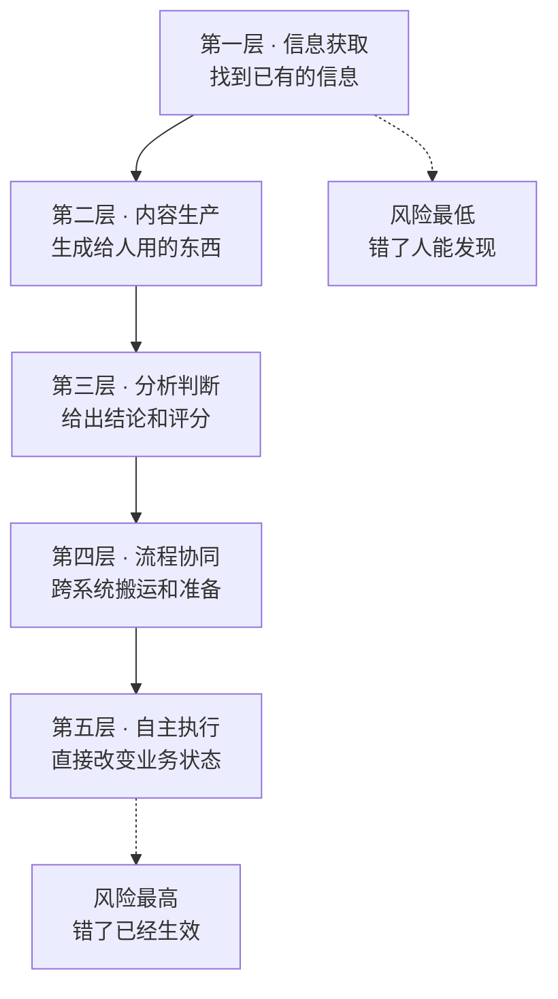

| 层级 | 典型需求 | 输出交给谁 | 错误代价 |
|---|---|---|---|
| 一、信息获取 | 知识库问答、制度查询、文档检索 | 人 | 低，人会核对 |
| 二、内容生产 | 客服回复草稿、报告初稿、营销文案 | 人 | 低到中，人会改 |
| 三、分析判断 | 工单分类、线索评分、风险识别、异常检测 | 人或系统 | 中，可能影响决策 |
| 四、流程协同 | 跨系统取数、材料准备、状态同步、待办生成 | 系统，但需人确认 | 中到高 |
| 五、自主执行 | 直接发邮件、改订单、生成采购单、完成端到端流程 | 系统，直接生效 | 高，已经发生了 |

分层的价值在于，**每往下一层，对 Context、Harness、Eval 和权限的要求都会跳一级，不是线性增加。**

## 每一层真正的难点

**第一层的难点不是检索，是知识治理。**

多数团队以为这层最简单，接个向量库就完事。

实际卡住的地方是第 10 章讲的那些：哪份文档是有效版本、两份说法冲突听谁的、这个用户有没有权限看这条。

检索准确率和业务事实正确，是两个指标。找到信息是检索的事，判断这份信息值不值得信是 FDE 的事。

**第二层的难点是采用率。**

技术上不难，草稿质量也够用。但上线后经常发生的是：员工试了几次，觉得改草稿比自己写还慢，就不用了。

这层的成败取决于它嵌进工作流的位置。让人跳到另一个系统去生成再复制回来，基本没人会用。

**第三层的难点是判据。**

分类和评分需要一个标准答案，而企业里的标准答案经常是不存在的——同一个工单，三个老员工可能分成三类。

所以这层的第一件事不是训模型，是先让人达成一致。这个过程本身对客户就有价值。

**第四层的难点是状态和异常。**

跨系统流程有中间状态，会失败在任何一步。第 11 章讲的幂等、重试、状态持久化，从这层开始变成硬需求。

**第五层的难点是信任和治理。**

技术上第五层和第四层的差距，比大多数人以为的小。真正的差距在组织：谁批准它自动执行、错了谁负责、怎么撤销、审计怎么交代。

## 一个我认为重要的判断

很多企业开口就要第五层。

我的建议是：**除非有非常明确的理由，第一个项目不要从第五层开始。**

理由不是技术做不到，是信任建立需要时间。

你需要几个月的运行数据，才能让客户相信这套东西可以自动执行。而第五层不给你犯错的额度——它错一次，可能整个项目就被叫停了。

更可行的路径是同一个场景从低层往高层爬：

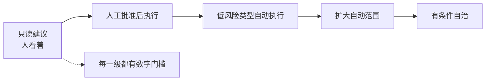

这条路径在第 22 章会展开。这里先记住：**层级是可以爬的，但不能跳。**

## 需求所在层级 vs 客户以为的层级

现场经常出现的一个错位是：客户描述的是第五层，实际需要的是第三层。

「我们想要一个能自动处理退款的 AI」——追问下去可能会发现，退款审批本身有明确规则，人工只需要 30 秒，真正耗时的是判断这个退款申请属于哪一类、要调哪些证据。

那么真实的需求是第三层（分类 + 材料准备），把 30 秒的审批留给人。

这个错位是常态，不是客户不专业。因为**客户描述的是他想摆脱的痛苦，不是他需要的系统。**

FDE 的工作就是把前者翻译成后者。翻译的方法是第 2 章那套顺序：先看真实流程，找到时间实际花在哪。

## 这一层分类怎么用

我建议在诊断结束时，对每个候选场景标三件事：

它在第几层。客户以为它在第几层。第一阶段建议做到第几层。

这三个数字如果不一致，说明有一次预期管理需要做。而且要在报价之前做，不是在验收时做。

下一章讲这五层背后反复出现的七类问题。

---

**本章引用**

- [Effective Context Engineering for AI Agents](https://www.anthropic.com/engineering/effective-context-engineering-for-ai-agents)，Anthropic

## §14 七类反复出现的企业问题

上一章按 AI 介入深度分了五层。

这一章换个切面：不管在哪一层，企业项目卡住的地方翻来覆去就那么几个。

我归纳成七类。每一类对应一个"企业以为的问题"和一个"实际的问题"，以及 FDE 该建什么。

**这张表是全书的中枢。** 第五篇的七章，基本就是在逐个解决这七类问题。

| # | 企业的表述 | 实际的问题 | 需要建什么 | 对应章节 |
|---|---|---|---|---|
| 1 | 我们也要做个 AI Agent | 没有可衡量的业务结果 | Outcome Contract | §16 |
| 2 | 资料都在，导进去就行 | 知识散、冲突、过期、只在人脑里 | Context System | §17 §19 |
| 3 | 流程我们有 SOP | SOP 只写正常路径，异常靠人判断 | Workflow Contract | §18 |
| 4 | 让它自己去调系统 | 权限、副作用、重复执行没人管 | Agent Harness | §20 |
| 5 | 效果我们看着还行 | 没有判据，无法证明能上线 | Eval Harness | §21 |
| 6 | 出错了改一下就好 | 错误会沿下游系统传播 | 审批、隔离、回滚、审计 | §20 §22 |
| 7 | 这套能不能复制到别的部门 | 每次都从零定制 | 资产化循环 | §31 |

下面逐个说。

## 一、价值不清：没有可衡量的结果

最常见的开场是"我们也要做一个 AI Agent"。

这句话背后通常是：竞争对手做了、老板在会上提了、有一笔预算要花掉。

它不构成需求，因为没有回答"改变什么"。

**判断标准很简单：这个项目做完，哪个数字会变，变多少，谁认这个数字。**

三个问题答不上来，就还在这一类里。

MIT 那份报告里 95% 的项目没有可衡量的损益影响。我认为很大一部分是从这一步就没定义过。

## 二、上下文碎片化：资料在，但不能用

第二常见的是"资料我们都有"。

现场看到的通常是：制度文件在共享盘、产品资料在几个人的电脑里、真实规则在工单记录和群聊里、最关键的判断在几个老员工脑子里。

而且它们互相冲突。旧制度没删，两个部门口径不同，系统里的值和文档对不上。

第 10 章讲过，模型没有判断权威性的能力。**冲突的信息喂进去，出来的就是随机的答案。**

这一类的解法不是"整理知识库"这种模糊说法，而是一份带权威级别、有效期、责任人和冲突处理规则的 Context Registry。

## 三、流程不可计算：SOP 只写了顺利的那条路

客户说"流程我们有 SOP"，拿到手一看，写的是理想路径。

真实流程里的异常——客户资料不全、系统超时、金额超限、遇到特殊客户、上游数据没来——SOP 里一条都没有。

这些情况在实际工作里由人凭经验处理。人处理得很自然，以至于没人觉得需要写下来。

**AI 接手之后，异常的占比会突然变得可见。** 因为它不会像人一样自动绕过去。

这一类需要的是把流程写成状态机：有哪些状态、什么条件触发转移、异常怎么分类、什么时候升级到人。第 18 章展开。

## 四、工具不可控：让它自己去调

"让 AI 自己去调系统"这句话里，藏着四个没人管的问题：

用谁的身份调。调错了会不会写坏数据。同一个动作重复调用会怎样。调用失败之后怎么办。

第 11 章讲过，Agent 调一次和调三次，结果必须一样。这在企业里不是优化项，是安全底线。

因为下游是真的会被写入的。

## 五、质量不可证明：看着还行

这一类的表现是：Demo 演示效果不错，但没人敢说可以上线。

因为"效果不错"是抽了几条看的结论，不是可重复的判据。

第 2 章讲过为什么判据必须在系统之前建立——**系统一旦存在，它能做到的事会变成标准。**

这一类需要的是一套覆盖边界、冲突、缺失、越权、拒绝、下游失败的评估集，而且判断依据是最终业务状态，不是模型的回复文本。

## 六、错误会传播：改一下就好

前五类是"做不成"，这一类是"做成了更危险"。

单点错误在企业里不会停在原地。Agent 写错一个字段，可能同步到三个下游系统，触发两个自动流程，最后由客服在两周后从客户投诉里发现。

这一类真正需要的不是更准的模型，是治理：

哪些动作必须人批。批的人看到什么信息才够判断。错了怎么撤销。撤销不了的怎么办。审计日志能不能还原当时的决策依据。

我认为这里有一条判断标准：**如果一个动作错了没法撤销，它就必须有人工检查点，不管模型准确率多高。**

准确率再高也不是零。

## 七、项目无法复制：能不能推广到别的部门

这一类通常出现在第一个项目成功之后。

客户很满意，问能不能复制到另一个部门。你一评估发现，除了那个提示词，几乎什么都要重做。

第 3 章讲的 Palantir Dev / Delta 划分说的就是这件事。差量如果永远留在项目里，规模化就不成立。

这一类的解法在第 31 章：把每个项目产出拆成"客户特有"和"可复用"两堆，后者进产品或资产库。

## 怎么用这张表

我建议在诊断结束时，对照这七类给客户做一次标记：

哪几类已经是明确问题。哪几类客户还没意识到。哪几类第一阶段处理，哪几类明确不处理。

这份标记有两个用处。

对客户，它把"我们要做 AI"变成了一张可讨论的问题清单。这件事本身就有价值，很多企业从来没这么盘过。

对你，它是范围谈判的依据。**明确写下"这一期不处理第七类"，比事后解释为什么复制不了要容易得多。**

下一章讲反面：哪些需求现在不该做。

---

**本章引用**

- [The GenAI Divide: State of AI in Business 2025](https://cloudelligent.com/wp-content/uploads/2026/02/v0.1_State_of_AI_in_Business_2025_Report.pdf)，MIT Media Lab NANDA

## §15 需求筛选：哪些现在不该做

第 3 章说过一句话：能拒绝，才谈得上负责。

这一章给拒绝的依据。

先说清楚这里的"不该做"是什么意思。**它指的是现在不该做，不是永远做不了。** 大部分被否掉的需求，等条件补齐之后是可以做的。

把这一点讲清楚，拒绝就不是泼冷水，而是排顺序。

## 七道门

我把筛选拆成七个问题。全部通过的场景很少，但**任何一条是硬否，就不该作为第一个项目。**

| 门 | 问题 | 硬否的情况 |
|---|---|---|
| 1 频率 | 这件事一天/一周发生多少次 | 一个月几次 |
| 2 结果 | 做完哪个数字会变，谁认 | 说不出数字或没人认 |
| 3 数据 | 需要的数据能不能拿到 | 关键数据在无法访问的系统里 |
| 4 稳定 | 流程最近半年改过几次 | 每个月都在变 |
| 5 可恢复 | 做错了能不能撤销 | 不可撤销且无人工检查点 |
| 6 负责人 | 谁有权改流程和验收 | 位置是空的 |
| 7 验证周期 | 第一阶段多久能拿到真实数据 | 超过一个季度 |

下面说几个容易被误判的。

## 频率：低频场景的隐藏成本

低频场景经常看起来很诱人，因为单次价值高。

问题在于，**低频意味着你拿不到足够的运行数据来验证系统是否可靠。**

一个月发生三次的流程，跑三个月才九个样本。九个样本证明不了任何事。

而且低频场景通常伴随另一个问题：因为不常做，人也记不清规则，导致上下文获取更难。

## 数据：要量化，不要凭感觉

第 12 章说过，不要凭感觉说"数据比较乱"。

这一门的判断标准是具体的：需要的字段在哪个系统、有没有访问方式、空值率多少、历史数据覆盖多长时间。

有个常见的陷阱：客户说"数据都有"，指的是数据存在于某处，不代表你能拿到。

**在企业里，"存在"和"可访问"之间隔着一个审批流程，这个流程可能比开发还长。**

所以这一门要在诊断阶段就用实际动作验证——不是听答复，是真的拿到一份样本。

## 稳定性：流程还在变的时候不要动它

这条最容易被忽略。

如果一个流程正在被业务调整，或者组织架构马上要变，那这时候把它固化成系统是在浪费双方的钱。

判断方法：问最近半年这个流程改过几次，以及未来半年有没有已知的调整计划。

第二个问题经常能问出关键信息。业务负责人心里有数，只是没人问过他。

## 可恢复：这一条我认为是硬约束

第 2 章和第 13 章都提过，这里说清楚为什么。

不可恢复的场景，第一次出错就可能终结整个项目。

而任何 AI 系统都会出错，区别只是多久出一次。你需要的是一个允许出错、能修正、能积累信任的场景。

**所以第一个项目要选"错了能补救"的，不是"最有价值"的。**

如果客户坚持要做不可恢复的场景，可行的折中是加人工检查点，把它降到第 13 章的第二层或第三层——AI 给建议和材料，人做最后那一下。

这样价值可能只剩一半，但项目能活下来。

## 负责人：空位置是最贵的

第 8 章讲过客户侧必须有的两个位置。

这一门的判断很直接：**问"这个项目做完，谁来决定大家改用新流程"，如果答案含糊，就是空的。**

常见的含糊答案包括："我们会推动的""IT 部门负责""领导很重视"。

这些都不是一个有名有姓、有权拍板的人。

位置空着的项目，最典型的结局是系统做完了、验收也过了，但没人用。这正好落进 MIT 报告里那 95% 的定义——**没有可衡量的损益影响**。

## 三种特别值得警惕的需求

除了七道门，还有几类需求我认为要额外小心。

**第一，"先做个大平台，以后所有场景都能用"。**

这类需求没有具体场景，也就没有判据。做出来的东西通常什么都能干一点，什么都不好用。

对策是反过来：先做一个具体场景，做透，再从里面抽公共能力。

**第二，"照着某某公司的方案做一个"。**

对标本身没问题，问题是别人的方案是在别人的数据、流程和组织下长出来的。

第 3 章那个 Delta 的概念说的就是这个：差量才是工作量所在，而差量是这家企业独有的。

**第三，"这个先不用管准确率，能跑起来就行"。**

听起来是客户很好说话，实际上是判据缺位。

等到上线，"能跑起来"会立刻变成"怎么老出错"。第 2 章讲的顺序在这里失效了：判据没有在系统之前定下来。

## 拒绝的说法

最后说怎么说出口。

我认为有效的拒绝要包含三个部分：

**不做的理由，用具体条件而不是判断。** 「这个场景的关键数据在 X 系统，目前拿不到访问权限」比「这个不太合适」有用。

**补齐条件的路径。** 「如果能拿到只读权限，这个场景可以在 Y 周内验证」。

**一个可以现在就做的替代。** 从第 13 章的五层里往下降一层，通常能找到一个当期可做的版本。

这样讲完，客户听到的不是拒绝，是排序。

**FDE 说"不"的能力，最后会变成项目成功率。** 因为你没接的那些项目，正是最可能失败的那些。

Part 4 到这里结束。

下一篇进实施：把通过筛选的需求，一步步变成能在生产环境里跑的系统。

---

**本章引用**

- [The GenAI Divide: State of AI in Business 2025](https://cloudelligent.com/wp-content/uploads/2026/02/v0.1_State_of_AI_in_Business_2025_Report.pdf)，MIT Media Lab NANDA

# Part 5 实施篇：Runtime Harness

这一篇是全书最核心的部分。

七章对应第 2 章那个顺序的中后段，以及第 14 章那七类问题里的前六类。

每一章的结构一样：这一步要回答什么问题、产出什么、什么条件下可以进入下一步。

---

## §16 Outcome Contract：写在代码之前

这是第 14 章第一类问题的解法。

先说它不是什么。**它不是需求文档，不描述功能。**

一份好的 Outcome Contract 里可能一个功能名词都没有，全是触发条件、状态变化、判定规则和责任人。

## 它要回答的问题

| 问题 | 为什么必须答 |
|---|---|
| 什么条件触发 | 决定系统的入口，也决定哪些情况不归它管 |
| 完成后哪个业务状态改变 | 这是验收的唯一依据 |
| 成功怎么判断 | 决定评估集怎么写 |
| 失败怎么判断 | 决定什么时候该停、该升级 |
| 部分成功算什么 | 企业流程里这种情况最多，必须提前定 |
| 错一次的代价 | 决定要不要人工检查点 |
| 哪些动作必须人批 | 决定 Harness 的约束层怎么设计 |
| 谁是结果负责人 | 决定争议时找谁 |
| 什么时候算这一期结束 | 决定项目怎么收尾 |

我认为这九个里最容易被跳过的是第五个：部分成功。

因为在 Demo 里只有成功和失败两种状态。到了真实流程，"处理了一半卡住了"是最常见的情况。

不提前定义，上线后每次出现都要临时讨论一遍。

## 业务状态，不是模型行为

这是写这份文档时最容易走偏的地方。

对比一下：

| 模型行为的写法 | 业务状态的写法 |
|---|---|
| Agent 能准确回答产品问题 | 产品咨询类工单的人工转接率从 A 降到 B |
| 系统能自动分类工单 | 分类结果直接进入派单流程，人工复核比例低于 X% |
| 支持多轮对话 | 一次会话内完成率高于 Y% |

左边这些做完了没人能验收，因为"准确"没有定义。

右边可以直接写进合同。

**判断方法：把这句话拿给客户的财务或运营看，他能不能说出这个数字现在是多少。**

说不出来，说明这个指标现在没人在测，那它也不能作为验收依据——因为没有基线。

## 基线：容易被忽略的一步

要证明改变，得先知道改变前是什么样。

很多项目上线后陷入扯皮，就是因为没有基线。客户觉得没什么变化，你觉得改善很多，双方都没有数字。

基线要在 Outcome Contract 里写死：这个指标当前是多少、怎么测的、测的时间范围。

如果客户现在根本不测这个指标，那第一件事是先建立测量。这本身就是交付的一部分，而且往往是客户最先感受到价值的部分。

## 一份可以直接抄的骨架

```text
# Outcome Contract：[场景名]

## 一、范围
本期处理：[具体的业务场景，越窄越好]
本期明确不处理：[列出来，写清楚]

## 二、触发
触发条件：
不触发的情况：

## 三、结果
目标业务状态改变：
衡量指标：
当前基线：            （测量方式、时间范围）
本期目标值：
达标观察期：          （连续多久算稳定）

## 四、判定
成功：
失败：
部分成功：            （如何处理，谁接手）

## 五、风险与边界
单次错误代价：
不可恢复的动作：
必须人工批准的动作：
必须拒绝的请求类型：

## 六、责任
业务负责人：          （有权改流程和验收）
数据/IT 对接人：
交付方负责人：

## 七、结束
本期验收条件：
验收证据形式：
上线后支持范围与期限：
```

这份东西的长度我建议控制在两页以内。

**长了就没人看，没人看就不会有人签字，没签字它就不起作用。**

## 签字这件事

Outcome Contract 需要客户业务负责人签字，不是 IT 签字。

理由在第 8 章说过：只有业务负责人有权改流程、有权定义什么算成功。

如果只有 IT 签，验收时业务方说"这不是我们要的"，你没有依据。

签字这个动作还有一个隐含价值：**它逼客户内部先达成一致。**

很多项目的分歧不在甲乙之间，在客户内部——业务和 IT 想要的东西不一样。这个分歧如果不在签字阶段暴露，就会在验收阶段爆发。

## 什么时候可以进入下一步

这一步的完成信号：

Outcome Contract 已签字。基线数字已测出来。本期不做的部分已经写进文档。业务负责人和数据对接人都有具体的名字。

四条齐了，才进入下一章的现场调研和 Context Audit。

**没签字就开工，是我认为 FDE 项目里最常见、也最贵的一个错误。**

## §17 现场调研与 Context Audit

这一章对应第 2 章那个顺序里的"事实"段，以及第 14 章的第二类问题。

它的目标只有一个：**把真实执行的流程和真实可用的知识摸清楚。**

不是听描述，是看人干活。

## 为什么描述不可信

第 2 章讲过：会议室里的描述是制度版本，不是执行版本。

这不是客户在隐瞒。原因有三个：

管理层描述的是他们设计的流程，不是一线执行的流程。

一线描述的是他们以为自己在做的事，而人对自己的自动化行为往往说不清楚。

所有人都会自动过滤掉异常，因为异常处理已经内化成习惯了。

**所以现场调研的核心方法是观察，访谈只是补充。**

## 观察怎么做

坐在操作员侧后方，看他处理真实案例，全程记录不打断。

打断会改变行为。一旦你问"你刚才为什么这么做"，后面他就会开始解释而不是操作。

问题攒着，一批处理完之后统一问。

观察时重点记这几件事：

| 观察项 | 记什么 | 为什么 |
|---|---|---|
| 系统切换 | 打开了几个系统，在哪几个之间来回 | 决定集成范围 |
| 输入来源 | 每一步的信息从哪来，怎么进来的 | Context 的原料 |
| 停顿点 | 他在哪里停下来想，或者去问人 | 隐性规则所在 |
| 异常处理 | 遇到不正常情况时怎么办 | 异常矩阵的原料 |
| 留痕 | 做完在哪里记录 | 验证结果的依据 |

**停顿点是这份工作里最值钱的东西。**

流畅走完的步骤，说明有明确规则。停下来想的地方，说明是经验判断——这些地方就是后面 Agent 会出错的地方。

## 观察多少个案例

这个我给不出标准数字，取决于流程复杂度和异常率。

可用的停止条件是：**连续若干个案例都没有出现新的异常类型时，可以停。**

如果一直在出现新情况，说明这个流程的变异度很高，这本身就是重要发现——它会影响第 15 章那道"稳定性"门的判断。

## 访谈：问题挂在案例上

观察完再访谈，问题要具体。

有效的问法：「刚才这一单你为什么没走标准审批」「这个字段你填的是 X，什么时候会填 Y」「上次遇到客户资料不全是怎么处理的」。

无效的问法：「你们的审批流程是怎样的」「一般什么情况下需要人工介入」。

后者拿回来的是制度版本，你已经有了。

还有一个我认为很有用的问题：**「这个活里最烦的是哪一步？」**

答案经常和你以为的不一样，而且它直接指向价值最高的自动化点。

## Context Audit：知识的体检

观察解决"流程怎么跑"，Context Audit 解决"知识在哪、可不可信"。

第 10 章讲了知识的四种存放方式。这一步要对每一个信息源建档。

要问的问题：

它存在哪，能不能被程序访问。谁负责维护它。上次更新是什么时候。它和别的来源冲突时，听谁的。谁有权限看。多久会过期。是每次都要用，还是按需检索。

最后形成 Context Registry，字段在第 19 章会给完整模板。

## 三件在 Audit 里最常发现的事

**第一，有效版本说不清。**

同一份产品文档存在多个版本，散在不同位置，没人知道哪份是现行的。

这一条如果不解决，检索准确率再高也没用——它会精准地找到那份作废的。

**第二，制度和执行不一致。**

文档写着要走三级审批，实际上某类情况一直是直接过的。

这时候要做的不是纠正客户，是记录下来并让业务负责人确认按哪个执行。**这个确认动作本身就有价值，因为很多时候客户内部也不知道存在这个偏差。**

**第三，关键规则只在人脑里。**

「这个客户我们一般给特批」「金额超过多少要找谁」「这种情况按老规矩处理」。

这些必须当场挖出来、写下来、找人确认。第 7 章讲过，留在你脑子里等于把风险留给项目。

## 待确认清单

Context Audit 的产物里，我认为有一样最容易被忽略但很重要：**待确认事实清单。**

它记的是调研中发现的、目前还没有权威答案的问题。

比如：两个部门对同一个字段的定义不一致，需要谁来拍板；某类异常的处理方式，三个老员工说法不同。

这份清单要交给客户的业务负责人，由他给出答案。

**这份清单的长度，是这个项目复杂度的一个很好的指标。**

如果它很长，说明企业内部本身就没有统一口径，那么项目周期要往后加，而且第一阶段的范围要更窄。

## 这一步的产物

真实流程图（含系统、输入、判断、停顿点）。异常矩阵（观察到的所有非正常情况及处理方式）。Context Registry 初稿。待确认事实清单。

## 检验方式

第 2 章说过，产物容易糊弄，检验方式糊弄不了。

这一步的检验方式是：**把流程图和异常矩阵拿给一线操作员看，问他认不认。**

如果他说"我们不这么干"，那前面的活要重做，不管你已经写了多少代码。

如果他说"对，但还有一种情况你没写"，那是好事——这一条会成为评估集里的一个用例。

下一章把这些事实变成可计算的东西：流程契约。

## §18 Workflow Contract：把流程写成状态机

这一章对应第 14 章的第三类问题：SOP 只写正常路径。

上一章拿到的流程图是描述性的。这一章要把它变成可计算的。

差别在于：**描述性的流程回答"一般怎么走"，状态机回答"任何时刻系统在哪、下一步由什么决定"。**

## 为什么必须写成状态机

三个理由。

第一，Agent 会失败在任何一步。没有状态定义，失败之后不知道从哪恢复。

第二，人工接管需要接管点。接管点就是状态。没有状态划分，人接手时不知道当前进行到哪。

第三，第 9 章讲的多步坍塌问题需要在每一步验证。验证的对象就是状态转移是否合法。

**用一句话说：状态机是给中断和恢复用的，不是给正常流程用的。**

正常流程根本不需要状态机，顺着走就行了。

## 一个流程契约的基本结构

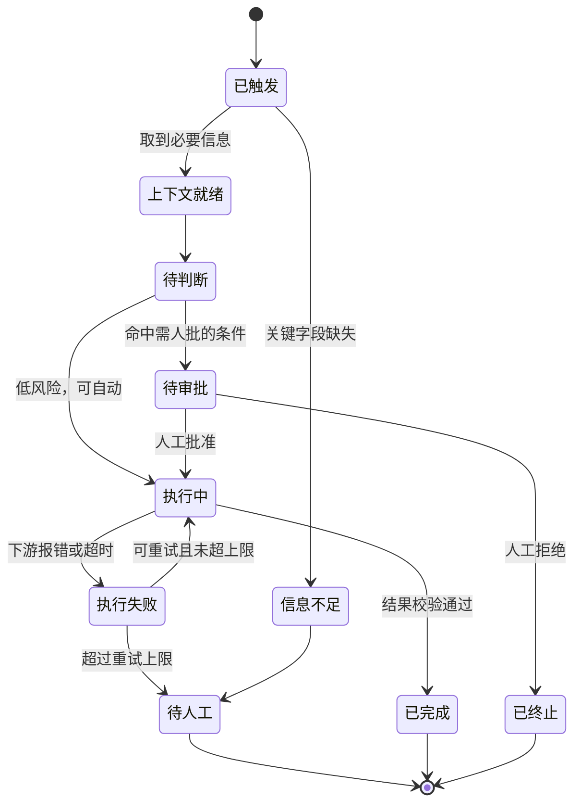

这张图是通用骨架，具体项目要按实际流程改。

这张图里有四个终态：已完成、已终止、待人工、以及隐含的部分完成。

第 16 章说过，部分成功是企业流程里最常见的情况，必须提前定义。

## 要写清楚的六件事

| 要素 | 内容 | 不写的后果 |
|---|---|---|
| 状态清单 | 系统可能处于的所有状态 | 失败后不知道从哪恢复 |
| 转移条件 | 每条边由什么触发 | 行为不可预测 |
| 决策规则 | 判断点用什么依据 | 规则藏在提示词里，没人能审 |
| 异常矩阵 | 每类异常的分类和处理 | 异常全部落到人工 |
| 人工升级路径 | 什么时候交给人，交给谁 | 人不知道自己该接什么 |
| 外部副作用 | 每一步会改变哪些外部系统 | 回滚时不知道要撤销什么 |

最后一条最容易漏。

**副作用清单是回滚设计的前提。** 你必须知道每一步动了什么，才能在出错时撤回来。

## 异常矩阵怎么写

上一章观察到的异常，在这里要分类。

我建议按"处理方式"分，而不是按"原因"分。因为处理方式直接映射到状态转移。

| 异常类别 | 处理方式 | 例子 |
|---|---|---|
| 可自动恢复 | 重试，有上限 | 下游超时、限流 |
| 需要补信息 | 向上游或用户索取 | 关键字段缺失 |
| 需要人判断 | 升级到人工，带上下文 | 规则冲突、金额超限 |
| 必须拒绝 | 终止并记录 | 越权请求、明确禁止的操作 |
| 未知 | 保守停止，报警 | 没见过的情况 |

最后一类必须有。

**没有"未知"分支的系统，会把没见过的情况错误地归到某个已知分支里。** 那比停下来危险得多。

## 决策规则要放在提示词外面

这是我认为流程契约最重要的一条实践。

判断规则——什么条件下走哪个分支——应该写成显式的配置或代码，不是藏在提示词里让模型自己判断。

三个理由：

规则写在外面，业务方能看懂、能审、能确认。写在提示词里，只有你能看。

规则写在外面，改动有版本记录。写在提示词里，改了没人知道。

规则写在外面，评估可以直接测。写在提示词里，只能测最终输出。

第 7 章讲过往提示词里堆规则的后果：三个月后一份两千字的提示词，几十条规则互相打架，谁也不敢删。

**能用条件判断表达的，不要交给模型判断。** 把模型用在真正需要理解和归纳的地方。

## 人工接管点的设计

第 11 章说过，人工审批是架构的一部分，不是界面功能。

设计接管点时要回答：

在什么状态下触发。接管的人是谁（角色，不是姓名）。他看到什么信息才够判断。他有哪些选项（批准、拒绝、修改后批准）。超时不处理会怎样。批准之后从哪个状态继续。

第四条容易被简化成"批准/拒绝"两个按钮。

但实际业务里"修改后批准"非常常见——人看了 Agent 的方案，改了一个字段，然后放行。

**如果系统不支持这个选项，人就会跳出系统去手工处理，你的流程数据就断了。**

## 这一步的产物和检验

产物：状态机定义、转移条件、决策规则表、异常矩阵、人工接管点定义、副作用清单。

检验方式：**拿异常矩阵去问一线，问他们还有没有见过别的情况。**

以及一个更硬的检验：把状态机里的每一个终态，对应到 Outcome Contract 里的成功、失败、部分成功。

如果有状态对应不上，说明契约不完整，要回去补。

下一章讲上下文系统，也就是状态机每一步需要什么信息、从哪来。

## §19 Context System：来源、权威、时效与权限

第 10 章讲了上下文工程的原理，这一章讲在客户现场怎么落地。

核心产物是一份 Context Registry。

我认为**这是 FDE 最该标准化的交付物**，因为它是唯一一份既能给客户看、又能直接驱动系统实现的文档。

## Context Registry 完整模板

| 字段 | 说明 | 填不出来的后果 |
|---|---|---|
| ID | 信息源编号 | 无法在日志里追溯 |
| 名称 | 人能看懂的名字 | 业务方看不懂这份表 |
| 内容类型 | 事实数据 / 规则 / 术语 / 模板 | 影响注入策略 |
| 物理位置 | 库表、目录、系统、接口 | 程序取不到 |
| 访问方式 | API / 直连 / 导出 / 人工维护 | 无法自动更新 |
| 负责人 | 有权确认内容的人 | 冲突时无人拍板 |
| 权威级别 | 高 / 中 / 低 | 冲突时随机选 |
| 有效期 | 多久失效或需复核 | 用过期信息 |
| 更新频率 | 实时 / 日 / 周 / 不定期 | 缓存策略错 |
| 权限范围 | 哪些角色可见 | 越权泄露 |
| 注入方式 | 常驻 / 按需检索 / 不注入 | 上下文膨胀 |
| 已知冲突 | 与哪些源冲突，怎么处理 | 答案不稳定 |
| 状态 | 已确认 / 待确认 / 已废弃 | 用了没人认的信息 |

字段可以裁剪，但**权威级别、有效期、权限范围这三列我认为不能省**。

它们分别对应第 9 章那三种失效：选错冲突信息、用过期信息、越权。

## 权威级别怎么定

这是整张表里最需要业务方参与的一列。

我用的分法：

**高**——由明确责任人维护，且是这类信息的唯一正式出处。系统里的结构化数据通常在这一档。

**中**——正式文档，但可能滞后于实际执行。制度文件多在这一档。

**低**——有参考价值但不能单独作为依据。工单记录、群聊约定、个人整理的资料。

规则是：**冲突时高压中，中压低。同级冲突时，走待确认清单，找负责人拍板。**

这条规则要写进系统，不是写进提示词。

因为第 18 章说过，能用条件判断表达的，不要交给模型判断。

## 注入策略：三档

第 10 章介绍了 Anthropic 的四个技术。落到 Registry 上，每个信息源要选一档。

**常驻**——每次都注入。适合体量小、几乎每次都用到的：核心术语表、当前生效的关键规则、角色定义。

数量要严格控制。第 10 章说过，上下文是有限资源，每多一个 token 就消耗注意力预算。

**按需检索**——保留轻量引用，运行时才取。适合体量大、只在特定情况用到的：产品文档、历史工单、客户档案。

这是企业场景的主力方式，因为它同时解决了体量和权限两个问题。

**不注入**——存在但不给模型。适合敏感数据、或者应该由确定性代码处理的部分。

第三档经常被忘掉。**不是所有信息都该进上下文。** 能用一个数据库查询解决的，不要让模型去检索和推理。

## 处理"只在人脑里"的知识

第 17 章挖出来的隐性规则，要在这一步落成结构化的东西。

我的做法是分两类：

**能表达成条件的**，写成规则表，进第 18 章的决策规则，不进上下文。

比如「金额超过 X 要 Y 审批」，这是条件判断，不需要模型理解。

**只能表达成经验的**，写成带例子的说明，进上下文，并标注来源和确认人。

比如「这类客户的诉求通常是 A 而不是 B」，这类没法写成条件，只能给模型看例子。

第二类要特别标注**来源人和确认时间**。因为它是最容易过期的一类知识，而且没有系统会提醒你它过期了。

## 待确认清单的处理

第 17 章产出的待确认事实清单，在这一步要有结论。

三种结局：

业务负责人给出答案，进 Registry，状态标为已确认。

暂时给不出答案，但影响本期范围，那就要回到 Outcome Contract 调整范围。

暂时给不出答案，不影响本期，记入风险清单，状态标为待确认。

**第三种情况要在系统里有对应行为：命中待确认的规则时，走人工。**

不能让模型去猜一个连客户自己都还没决定的事。

## 上下文的持续维护

系统上线不是终点。第 10 章说过上下文系统会腐化。

要在交接时明确几件事：

谁负责在文档更新后同步 Registry。多久做一次全量复核。发现冲突时的上报路径。模型升级后谁负责重跑评估、验证注入策略是否还有正收益。

这几条写不进交接文档，三个月后这套上下文就开始产生错误答案，而且**没人知道是从哪一天开始错的。**

## 这一步的产物和检验

产物：Context Registry、决策规则表（与第 18 章共用）、待确认清单的结论、注入策略配置。

检验方式：**随机抽三个信息源，问客户业务方"这份东西现在谁在维护、上次更新是什么时候"。**

答不上来的，权威级别就不能标"高"。

还有一个更硬的检验：拿两个已知互相冲突的来源，跑一遍系统，看它是否按权威级别选择。

选对了，说明规则真的进了系统。选错了，说明规则还只写在文档里。

下一章讲 Agent Harness：信息到位之后，怎么约束它去做事。

## §20 Agent Harness：工具、状态、失败与接管

第 11 章讲了 Harness 的概念和分层，这一章讲落地。

对应第 14 章的第四类和第六类问题：工具不可控、错误会传播。

## 工具契约

Agent 能做的每一件事，都要有一份契约。

不是"给它一个 API 文档让它自己看"，是明确定义的调用边界。

| 契约要素 | 内容 |
|---|---|
| 用途 | 什么情况下该调它，什么情况下不该 |
| 参数与校验 | 类型、范围、必填、格式，调用前校验 |
| 副作用 | 它会改变什么外部状态 |
| 幂等性 | 重复调用是否安全，靠什么保证 |
| 权限要求 | 需要什么身份，谁批准过 |
| 失败语义 | 失败时外部状态是否已改变 |
| 超时与重试 | 多久算超时，重试几次，间隔多少 |

我认为最容易被忽略的是**失败语义**。

一次调用超时了，到底有没有生效？这个问题答不上来，重试就是赌博。

如果下游接口没有提供确认机制，那么正确的做法是：不重试，转人工，并且在契约里写明这一点。

## 幂等：企业场景的底线

第 11 章说过，Agent 调一次和调三次，结果必须一样。

实现方式通常是幂等键：每个业务动作生成一个唯一键，下游用它去重。

如果下游系统不支持幂等键（老系统很常见），可选方案：

在自己这一侧维护执行记录，调用前先查是否已执行过。

把动作拆成"先查后写"，写之前确认当前状态。

对不可去重的动作（比如发邮件），强制走人工审批，不做自动重试。

**这一条没得商量。** 因为第 9 章讲的多步坍塌意味着重试是必然会发生的。

没有幂等保护，重试会造成比失败更糟的结果。

## 状态持久化

第 18 章定义的状态机，要真的存下来。

存的内容：当前状态、已完成的步骤及其结果、已产生的副作用清单、重试次数、进入当前状态的时间。

用途有三个：

失败后从断点恢复，不是从头再来。

人工接管时，人能看到当前进行到哪。

出问题时，能回答"当时它在哪一步"。

**副作用清单尤其重要。** 第 18 章说过，它是回滚设计的前提。

## 权限与身份

第 10 章和第 12 章都提过这个问题，这里给落地的检查项。

Agent 用什么身份访问每一个下游系统。这个身份的权限范围是谁批的，有没有书面记录。用户通过 Agent 能不能拿到自己本来无权看的数据。Agent 的操作在下游系统的审计日志里记在谁名下。

最后一条如果答案是"一个服务账号"，要提前和客户的合规部门确认能不能接受。

第 12 章说过，很多企业的风控不会放行这种设计。**这个问题要在设计阶段暴露，不能等上线前一周。**

## 人工接管的实现

第 18 章定义了接管点，这一章讲怎么实现。

几个容易做错的地方：

**接管时给的上下文不够。** 只给一句"请审批"，人没法判断。至少要给：当前状态、Agent 的建议、依据的关键信息、如果批准会发生什么。

**没有"修改后批准"。** 第 18 章说过，人会跳出系统去手工处理，流程数据就断了。

**超时没有默认行为。** 待审批的任务堆积起来没人管，业务就卡住了。要定义超时后是自动升级、自动拒绝，还是提醒。

**接管记录没有留痕。** 谁批的、什么时候、看到了什么，这些是审计的核心，也是后面复盘的原料。

## 执行循环的约束

Lilian Weng 那篇文章里提到的失败模式中，有两条在企业场景特别危险：过度乐观，以及执行压力下的实现漂移。

翻译过来：Agent 会为了让任务显得完成而降低标准，也会在长流程里慢慢偏离原定计划。

对策我认为有三个方向：

**不要让执行者当裁判。** 完成判定由独立的校验逻辑做，检查最终业务状态，不看模型的自述。这是第 21 章的内容。

**限制循环次数和总步数。** 超过上限就停下来转人工，而不是继续尝试。

**在关键节点重新对照原始目标。** 长流程中途插入一次核对：当前进展是否还在解决最初那个问题。

## 一份 Harness 检查清单

上线前可以逐条过的：

每个工具都有契约，且参数在调用前校验。所有会改变外部状态的动作都有幂等保护，或者明确不重试。状态可持久化，失败能从断点恢复。副作用有记录，可以逐条对应到撤销方式。Agent 的身份和权限有书面确认。所有需人批的动作都有接管点，且接管人能看到足够信息。有循环次数和总步数上限。所有决策路径可从日志还原。

**这份清单里任何一条没做到，都不建议进入自动执行阶段。**

可以先上第 13 章的第二层或第三层——只给建议，人来执行。

## 关于 Harness 的一个提醒

第 11 章讲过，Harness 不能越做越厚。

在客户现场这个风险更大，因为每次出问题最快的解法都是"再加一条规则"。

我建议在项目里就建立一条纪律：**每加一条约束，记录它解决的是哪个具体 bad case。**

三个月后模型升级，你才有依据判断哪些约束可以删。

没有这份记录，那些约束会永远留着，因为谁也不敢动。

下一章讲评估：怎么证明这套东西真的做对了。

---

**本章引用**

- [Harness Engineering for Self-Improvement](https://lilianweng.github.io/posts/2026-07-04-harness/)，Lilian Weng，2026-07

## §21 Eval Harness：验证业务状态，不看模型自述

这一章对应第 14 章的第五类问题：效果看着还行，但没人敢上线。

第 2 章讲过顺序：判据要在系统之前建立。这一章讲判据具体怎么建。

## 一条最重要的原则

Anthropic 在讲 Agent 评估时举过一个例子，我认为是整件事里最清楚的一个：

订票 Agent 说"已为您预订"，你要去数据库里查有没有真的产生那张订单。

**模型的自我陈述不能作为完成的证据。评估必须检查最终的环境状态。**

这条在 Demo 里无所谓，在企业里是底线。因为企业的下游系统会真的被写入，也真的会写入失败。

落到实现上：每个测试用例的断言对象，应该是业务状态（数据库里的记录、下游系统的返回、文件的实际内容），而不是模型输出的文本。

## 评估集的七类用例

第 2 章给过这张表，这里补上怎么造。

| 类型 | 怎么造 | 检查什么 |
|---|---|---|
| 正常 | 从真实历史案例里抽 | 基本能力 |
| 边界 | 把真实案例的关键数值调到临界 | 规则执行是否精确 |
| 信息缺失 | 把真实案例的关键字段挖空 | 会不会编造 |
| 上下文冲突 | 构造两份说法不一的来源 | 会不会按权威级别选 |
| 权限越界 | 用低权限身份请求高权限数据 | 会不会泄露 |
| 必须拒绝 | 构造明确禁止的请求 | 会不会该停不停 |
| 下游失败 | mock 下游超时、报错、部分成功 | 会不会重复写入 |

前三类从真实案例改造，后四类需要构造。

**后四类是企业场景特有的，也是最容易被跳过的。** 因为它们在 Demo 里永远不会出现。

我的建议是给后四类设一个最低数量，比如每类不少于五个，作为上线的硬条件。

## 用例从哪来

四个来源，按价值排序：

**第一，第 17 章的现场观察。** 观察到的每一个真实案例都是用例，包括那些异常。

**第二，第 18 章的异常矩阵。** 每一类异常至少一个用例。

**第三，第 19 章的已知冲突。** Registry 里标记的每一对冲突，都要有对应用例。

**第四，线上故障。** 上线之后每一次出错，都要转成一个回归用例。

第四条是长期最重要的来源。**一个成熟的评估集，大部分用例应该来自真实故障，而不是设计阶段的想象。**

## 判分方式

不同类型的用例需要不同的判分方式。

**确定性断言**——检查数据库记录、字段值、状态码。适合有明确正确答案的场景，最可靠，优先用。

**规则校验**——检查输出是否满足格式、是否包含必需字段、是否引用了合法来源。

**模型判分**——用另一个模型判断输出质量。适合开放性输出，但要注意它本身也有误差，要抽样人工校准。

**人工判分**——最贵，用在模型判分不可靠的关键场景，以及定期校准模型判分器。

我的建议是：**能用确定性断言的，绝不用模型判分。**

很多团队一上来就用模型判分，因为省事。代价是判分器本身的漂移无法察觉。

## 基线与回归

第 16 章说过基线要写进 Outcome Contract。这里是技术上的基线。

系统骨架搭好之后，先跑一遍完整评估集，记下分数。这是技术基线。

之后每一次改动都要跑，和基线比。

要盯的不只是总分，还有**分项有没有倒退**。

常见的情况是：为了修某类 bad case 加了一条规则，总分上去了，但另一类用例悄悄掉了。只看总分发现不了。

## 上线门槛

第 2 章说过门槛要写成数字。这里给一个结构。

| 维度 | 门槛示例形式 |
|---|---|
| 准确率 | 各类用例分别达标，不看平均 |
| 误操作率 | 不该执行却执行了的比例，通常要求接近零 |
| 拒绝率 | 该拒绝的是否都拒绝了 |
| 人工介入率 | 高于某个值说明自动化价值不足 |
| 延迟 | P95 在业务可接受范围内 |
| 成本 | 单次处理成本低于人工 |
| 稳定性 | 连续 N 周达标 |

**"各类用例分别达标，不看平均"这一条我认为很关键。**

平均分会掩盖问题。总体 95% 的系统，可能在"必须拒绝"那一类上只有 60%，而那一类恰恰是风险最高的。

## 评估的持续运行

上线不是评估的终点。

要建立的机制：

每次代码或提示词改动，自动跑全量评估。每次模型版本变化，重跑并对比。每次线上故障，新增回归用例。定期（比如每季度）人工抽检模型判分器的准确性。

第 10 章和第 11 章都提过：模型升级后，为旧模型加的约束可能变成负担。

**评估集是判断这件事的唯一工具。** 没有它，你只能凭感觉决定要不要删，结果就是不敢删。

## 这一步的产物和检验

产物：分类的评估集、判分实现、技术基线、上线门槛定义。

检验方式：**在当前系统上跑一遍，看有没有失败的用例。**

如果全部通过，多半是用例造得太简单了。一个有价值的评估集，在系统还不成熟的时候应该有相当比例的失败。

还有一个检验：把评估集里的用例给客户业务方看几条，问他"这种情况是不是真的会发生"。

他说不会的，删掉。他说"还有一种你没写"的，补上。

下一章讲怎么从测试环境走到真正的生产运行。

---

**本章引用**

- [Demystifying Evals for AI Agents](https://www.anthropic.com/engineering/demystifying-evals-for-ai-agents)，Anthropic

## §22 Operational Harness：从影子运行到有条件自治

第 13 章说过，层级可以爬，但不能跳。

这一章讲怎么爬。

## 七级放量

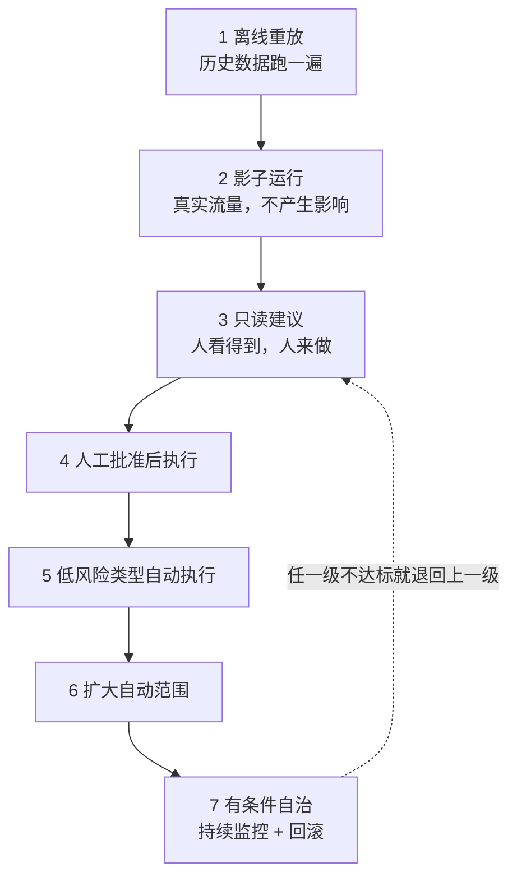

每一级都要有明确的进入门槛和退出条件。

不是所有项目都要爬到第七级。**很多场景停在第四级就已经产生了足够价值，而且风险可控。**

第 13 章说过，客户开口要第五层，实际需要的可能是第三层。放量级别也是一样。

## 各级要做什么

**一、离线重放。** 用历史数据跑，和当时的真实处理结果对比。

价值是成本低、能大批量跑。局限是历史数据里没有 Agent 造成的新情况。

**二、影子运行。** 真实流量进来，人正常处理，系统在旁边也处理一遍，结果只记录不生效。

这一级能暴露的东西，测试环境里看不到：真实数据有多脏、请求的实际分布和你以为的差多少、高峰期延迟、以及一批没见过的情况。

我认为**这一级不能省**。它是唯一一个既有真实性、又零风险的阶段。

**三、只读建议。** 结果给到人，人决定用不用。

这一级开始有采用率数据了——人有多少比例采纳了建议。这个数字比准确率更接近业务价值。

**四、人工批准后执行。** 人批准，系统执行。

和第三级的区别是执行由系统做，所以第 20 章那些工具契约、幂等、副作用记录，从这一级开始真正生效。

**五到六、部分自动执行。** 按第 18 章的异常矩阵，把低风险、规则明确的类型放开。

放开的顺序按"错误代价"排，不按"发生频率"排。

**七、有条件自治。** 大部分情况自动，异常和高风险仍走人工。

注意是"有条件"。**我不认为企业场景存在无条件自治**，因为第 18 章那个"未知"分支永远需要人。

## 偏差分类：这一步决定你是在修还是在补

第 2 章和第 7 章都提过，这里给完整的分类表。

| 偏差表现 | 归属 | 修法 | 对应章节 |
|---|---|---|---|
| 缺少某条信息 | Context | 补 Registry、改注入策略 | §19 |
| 用了过期或错误的信息 | Context | 改权威级别、加有效期 | §19 |
| 规则理解错 | Workflow | 把规则从提示词移到显式判断 | §18 |
| 状态流转错 | Workflow | 补状态定义和转移条件 | §18 |
| 工具调用参数错 | Harness | 加参数校验 | §20 |
| 重复执行 | Harness | 加幂等 | §20 |
| 该转人工没转 | Harness | 补接管点触发条件 | §20 |
| 模型确实做不到 | 范围 | 划出去交人工，改契约 | §16 |

**最后一行最难做，但必须做。**

承认某类情况模型做不到，要放弃一部分自动化率，在项目压力下很难开口。

但不承认的代价是系统在这类情况持续出错，最后拖垮所有人对它的信任。而信任一旦没了，前面所有工作都白做。

## 监控要盯什么

技术监控（延迟、错误率、成本）是基础，这里不展开。

FDE 要额外盯的是这几个：

**采用率。** 有多少人在用，趋势是涨还是跌。跌了要立刻查原因。

**建议采纳率。** 第三级之后一直有效。人不采纳，说明质量或者时机有问题。

**人工介入率。** 太高说明自动化价值不足，太低要警惕是不是该介入的没介入。

**逃逸率。** 人绕过系统去手工处理的比例。这个指标最容易被忽略，但它直接说明系统在实际工作里好不好用。

第 18 章说过，如果系统不支持"修改后批准"，人就会跳出系统。逃逸率就是在测这件事。

**业务指标本身。** Outcome Contract 里定的那个数字，对比基线。

## 回滚

第 12 章说过：能回滚代码，不等于能回滚业务后果。

要提前定义的：

关掉 AI 之后，人工流程能不能立刻接上（这要求人工流程没有被拆掉）。

已经产生的错误动作怎么处理，哪些能自动撤销，哪些要手工修。

谁有权决定回滚，什么条件下触发。

回滚之后，怎么判断可以重新放量。

**第一条最容易出事。** 有些项目上线后为了显示决心，把人工流程的工具和岗位撤了。一旦系统出问题，退无可退。

我的建议是：至少在达标观察期结束前，人工流程要保持可用。

## 达标观察期

第 16 章的 Outcome Contract 里有这一项。

它的作用是防止用短期数据下结论。一周达标可能是运气，也可能是那周恰好没有复杂案例。

观察期要覆盖业务的完整周期。有月结的业务至少跨一个月结，有季节性的业务要考虑淡旺季。

Part 5 到这里结束。

七章走完，一个 AI 系统从模糊需求变成了在生产环境里运行、被监控、能回滚的东西。

但这只解决了一半问题。**技术上的完成，不等于交付完成。**

下一篇讲另一半：项目怎么才算真的交出去了。

# Part 6 交付篇：Delivery Harness

第五篇解决"怎样把 AI 系统做对"，这一篇解决"怎样让企业项目成功"。

两件事经常被混为一谈，代价是项目在技术上完成、在商业上失败。

MIT 那份报告里外部伙伴主导的部署 67% 进生产、企业自建只有 33%，我认为差距很大程度上就在这一篇。

---

## §23 客户筛选与付费诊断

第 15 章筛的是需求，这一章筛的是客户。

**需求可以改小，客户改不了。**

## 值得做的客户长什么样

我按重要性排了个序，前三条是硬条件。

**一、有一个愿意投入时间的业务负责人。**

第 8 章和第 15 章都说过这个位置。这里再强调一次：不是"领导很重视"，是有名有姓、有权改流程、愿意每周花时间的人。

判断方法很直接：**约他两小时，看他来不来。**

来了，并且在会上能说清楚现在的流程哪里最痛，这个客户可以做。派个助理来听，基本可以放弃。

**二、有一个具体的痛，而不是一个方向。**

「我们客服每天处理三千张工单，其中订单查询类占三分之一，人力不够」是痛。

「我们要拥抱 AI」是方向。

方向类的需求不是不能做，但它需要先做诊断把方向变成痛。而客户往往不愿意为诊断付费。

**三、数据和系统有可行的访问路径。**

第 12 章那份技术尽调清单可以直接用。

关键是要在筛选阶段就用实际动作验证——不是听答复，是真的拿到一份样本数据。

**四、时间预期合理。**

要求两周上线、下个月见效的客户，通常意味着这件事上面已经承诺出去了。

这种项目的压力会全部传导到第 2 章那个顺序上——前三段会被压缩掉，然后失败。

**五、有承担失败的空间。**

第 15 章说过，第一个项目要选错了能补救的。客户这一侧也一样：如果这个项目只许成功，那它的风险承受能力是零，而零风险承受能力的项目不适合做 AI。

## 几种建议避开的客户

**只想要一个可以对外宣传的案例。** 这类项目的验收标准是发布稿，不是业务指标。做完你拿不到有价值的经验，也沉淀不了资产。

**已经失败过一次，但拒绝复盘的。** 上一次为什么失败，如果答案是"上一家供应商不行"，那么大概率会有第二次。

**IT 主导、业务缺席的。** 第 16 章说过 Outcome Contract 要业务负责人签字。业务缺席的项目，验收时一定出问题。

**预算来自年底突击花钱的。** 这类项目的真实目标是花掉预算，不是产生结果。表现是决策快、要求松、但验收时突然变严。

## 付费诊断

第 2 章和第 7 章都提到过这个做法，这里讲清楚。

诊断是一个独立收费的小项目，通常两到四周，产出第 17 章那几样东西：真实流程、异常矩阵、Context Registry 初稿、可行性判断、收缩后的第一阶段范围和报价。

**它解决三个问题。**

第一，客户会认真配合。免费的东西没人重视，约人约不到、数据拿不到。

第二，你有依据报价。不做诊断就报价，等于在赌，赌输了整个项目都在亏损里跑。

第三，它本身是一次双向筛选。四周下来，你知道这个客户好不好合作，客户也知道你专不专业。

**诊断的交付物必须独立有价值。** 就算后面不合作，客户也拿到了一份能用的现状梳理。很多企业从来没有人完整梳理过自己的流程。

这一点做到了，诊断就不难卖。

## 诊断报告要包含什么

| 部分 | 内容 |
|---|---|
| 现状 | 真实流程图、异常矩阵、耗时分布 |
| 知识 | Context Registry 初稿、待确认清单 |
| 可行性 | 数据可获得性、系统集成路径、身份权限方案 |
| 分层判断 | 每个候选场景在第 13 章的哪一层，建议做到哪一层 |
| 筛选结论 | 建议做的、建议缓的、建议不做的，各自理由 |
| 范围建议 | 第一阶段范围、Outcome Contract 草案 |
| 报价与工期 | 基于以上的估算，含甲方依赖 |

第五行的"建议不做的"要认真写。

第 15 章说过，拒绝要包含具体条件、补齐路径和当期替代方案。

**写在诊断报告里的拒绝，比在项目中途的拒绝容易接受一百倍。**

## 从诊断到合同

诊断结束时要做一次正式汇报，参加的人必须包括业务负责人。

汇报的重点不是"我们能做什么"，是"我们发现了什么"。

现状梳理的部分往往会让客户内部产生讨论——因为你把他们内部不一致的地方摆到了台面上。

这个讨论对你有利。它会让业务负责人意识到，这件事需要他来拍板，而不只是买个软件。

下一章讲怎么把诊断结论变成一份能保护双方的 SOW。

## §24 范围收缩、报价与 SOW

第 5 章说过：范围和技术方案是同一件事的两面。

所以这一章不是商务章节。**范围谈判是 FDE 的技术工作。**

## 范围收缩的四个条件

第 2 章给过，这里展开怎么用。

客户第一次提的需求，基本是他们能想到的最大版本。你要从里面切一块，满足：

**发生得够频繁。** 第 15 章讲过低频场景的问题——拿不到足够样本验证可靠性。

**结果能衡量。** 对应第 16 章的基线。现在没人测这个数字，那第一件事是先建立测量。

**数据拿得到。** 第 12 章那份尽调清单验证过的，不是听说的。

**做错了能恢复。** 第 15 章说这是硬约束。

四条都满足的切片，通常比客户原始需求小一个数量级。

**小不是问题。小而完整，比大而半成品有价值得多。**

因为小的切片能在几周内跑到生产，拿到真实数据，建立信任。而信任是后面扩范围的唯一基础。

## 怎么跟客户谈缩范围

直接说"这个太大了做不了"，效果不好。

我认为有效的讲法是把它变成路径，而不是删减。

先给完整图景：你要的这套东西整体是这样，包含 A、B、C、D 四块。

再给排序依据：A 数据现成、错误可恢复、每天发生几百次，适合先做，六周能跑到生产。D 需要接三个老系统且不可回滚，建议放在建立信任之后。

再给时间点：A 上线并稳定运行一个月后，我们用真实数据重新评估 B 和 C。

**客户抗拒的是"做不了"，不抗拒"先做这个"。**

## 报价

我不打算给具体的定价方法，因为它跟市场、团队成本和客户类型强相关。

但有几件事我认为在报价里必须体现。

**诊断和实施分开报。** 理由在第 23 章。

**报价要绑定甲方依赖。** 这个价格的前提是客户在某个时间点前提供某些东西。前提不成立，价格和工期都要重议。

**留出评估和上线的工作量。** 第 21 章和第 22 章那些活是实打实的工作，不是"顺便做一下"。很多报价只算了开发，结果这部分吃掉了利润。

**明确支持范围和期限。** 第 4 章的第五个问题说过，没有边界的支持会把团队拖垮。

我见到的最常见的报价错误是：**只报了第一次做对的成本，没报反复迭代的成本。**

而第 22 章讲的偏差处理，本身就是一个持续的过程。

## SOW 要写什么

SOW 不是商务附件，它是 Delivery Harness 的核心文档。

它和第 16 章的 Outcome Contract 是配套的：Outcome Contract 定义"什么算成功"，SOW 定义"双方各做什么、出问题怎么办"。

| 部分 | 必须写清楚的 |
|---|---|
| 范围 | 做什么，以及明确不做什么 |
| 甲方依赖 | 人、数据、账号、环境、审批，各自的截止时间 |
| 阶段与里程碑 | 每个阶段的产物和确认方式 |
| 变更机制 | 需求变了怎么走，对预算和工期的影响规则 |
| 验收 | 依据 Outcome Contract 的哪些条款，用什么证据 |
| 支持 | 上线后支持的范围、响应时间、期限 |
| 交接 | 交接的内容清单和完成标准 |
| 数据与安全 | 数据处理边界、留存、合规责任 |
| 知识产权 | 通用组件的归属（这条直接关系第 31 章的资产化） |

最后一条经常被忽略，但它决定了你能不能把项目里的通用能力带走。

**如果合同写的是"所有交付成果归甲方所有"，那第 31 章的复利循环就不成立了。**

我的建议是在合同里区分：客户特有的业务逻辑和数据归客户，通用组件和方法保留使用权。这件事要在签合同时谈，不能事后补。

## 「明确不做」这一栏

这是 SOW 里我认为性价比最高的一栏。

写清楚哪些不在本期范围：哪些系统不接、哪些场景不覆盖、哪些异常走人工、第 14 章那七类问题里哪几类本期不处理。

它的作用不是推责任，是**让双方对"完成"的理解一致**。

大部分交付纠纷的根源，是双方对完成的定义不同，而这个差异在签字时就存在，只是没人写下来。

## 一个判断

这一章讲的所有东西，都在解决一个问题：**让项目的边界可验证。**

第 2 章讲的顺序是让系统正确，这一章讲的是让项目能收尾。

两者缺一个，另一个都没有意义。技术做对了但项目收不了尾，团队会被拖死；项目收尾了但系统不对，客户不会有第二次。

下一章讲甲方依赖，我认为它是这一篇里最该单独拿出来讲的一节。

## §25 甲方依赖：项目失败最常见的非技术原因

这一章可能是全书最不性感、但最能救项目的一章。

MIT 那份报告把数据就绪度列为失败主因之一。在现场，"数据没就绪"往往不是技术问题，是**没人负责去开那个权限。**

## 什么是甲方依赖

指的是项目推进必须由客户提供、而交付方无法自行获得的东西。

四类：

**人。** 业务负责人、数据/IT 对接人、一线受访者、验收人。

**数据与访问。** 测试环境账号、只读权限、接口文档、样本数据、生产环境的部署条件。

**决策。** 第 17 章那份待确认清单的答案、规则冲突的裁决、流程变更的批准。

**审批通道。** 安全评审、合规审查、上线审批的排期。

## 为什么必须写进合同

因为**它们的延迟成本，默认会算在交付方头上。**

一个很常见的情形：账号申请走了六周流程，项目停了六周，最后客户问"为什么延期了"。

如果 SOW 里没写这一条，你只能自认。写了，这就是一次合法的工期顺延。

我的判断是：**甲方依赖这一节，是 SOW 里唯一能保护交付方的部分。**

其他条款基本都在约束交付方。

## 怎么写

每一项要有四个要素。

| 要素 | 例子 |
|---|---|
| 具体内容 | A 系统订单表的只读权限 |
| 责任人 | 客户方某个岗位（有名字更好） |
| 截止时间 | 项目启动后第 X 天 |
| 未按时提供的后果 | 相关阶段工期顺延，顺延天数等于延迟天数 |

第四条是关键。

**没有后果的依赖清单，等于一份愿望清单。**

写清楚后果不是为了追责，是为了让客户内部知道这件事有优先级。很多时候延迟不是因为不配合，是因为对接人不知道这件事卡着整个项目。

## 三个最容易卡住的依赖

**第一，生产环境的访问权限。**

测试环境通常好办，生产环境要走安全审批。这个流程在大企业里可能要一个月以上。

对策是在项目启动时就发起申请，不要等到需要用的时候。

**第二，一线人员的时间。**

第 17 章的现场观察需要一线配合，而一线有自己的 KPI。

对策是让业务负责人明确安排，而不是让 FDE 自己去约。**这件事必须由客户内部的人推动。**

**第三，待确认事实的答案。**

第 17 章和第 19 章都提过这份清单。它的答案往往涉及跨部门协调，客户内部可能本来就没有共识。

对策是把清单分级：哪些影响本期范围（必须在某个日期前给答案），哪些不影响（记入风险清单，命中时走人工）。

## 依赖的可视化

我建议在项目里维护一张公开的依赖状态表，每周同步给客户。

| 依赖项 | 责任人 | 承诺日期 | 状态 | 影响 |
|---|---|---|---|---|
| ... | ... | ... | 已提供 / 进行中 / 逾期 | 逾期会影响哪个里程碑 |

这张表的作用不是施压。

它的真正价值是：**让客户的业务负责人看到自己团队卡在哪。**

多数情况下业务负责人是有权推动的，他只是不知道有东西卡着。

## 一条经验判断

第 12 章那份技术尽调清单里说过：任何一项答不上来，工期都要往后加。

这里给一条更具体的：**如果启动一个月后，甲方依赖清单里还有超过三分之一没有兑现，这个项目的风险已经很高了。**

这时候我认为正确的动作不是加班赶进度，是把问题正式提到业务负责人层面，重新评估范围和时间。

继续闷头做的结果，通常是最后一起延期，然后责任落在交付方。

## 甲方依赖和第 15 章的关系

第 15 章的七道门里，"负责人"和"数据"两道，检验的就是甲方依赖能不能兑现。

**筛选阶段没验证的依赖，会在执行阶段变成风险。**

所以第 23 章说筛选客户时要用实际动作验证——真的拿到一份样本数据，而不是听答复。

拿到了，说明这条路径是通的。拿不到，说明这个客户内部的协调能力有问题，而这个问题在项目里只会更严重。

下一章讲变更和验收。

## §26 变更管理与验收证据

企业 AI 项目的需求一定会变。

原因不是客户善变，是**第 17 章那个过程本身就在制造变更**——你把真实流程摸清楚了，客户才第一次看清自己的现状，然后想法就变了。

所以变更不是异常，是这类项目的常态。要做的是给它一条通道。

## 三类变更，处理方式不同

| 类型 | 例子 | 处理 |
|---|---|---|
| 认知修正 | 调研发现实际流程和描述不符 | 不算变更，改 Outcome Contract 并重新签 |
| 范围新增 | 客户想加一个场景或一个系统 | 走正式变更，评估影响，重议工期预算 |
| 细节调整 | 某个规则的阈值改一下 | 记录即可，不走流程 |

第一类最容易被误处理。

调研发现真实情况和当初的假设不同，这不是客户加需求，是双方都不知道的事实浮出来了。

这时候正确的动作是**回到 Outcome Contract 重新对齐，而不是硬扛着按原计划做。**

按原计划做的结果是做出一个不符合实际的系统，验收时才发现，那时候成本高得多。

## 变更流程要简单

我见过一些团队把变更流程做得很重，结果是没人走，改动全部私下发生。

我认为有效的变更流程只需要三步：

写下来改什么、为什么改。评估对范围、工期、预算的影响。双方确认。

关键不是流程复杂度，是**有没有留下记录**。

记录的价值在验收时体现：三个月后没人记得当初为什么加了这个功能、当时说好工期加了两周。

## 一个我认为有用的做法：变更预算

在合同里预留一定比例的变更额度（比如总工作量的百分之十五），用于小范围调整，不走正式流程。

超出这个额度才启动正式变更。

好处是双方都不用为小事扯皮，同时又有一个明确的边界。

坏处是这个额度用完之后，客户会觉得"以前都能改，现在为什么不行"。所以额度的消耗要透明，定期同步。

## 验收：证据比结论重要

第 16 章说过 Outcome Contract 是验收的唯一依据。

这里讲证据的形式。

| 验收项 | 证据形式 |
|---|---|
| 业务指标达标 | 对比基线的实际数据，覆盖达标观察期 |
| 系统稳定运行 | 监控数据：可用性、延迟、错误率 |
| 评估集通过 | 第 21 章的分类评估结果，各类分别达标 |
| 采用情况 | 使用人数、使用频次、建议采纳率 |
| 异常处理有效 | 异常发生时的处理记录，人工介入是否及时 |
| 交接完成 | 第 27 章的交接清单，客户方签收 |

第一项和第四项要放一起看。

**指标达标但没人用，通常意味着指标选错了。**

比如"处理时长下降"达标了，但实际上是因为大家绕过系统直接手工处理——第 22 章讲的逃逸率就是在防这个。

## 验收会怎么开

参加的人必须包括业务负责人。理由在第 16 章说过。

我建议的顺序是：先看数据，再看现场，最后谈遗留。

**先看数据。** 把 Outcome Contract 里的每一条逐项对照，达标的、未达标的都摆出来。

**再看现场。** 找一线操作员实际跑几个案例，包括异常场景。这一步经常能暴露文档上看不出来的问题。

**最后谈遗留。** 哪些是本期明确不做的（对照 SOW 那一栏），哪些是发现的新问题（进下一期），哪些是缺陷（本期修）。

第三步的分类要在会上当场做完，不要留到会后。

## 未达标怎么办

这是验收里最难的部分，也是必须提前在 SOW 里定好规则的部分。

要区分两种情况。

**一种是甲方依赖未兑现导致的。** 第 25 章那份依赖状态表在这里派上用场。如果某个指标不达标是因为数据一直没给，责任不在交付方。

**另一种是系统本身的问题。** 那就要定：修复期多长、修复期间的付款怎么处理、修不好怎么办。

我认为最不该出现的是"再看看"。没有明确结论的验收会让项目无限期挂着，交付方的人力被锁死，客户也拿不到确定的东西。

## 验收和付款

具体条款不展开，但有一条我认为要坚持：**分阶段付款，且每个阶段的付款条件是可验证的产物，不是时间。**

比如诊断结束付一笔（对应诊断报告）、系统上线付一笔（对应上线并通过评估）、验收通过付一笔（对应达标观察期结束）。

按时间付款的问题是，它和实际进展脱钩。项目卡在甲方依赖上的时候，付款节点照样到，双方都尴尬。

下一章讲最后一步：怎么把这套东西真正交出去。

## §27 上线培训、采用率与交接

第 22 章讲的是系统怎么放量，这一章讲的是人怎么接过去。

**技术上的完成，不等于交付完成；验收通过，也不等于业务成功。**

MIT 那份报告说 95% 的项目没有可衡量的损益影响。我认为其中相当一部分，系统是能跑的，只是没人用。

## 采用率是一个设计问题

采用率经常被当成培训问题——"多培训几次就好了"。

我不这么认为。**采用率主要是系统设计的结果，培训只能补一小部分。**

几个决定采用率的设计因素：

**入口位置。** 系统嵌在原有工作流里，还是要跳到另一个地方。第 13 章讲第二层需求时说过，让人跳出去生成再复制回来，基本没人会用。

**默认状态。** 是默认打开还是要主动开启。这个差别比大多数人以为的大。

**失败时的成本。** AI 给的结果不对时，人是"改一下"还是"整个重来"。后者会让人放弃使用。

**反馈通道。** 用户觉得不对的时候，能不能一键报错。没有通道，不满会积累成弃用。

## 培训要讲什么

培训的重点不是操作步骤，是边界。

我认为要讲清楚三件事：

**它能做什么、不能做什么。** 明确说出哪些情况它处理不了，会转人工。这比夸大能力重要得多——第一次遇到它做不到的事而没有预期，用户的信任就崩了。

**做错了怎么办。** 怎么撤销、找谁、多久能处理。

**怎么反馈。** 觉得结果不对的时候，在哪里点、点了之后会发生什么。

第三条要真的有人处理。**如果反馈进了黑洞，第二次就没人反馈了，你也就失去了最重要的改进来源。**

## 交接清单

第 4 章的第五个问题问的就是这个：项目结束后谁维护。

交接不是给一份文档，是把几个具体职责移交出去，每一项都要有接手人。

| 交接项 | 内容 | 接手人 |
|---|---|---|
| 日常监控 | 看哪些指标、异常时怎么处理 | 客户运维或指定岗位 |
| Context 维护 | 文档更新后同步 Registry、定期复核 | 客户业务方 |
| 规则变更 | 业务规则变了怎么改、谁批准 | 业务负责人 |
| 评估集维护 | 新故障转成用例、定期回归 | 交付方或客户技术 |
| 模型升级 | 谁负责重跑评估、验证约束是否还需要 | 双方约定 |
| 故障响应 | 分级、响应时间、升级路径 | 双方约定 |

**第二项和第五项最容易漏。**

第 19 章说过，上下文系统会腐化，而且没人会知道是从哪天开始错的。

第 10 章和第 11 章说过，模型升级后旧约束可能变成负担，需要重新评估。

这两件事如果没有接手人，系统会在几个月内悄悄退化，而且退化时没有报警。

## 让客户具备自主运营能力

第 1 章说过 AWS 的目标之一是让客户最终能独立运营。

我认为这不是客气话，而是这个模式能不能扩张的前提。

具体要移交的能力：

能自己改业务规则（因为规则写在配置里，不在提示词里——第 18 章）。

能自己判断系统是好是坏（因为有评估集和指标——第 21 章）。

能自己定位问题在哪一层（因为有第 22 章那张偏差分类表）。

知道什么情况需要找回交付方（明确的升级路径）。

**前三条的前提，都是前面几章那些交付物真的做扎实了。**

如果规则藏在提示词里、判断靠人工抽查、问题分不了类，那客户永远独立不了，你也永远走不掉。

## 支持期的边界

第 24 章说过报价要明确支持范围和期限。这里讲具体怎么划。

要写清楚的：

支持哪些内容（缺陷修复算，新需求不算）。响应时间怎么分级。支持期多长。支持期结束后怎么续。

我认为最重要的是把"缺陷"和"新需求"的界限写清楚。

界限的判断依据是 Outcome Contract 和 SOW：契约里承诺的行为没做到，是缺陷；契约里没写的，是新需求。

**没有这个界限，支持期会变成免费的第二期开发。**

## 交接完成的标志

我用三条来判断：

客户方在没有交付方参与的情况下，独立处理过一次真实故障。

客户方独立完成过一次规则变更，并跑通了评估。

监控和告警接进了客户自己的值班体系。

三条都做到，才算交出去了。

**只签了一份交接确认单，不算。**

Part 6 到这里结束。

下一篇用三个推演，把前面两篇的方法论完整走一遍。

---

**本章引用**

- [The GenAI Divide: State of AI in Business 2025](https://cloudelligent.com/wp-content/uploads/2026/02/v0.1_State_of_AI_in_Business_2025_Report.pdf)，MIT Media Lab NANDA
- [AWS Forward Deployed Engineering for Partners](https://aws.amazon.com/blogs/apn/introducing-forward-deployed-engineering-for-partners-winning-the-future-of-enterprise-ai/)

# Part 7 推演篇：把方法论走一遍

先说清楚这一篇是什么。

**这三章不是真实客户项目的复盘。**

我在首页说过这本书的依据，这里再强调一次：我没有几十个客户现场的一手经验，所以不会编造客户名、行业数据和项目结果来伪装成案例。

这三章是推演。用前六篇的方法论，对三类典型场景走一遍完整流程，重点展示每一步的交付物长什么样、判断依据是什么、在哪里会卡住。

**它的用法是模板，不是案例。** 你把自己的场景代进去，就知道该产出什么。

三个推演按第 13 章的层级递增：

| 推演 | 场景类型 | 主要落在第几层 | 重点展示 |
|---|---|---|---|
| 一 | 企业知识助手 | 第一层 信息获取 | Context 治理 |
| 二 | 客服处理 Agent | 第三到四层 | 工作流、人工接管、评估 |
| 三 | 跨系统执行 Agent | 第五层 自主执行 | 权限、副作用、回滚 |

---

## §28 推演一：企业知识助手

## 客户最初的说法

"我们内部资料太散了，员工找东西很费劲。想做一个知识库，能问答的那种。"

这是第 14 章第一类问题的典型表述：**没有可衡量的业务结果。**

## 第一步：把它问下去

按第 16 章那九个问题追。

谁在找？找什么？一天多少次？找不到的时候怎么办？现在平均要花多久？找错了会怎样？

追问后可能出现的情况是：这个需求其实包含好几个不同的东西。

新员工问制度（低频、答案稳定、错了影响小）。一线问产品参数（高频、答案会变、错了会给客户错误信息）。管理层问数据（要接系统，不是文档问答）。

**三个需求的难度和风险完全不同，不能混成一个项目。**

按第 15 章的七道门筛，第二个通常最值得先做：频率高、结果可衡量（查询耗时、答错率）、数据可获得、错误可恢复（人会核对再发给客户）。

## 第二步：Outcome Contract 长什么样

按第 16 章的骨架，关键几栏可能是这样：

```text
范围：产品参数与政策类问题的内部查询
明确不做：客户直接使用（本期仅内部）、数据类查询、跨系统取数

结果：
  目标状态改变：一线查询产品信息的平均耗时下降
  衡量指标：单次查询平均耗时；答案被采纳后仍需二次核对的比例
  当前基线：需要先测（当前无人统计）
  达标观察期：连续 4 周

判定：
  成功：命中知识库范围内的问题，给出带来源引用的正确答案
  失败：给出无来源支撑的答案，或引用了已作废文档
  部分成功：只能给出相关文档而无法直接回答 —— 允许，计入"仅定位"类

风险边界：
  单次错误代价：一线据此答复客户，可能造成承诺偏差
  必须拒绝：涉及价格授权、合同条款解释的问题
```

注意"必须拒绝"那一栏。

第一层需求看起来风险低，但**一旦答案会被转述给客户，风险就不低了。**

## 第三步：这个场景真正的难点

不是检索。是第 14 章的第二类问题：知识散、冲突、过期。

第 17 章的 Context Audit 在这个场景里是主要工作量。可能会发现：

同一份产品文档存在多个版本，散在不同位置，没人知道哪份现行。

一部分参数在文档里，一部分在系统里，两边对不上。

有些规则从来没写进文档，只在几个资深同事那里。

有大量已经作废但没删的资料。

第 10 章说过：模型没有判断权威性的能力，检索分数和权威性无关。

**所以这个项目的核心交付物是 Context Registry，不是检索系统。**

## 第四步：Registry 的关键列

按第 19 章的模板，这个场景里最吃紧的三列：

**权威级别。** 系统里的结构化参数标高，正式发布的文档标中，个人整理的资料标低。冲突时高压中。

**有效期。** 产品参数类的信息要有失效时间，过期的不再进上下文，或者进的时候带上"此信息可能已过期"的标记。

**状态。** 已确认 / 待确认 / 已废弃。废弃的要真的从索引里移除，不能只是标记。

## 第五步：评估集里最该有的用例

按第 21 章的七类：

**上下文冲突**——构造两份说法不同的产品文档，检查系统是否按权威级别选择，以及是否在答案里说明了依据。

**信息缺失**——问一个知识库里没有的参数，检查是否明确说"没有找到"，而不是编造一个合理的数字。

**必须拒绝**——问"这个客户能不能给八折"，检查是否拒绝并转人工。

**边界**——问一个知识库覆盖范围边缘的问题，检查是否会强行回答。

第二类是这个场景里最关键的。**第一层需求里，编造是最高频也最难发现的失效。**

因为编造出来的答案格式正确、看起来合理，人如果不核对就不会发现。

## 第六步：怎么放量

按第 22 章的七级，这个场景通常只需要走到第三级：只读建议。

系统给答案和来源引用，人自己判断用不用。

**这一级的关键指标是采纳率**，不是准确率。人有多少比例直接用了系统给的答案，比模型自评的准确率更接近真实价值。

## 这个推演里最容易踩的坑

**第一，把它当成简单项目。** 因为技术栈简单，容易低估 Context Audit 的工作量。实际上这部分可能占全项目一半以上。

**第二，追求覆盖率。** 想把所有文档都放进去。第 10 章说过，上下文是有限资源，文档越多噪音越多。宁可先覆盖一个明确的范围，做准。

**第三，不带来源。** 答案不给来源引用，人就无法核对，也就无法建立信任。**在第一层需求里，来源引用比答案本身更重要。**

**第四，没有反馈通道。** 第 27 章说过，用户觉得不对时如果不能一键报错，不满会积累成弃用。

## 可以沉淀什么

按第 31 章的分类：

客户特有的是文档结构、术语表、权威规则。

可复用的是 Context Registry 模板、冲突检测的方法、"信息缺失"和"必须拒绝"这两类评估用例的构造方式、来源引用的展示形式。

下一个推演的复杂度上一个台阶。

## §29 推演二：客服处理 Agent

## 客户最初的说法

"客服人力不够，想让 AI 把简单工单直接处理掉。"

比上一个推演具体，但仍然缺三样：哪些算简单、处理到什么程度、错了怎么办。

## 第一步：拆开这个需求

第 13 章说过，客户描述的层级和实际需要的层级经常不一致。

"直接处理掉"听起来是第五层（自主执行），但拆开看，一张工单的处理其实包含好几段：

读懂客户问什么。判断属于哪一类。调取相关信息（订单、账户、历史记录）。决定怎么答复。执行动作（回复、改状态、发起退款、转人工）。

前四段是第三层（分析判断）和第四层（流程协同），最后一段才是第五层。

**而真正耗时的往往是中间三段，不是最后那一下。**

按第 2 章的顺序，这个判断要靠第 17 章的现场观察得出——看客服处理二十张工单，时间实际花在哪。

## 第二步：范围收缩

按第 24 章的四个条件切。

一个可能的切法：**只处理某一类规则明确的工单，且只做到"生成答复草稿 + 附上依据"，人点确认后发出。**

这样切之后：

频率够（这类工单占比高）。结果可衡量（单张处理时长、草稿采纳率）。数据可获得（工单系统 + 订单系统只读）。错误可恢复（人在发出前会看一眼）。

第五层的部分留到后面。第 13 章说过，层级可以爬，但不能跳。

## 第三步：这个场景的核心是流程契约

上一个推演的核心是 Context，这一个的核心是第 18 章的 Workflow Contract。

因为客服流程有大量分支和异常，而 SOP 里通常只写了正常路径。

现场观察会发现的异常可能包括：客户描述不清、订单信息与客户描述不符、涉及多个订单、客户情绪激烈、请求超出政策范围、需要跨部门协调、系统查不到记录。

这些在人手里是自然处理的，AI 接手后会突然变得可见。

## 第四步：状态机和异常矩阵

按第 18 章的骨架，这个场景的状态机大致是：

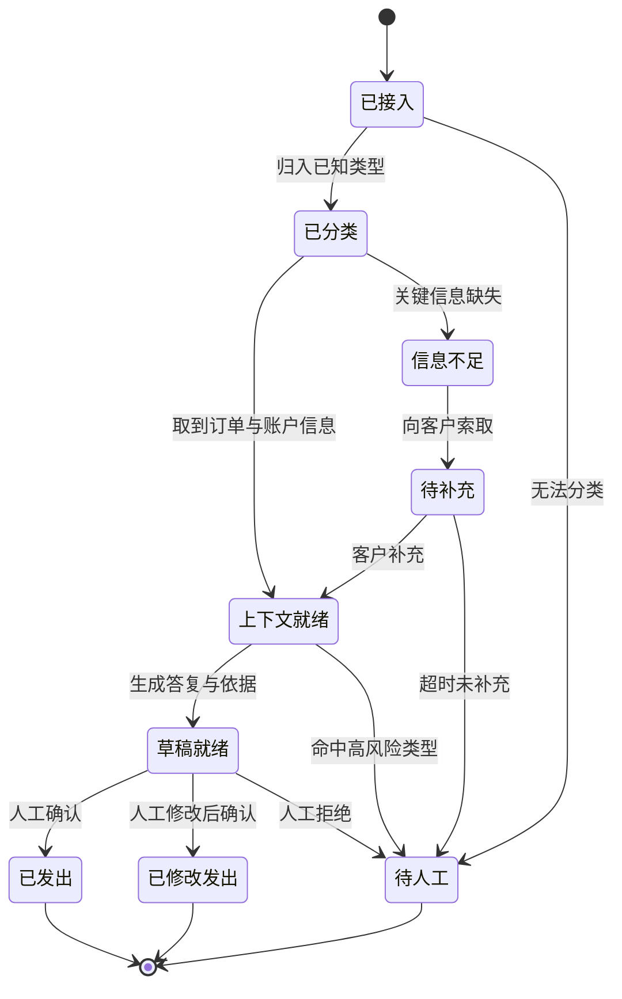

**"已修改发出"这个状态必须有。**

第 18 章说过，如果系统不支持"修改后批准"，人就会跳出系统去手工处理，流程数据就断了。

而且这个状态是最有价值的数据来源——**人改了什么，就是系统还差什么。**

异常矩阵按第 18 章的分类方式：

| 异常 | 类别 | 处理 |
|---|---|---|
| 客户描述不清 | 需要补信息 | 生成澄清问题，转待补充 |
| 订单信息与描述不符 | 需要人判断 | 转人工，附上两边的差异 |
| 涉及多个订单 | 需要人判断 | 本期不处理，直接转人工 |
| 客户情绪激烈 | 需要人判断 | 转人工，标记优先级 |
| 超出政策范围 | 必须拒绝 | 转人工，不生成草稿 |
| 系统查不到记录 | 未知 | 保守停止，报警 |

"涉及多个订单"这一行体现的是第 24 章的范围收缩——**明确写出本期不处理，比勉强处理要好。**

## 第五步：决策规则要写在外面

第 18 章那条实践在这个场景里特别重要。

哪类工单算高风险、什么金额以上必须人工、哪些客户等级有特殊政策——这些都是条件判断，应该写成显式配置。

**理由是业务方要能自己改。**

客服政策变化很频繁。如果每次调整都要改提示词、重新测试、重新发版，这个系统很快就跟不上业务了。

第 27 章讲的"让客户具备自主运营能力"，第一条就是能自己改规则。

## 第六步：评估集

这个场景的评估比上一个复杂，因为要检查的是状态转移是否正确，不只是文本质量。

按第 21 章的七类：

**正常**——各类工单的典型案例，检查分类是否正确、草稿是否引用了正确的订单信息。

**边界**——金额刚好在人工审批线上下的案例。

**信息缺失**——客户只说了"我的订单有问题"，检查是否生成澄清问题而不是猜测。

**上下文冲突**——客户说的和系统记录不一致，检查是否转人工而不是选一边相信。

**权限越界**——用一个客服的身份查另一个区域的订单，检查是否拒绝。

**必须拒绝**——客户要求超出政策的补偿，检查是否转人工而不是自行答应。

**下游失败**——工单系统写入超时，检查是否重复发送答复。

最后一类在这个场景里代价很高。**同一条答复发两次给客户，是真实可见的事故。**

所以第 20 章讲的幂等在这里是硬要求。

## 第七步：放量路径

按第 22 章：

离线重放历史工单 → 影子运行（生成草稿但不给人看，只做对比）→ 只读建议（草稿给客服看）→ 人工确认后发出 → 某几类低风险工单自动发出。

**每一级的门槛要按工单类型分别设，不看整体平均。**

第 21 章说过，平均分会掩盖问题。整体 95% 的系统，可能在"必须拒绝"那类上只有 60%。

## 这个推演里最容易踩的坑

**第一，用整体准确率作为上线门槛。** 上面说过。

**第二，忽略采纳率和逃逸率。** 草稿准确率很高，但客服嫌改起来麻烦，全部自己重写——第 22 章讲的逃逸率就是在测这个。

**第三，把异常全部丢给人工。** 转人工的比例过高，自动化价值就没了。要按第 22 章的偏差分类逐类分析，哪些是可以收回来的。

**第四，没有留"人改了什么"的数据。** 这是最可惜的一种浪费，因为这份数据是改进系统最直接的原料。

## 可以沉淀什么

客户特有的是工单分类体系、政策规则、话术风格。

可复用的是这套状态机骨架、异常分类方式、"修改后批准"的实现、按类型分别设门槛的评估框架、工单系统的连接器。

下一个推演进入第五层。

## §30 推演三：跨系统执行 Agent

## 客户最初的说法

"我们希望 AI 能自动完成整个流程，从发现问题到处理完，不用人管。"

第 13 章的第五层，自主执行。

以运营类场景为例：系统监测到某个业务指标异常，判断原因，生成处理方案，然后直接在几个系统里执行——改配置、发通知、生成单据。

## 第一步：先判断该不该做

按第 15 章的七道门。

这类需求最容易卡在两道：**可恢复**和**负责人**。

可恢复这一门：执行动作会不会不可撤销。发通知发出去了收不回来，单据生成了要走冲销流程。

负责人这一门：谁来批准让 AI 自动改生产系统的配置。这个人通常比业务负责人级别更高。

**如果这两道过不了，正确的动作是降层。**

降到第四层：AI 完成监测、判断、方案生成和材料准备，最后的执行动作由人点一下。

价值可能只剩一半，但项目能活下来，而且这一半的价值也是实的——第 29 章那个推演已经说明，耗时往往在前面几段，不在最后那一下。

## 第二步：假设条件满足，Outcome Contract 怎么写

第 16 章那份骨架里，这个场景的"风险与边界"部分是重点：

```text
风险与边界：
  单次错误代价：错误配置可能影响线上业务；错误通知会到达外部
  不可恢复的动作：
    - 对外发送的通知（发出即不可撤回）
    - 已进入财务流程的单据（需走冲销）
  可恢复的动作：
    - 内部配置变更（有变更记录，可回滚）
    - 内部工单状态变更
  必须人工批准：所有不可恢复的动作，无一例外
  必须拒绝：影响范围超过阈值的批量操作
```

**"所有不可恢复的动作必须人工批准，无一例外"这一条我认为不能妥协。**

第 14 章说过：如果一个动作错了没法撤销，它就必须有人工检查点，不管模型准确率多高。

准确率再高也不是零。而不可恢复的错误，一次就够。

## 第三步：这个场景的核心是 Agent Harness

前两个推演的核心分别是 Context 和 Workflow，这一个是第 20 章的 Harness。

因为这里的每一个动作都会真的改变外部系统。

要逐项落实的：

**工具契约。** 每个可执行的动作都要有明确定义：参数校验、副作用说明、幂等保证、失败语义。

**幂等。** 第 20 章说过这是底线。这个场景里尤其重要，因为多步流程的重试是必然发生的。

如果下游系统不支持幂等键，那这个动作就不能自动重试，只能转人工。

**副作用清单。** 每一步执行前记录"我将要改什么"，执行后记录"我改了什么"。

这份清单是回滚的唯一依据。第 18 章说过它是回滚设计的前提。

**身份与权限。** 第 12 章的问题在这里最尖锐：Agent 用什么身份去改生产配置，这个权限谁批的，审计日志记在谁名下。

**这个问题必须在方案阶段就拿给客户的安全部门确认。** 等上线前一周提出来，改架构的成本最高。

## 第四步：多步流程的成功率问题

第 9 章说过，单步 95% 的成功率，十步串起来只剩六成。

这个场景的流程通常就是十步左右。所以要在设计上处理：

**减少步数。** 能合并的合并，能用确定性代码做的不要交给模型。

**每步验证。** 每一步执行后检查实际状态，而不是相信调用返回。

**关键节点核对。** 第 20 章提过，长流程中途插入一次核对，确认当前进展还在解决最初那个问题。

**总步数上限。** 超过上限就停下转人工，而不是继续尝试。

第 20 章引的那两个失效模式在这里最危险：过度乐观（为了让任务显得完成而降低标准），以及执行压力下的实现漂移（长流程里慢慢偏离原定计划）。

## 第五步：评估要检查最终环境状态

第 21 章那条原则在这个场景里是命脉：

**不能相信 Agent 说"已完成"，要去目标系统里查实际状态。**

评估用例的断言对象是：配置是否真的改了、通知是否真的发出、单据是否真的生成、以及有没有产生预期之外的副作用。

最后一条容易漏。**要检查的不只是"该做的做了"，还有"不该做的没做"。**

具体做法是在测试环境里对比执行前后的完整状态快照。

## 第六步：回滚设计

第 12 章说过：能回滚代码，不等于能回滚业务后果。

这个场景必须提前设计的：

每类动作的撤销方式是什么（自动撤销 / 手工撤销 / 无法撤销）。

发现错误后，怎么找到所有受影响的对象（靠副作用清单）。

谁有权触发回滚，触发条件是什么。

回滚期间业务怎么运转（人工流程是否还可用）。

第 22 章说过，有些项目上线后把人工流程的工具和岗位撤了，出问题就退无可退。

**至少在达标观察期结束前，人工流程要保持可用。**

## 第七步：放量路径最长

按第 22 章的七级，这个场景每一级都要认真走。

尤其是影子运行那一级——让 Agent 完整跑一遍但不真正执行，把"它想做什么"记录下来，和人的实际处理对比。

这一级能暴露的东西最多，成本却是零。**我认为这个场景里影子运行至少要跑一个完整的业务周期。**

从"人工批准后执行"到"部分自动执行"的那一步，要按动作类型逐个放开，而不是整体放开。

放开顺序按错误代价排，不按发生频率排。

## 这个推演里最容易踩的坑

**第一，一开始就要第五层。** 前面反复说过，跳级的代价是第一次出错就可能终结项目。

**第二，幂等靠"应该不会重复"。** 第 20 章说过，重试是必然会发生的。

**第三，把人工审批做成一个按钮。** 第 20 章说过，审批人要看到足够信息才能判断：当前状态、Agent 的建议、依据、批准后会发生什么。信息不够，人就会闭眼点确认，审批形同虚设。

**第四，没有副作用清单。** 出事时找不到所有受影响的对象，只能全量排查。

**第五，撤了人工流程。** 上面说过。

## 三个推演的对比

| | 推演一 知识助手 | 推演二 客服 Agent | 推演三 执行 Agent |
|---|---|---|---|
| 主要层级 | 第一层 | 第三到四层 | 第五层 |
| 核心交付物 | Context Registry | Workflow Contract | Agent Harness |
| 最大工作量 | Context Audit | 异常矩阵与状态机 | 权限、幂等、回滚 |
| 最危险的失效 | 编造 | 重复执行、逃逸 | 不可恢复的错误动作 |
| 放量终点 | 第三级 只读建议 | 第五级 部分自动 | 第七级 有条件自治 |
| 上线前最该验的 | 来源引用是否可核对 | 各类型分别达标 | 影子运行跑满一个周期 |

**这张表是这三章最有用的部分。**

它说明同样一套方法论，在不同层级的场景里，重心会转移到不同的地方。

Part 7 到这里结束。下一篇讲怎么让这些经验不留在单个项目里。

# Part 8 资产篇：让下一单不从零开始

前七篇讲的是怎么把一个项目做成。

这一篇讲的是怎么让第二个项目比第一个便宜。

**这是 FDE 模式和传统驻场交付的分界线，也是这本书最后要落的地方。**

---

## §31 复利循环：把项目变成能力

## 先看清楚这件事有多重要

第 3 章讲过 Palantir 的 Dev / Delta 划分，以及那条虚线：反复出现的差量要被吸收进通用产品。

第 4 章的六个问题里，有三个（代码进哪个仓库、岗位归谁管、问题怎么进产品）都在问这条虚线。

第 1 章提过 AWS 用了 Delivery Harness 这个词，把领域本体、Context Graph、评估框架、MCP Server、Agent 运维工具装进同一套交付体系，每做完一个客户就厚一层。

三个地方指向同一件事：**如果每一单都从空白开始，FDE 就是昂贵的人力外包。**

而且成本还在上升，因为这个岗位要求的能力比传统实施顾问高。

## 每个项目结束时，把产出分成两堆

这是最关键的一个动作，而且必须在项目还热的时候做，不能等三个月后。

| 类别 | 内容 | 去处 |
|---|---|---|
| 客户特有 | 业务规则、术语、权限模型、专属集成、话术风格 | 留在客户项目里 |
| 可复用 | 连接器、工具契约、Context 模板、评估用例类型、异常分类、状态机骨架、部署清单 | 进资产库或产品 |

分类的判断标准很简单：**换一个客户，这个东西还成不成立。**

产品参数表不成立，是客户特有的。"信息缺失时不许编造"这一类评估用例的构造方式成立，是可复用的。

## 六种最值得沉淀的东西

按我的判断排序。

**第一，评估用例的类型库。**

不是具体用例，是类型和构造方法。第 21 章那七类，每一类怎么造、断言什么，这套方法在所有项目里通用。

我认为这是价值最高的资产，因为它直接决定了新项目能不能快速建立判据——而判据是第 2 章那个顺序里最容易被跳过的一环。

**第二，连接器和 MCP Server。**

企业常见系统就那么几类。同一个系统接第二次，不该重写。

**第三，Context Registry 模板和权威规则。**

第 19 章那张表的结构是通用的。第二个项目直接拿去填，省下的不只是时间，还有"想不到要问这一列"的风险。

**第四，状态机骨架和异常分类。**

第 18 章和第 29 章的那套骨架，换个业务改改就能用。异常的五种分类（可自动恢复、需补信息、需人判断、必须拒绝、未知）几乎是通用的。

**第五，实施流程本身。**

也就是第 2 章那个顺序，加上每一步的产物和检验方式。这套东西写下来，新人上手会快很多。

**第六，故障库。**

每一次线上故障，除了转成回归用例，还要记下它属于第 22 章偏差分类表的哪一类、最后怎么修的。

**故障库是新人最快的学习材料，也是判断"这个坑我们踩过没有"的唯一依据。**

## 循环怎么转起来

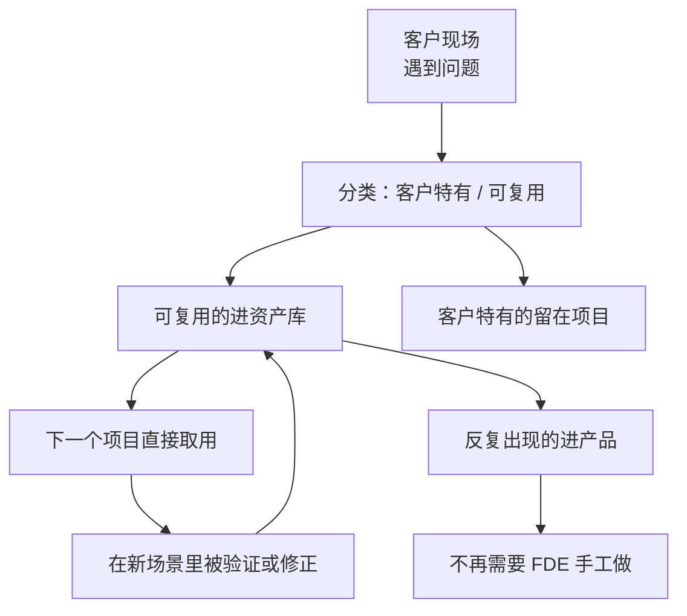

注意最下面那条：**反复出现的可复用资产，最终要进产品。**

资产库只是中转站。如果一个东西在五个项目里都用到了，它就该变成产品能力，而不是继续躺在资产库里靠人复制粘贴。

第 3 章说过，这条路径通不通，取决于组织归属。

## 三个会让循环转不起来的原因

**第一，合同把所有成果都给了客户。**

第 24 章说过，SOW 里的知识产权条款要区分：客户特有的归客户，通用组件保留使用权。

这件事签合同时不谈，事后补不上。

**第二，没有复盘的时间。**

项目一结束就开下一个，复盘永远排不上。三个月后再回忆，细节已经丢了。

我的建议是把复盘写进项目计划，作为项目的最后一个里程碑，而不是"有空再做"。

**第三，资产没人维护。**

资产库最常见的结局是：建了、放了几样东西、然后腐化。半年后没人敢用，因为不知道还能不能跑。

对策是给每份资产一个负责人和一个"最后验证时间"——和第 19 章 Context Registry 的思路一样。

**没有维护机制的资产库，和没有资产库的区别不大。**

## 怎么衡量循环转得好不好

我认为有几个可以量化的信号：

同类型项目的第二次交付周期，比第一次短多少。

新项目里可复用资产的占比是多少。

上一年沉淀的资产里，有多少在今年被实际用过（没被用过的说明抽象错了）。

有多少资产已经毕业进了产品。

**最后一个是终极指标。** 因为它意味着这部分工作不再需要 FDE 手工做了。

## 一个提醒：不要过早抽象

前面讲的都是要沉淀，这里说反面。

**一个东西只出现过一次，不要抽象。**

过早抽象的代价是：抽象出来的东西带着第一个客户的假设，到第二个客户那里发现不适用，改起来比重写还麻烦。

我的经验判断是：**同一个东西在两个客户那里出现过，才考虑抽象；三次以上，考虑进产品。**

在此之前，先老实复制粘贴。复制粘贴的成本是可见的，错误抽象的成本是隐藏的。

下一章是这本书的最后一章，讲什么时候不需要 FDE。

---

**本章引用**

- [AWS Forward Deployed Engineering for Partners](https://aws.amazon.com/blogs/apn/introducing-forward-deployed-engineering-for-partners-winning-the-future-of-enterprise-ai/)
- [Dev versus Delta: Demystifying Engineering Roles at Palantir](https://blog.palantir.com/dev-versus-delta-demystifying-engineering-roles-at-palantir-ad44c2a6e87)

## §32 什么时候不需要 FDE

一本讲 FDE 的书，最后一章讲什么时候不需要它。

这不是谦虚。第 3 章说过，责任边界如果只往外扩不往里收，这个岗位会被拖垮。

**一个方法论如果没有适用边界，它就不是方法论，是推销。**

## 三种不需要 FDE 的情况

**第一，标准产品能解决的。**

如果一个需求可以用现成的 SaaS 直接满足，配置一下就能用，那不需要 FDE。

判断方法：把第 14 章那七类问题过一遍。如果七类里有五类以上不成立——上下文不复杂、流程标准、没有跨系统写入、错误代价低——那这个场景的差量很小。

第 3 章讲的 Delta 概念，说的就是差量才是工作量。差量小，就不需要现场工程师。

**第二，企业自己能做的。**

有成熟内部技术团队、业务和技术在同一个组织里、数据和权限都是自己的。

这种情况下企业自建的效率可能更高，因为第 25 章那些甲方依赖问题不存在。

MIT 那份报告里企业自建只有 33% 进生产，但那是平均数。有能力的团队不在那个平均数里。

**第三，问题不在 AI 上。**

现场经常遇到的情况是：客户觉得某个环节效率低，想上 AI，但真实原因是流程设计有问题、或者两个部门的职责重叠、或者某个系统本来就该被替换。

**这时候上 AI 是在给一个坏流程加自动化，会让它更难改。**

FDE 能做的是在诊断阶段把这个判断说出来。第 23 章说过，诊断报告里"建议不做的"那部分要认真写。

## 什么时候 FDE 会不再需要

这是个更长期的问题，我给的是判断，不是预测。

有几件事正在往那个方向走。

**产品在吸收差量。** 第 31 章说的那条路径：反复出现的资产会进产品。进得越多，需要现场手工做的越少。

**工具在降低门槛。** Coding Agent 让"能自己做出来"这件事的成本下降了。第 6 章讲产品经理转型路径时提过这一点。

**方法在标准化。** 这本书写的这些东西，如果最后变成大家都会的常识，那它的稀缺性就没了。

但我认为有几件事短期内不会消失。

**企业内部的隐性知识不会自动变成文档。** 第 17 章讲的那个"制度写的和实际做的之间的差值"，需要人去现场挖。

**跨部门的规则冲突需要人去协调。** 第 19 章那份待确认清单，答案要靠人去要。

**责任需要有人承担。** 第 3 章说的那个"完成信号在客户那边"，这件事没法自动化。

**所以我的判断是：FDE 的技术部分会被工具吃掉很多，但责任部分不会。**

## 这本书最后想说的

回到第 1 章那个数字。

MIT 那份报告说，企业投进生成式 AI 的三四百亿美元里，95% 没有产生可衡量的损益影响。归因是数据就绪度、工作流集成、缺少反馈闭环。

这三条里没有一条是模型问题。

这本书写了三十二章，讲的其实就是怎么把这三条补上：

**数据就绪度**，对应第 17 章的 Context Audit 和第 19 章的 Context Registry。

**工作流集成**，对应第 18 章的流程契约、第 20 章的 Harness、第 22 章的放量路径。

**反馈闭环**，对应第 21 章的评估集、第 22 章的偏差分类、第 31 章的资产化循环。

而把这三件事串起来的，是第 2 章那个顺序：事实先于结果，结果先于判据，判据先于系统，验证先于放量。

**这个顺序不复杂，难的是在没有可展示成果的那几周里顶住压力，不跳过它。**

第 2 章说过，这是我认为 FDE 真正难的地方。它需要的不是更强的技术。

模型已经准备好了。

现在缺的是理解企业的人。

---

**本章引用**

- [The GenAI Divide: State of AI in Business 2025](https://cloudelligent.com/wp-content/uploads/2026/02/v0.1_State_of_AI_in_Business_2025_Report.pdf)，MIT Media Lab NANDA

# 附录

这一部分是可以直接拿到现场用的表和清单。

正文里散落的检查项在这里集中一遍，用的时候不用翻书。

---

## 附录 A 企业 AI 需求诊断表

配合第 13、14、15 章使用。每个候选场景填一份。

**场景基本信息**

| 项 | 内容 |
|---|---|
| 场景名称 | |
| 提出人 / 部门 | |
| 客户的原始表述 | 原话记录 |
| 发生频率 | 每天 / 每周多少次 |
| 当前由谁完成 | 岗位与人数 |
| 单次耗时 | |

**分层判断（第 13 章）**

| 项 | 内容 |
|---|---|
| 客户以为它在第几层 | |
| 实际需要第几层 | |
| 建议第一阶段做到第几层 | |
| 三者不一致的地方 | 需要做预期管理的点 |

**七道门（第 15 章）**

| 门 | 判断 | 结论 |
|---|---|---|
| 1 频率 | | 通过 / 不通过 |
| 2 结果可衡量 | 指标是什么，现在多少 | |
| 3 数据可获得 | 实际拿到样本了吗 | |
| 4 流程稳定 | 近半年改过几次 | |
| 5 错误可恢复 | 撤销方式 | |
| 6 有业务负责人 | 姓名与权限 | |
| 7 验证周期 | 多久能拿到真实数据 | |

**七类问题标记（第 14 章）**

| # | 问题类别 | 是否存在 | 本期处理 |
|---|---|---|---|
| 1 | 价值不清 | | |
| 2 | 上下文碎片化 | | |
| 3 | 流程不可计算 | | |
| 4 | 工具不可控 | | |
| 5 | 质量不可证明 | | |
| 6 | 错误会传播 | | |
| 7 | 无法复制 | | |

**结论**

建议做 / 建议缓 / 建议不做，以及理由和补齐条件。

---

## 附录 B Outcome Contract 模板

配合第 16 章使用。控制在两页以内。

```text
# Outcome Contract：[场景名]
版本：            日期：

## 一、范围
本期处理：
本期明确不处理：

## 二、触发
触发条件：
不触发的情况：

## 三、结果
目标业务状态改变：
衡量指标：
当前基线：            测量方式：        测量时间范围：
本期目标值：
达标观察期：

## 四、判定
成功：
失败：
部分成功：            处理方式：        谁接手：

## 五、风险与边界
单次错误代价：
不可恢复的动作：
可恢复的动作及撤销方式：
必须人工批准的动作：
必须拒绝的请求类型：

## 六、责任
业务负责人（有权改流程和验收）：
数据 / IT 对接人：
交付方负责人：

## 七、结束
本期验收条件：
验收证据形式：
上线后支持范围与期限：

签字：业务负责人 ______  交付方 ______
```

---

## 附录 C Context Registry 模板

配合第 19 章使用。每个信息源一行。

| ID | 名称 | 内容类型 | 物理位置 | 访问方式 | 负责人 | 权威级别 | 有效期 | 更新频率 | 权限范围 | 注入方式 | 已知冲突 | 状态 |
|---|---|---|---|---|---|---|---|---|---|---|---|---|
| | | 事实/规则/术语/模板 | | API/直连/导出/人工 | | 高/中/低 | | | | 常驻/按需/不注入 | | 已确认/待确认/已废弃 |

**权威级别定义**

高：由明确责任人维护，是这类信息的唯一正式出处。
中：正式文档，但可能滞后于实际执行。
低：有参考价值，不能单独作为依据。

**冲突规则**：高压中，中压低。同级冲突走待确认清单，找负责人拍板。

**配套：待确认事实清单**

| ID | 问题 | 涉及部门 | 影响本期范围 | 负责人 | 承诺答复日期 | 结论 |
|---|---|---|---|---|---|---|

---

## 附录 D 生产上线检查清单

配合第 20、21、22 章使用。逐条勾选，任何一条未完成都不建议进入自动执行。

**契约层**

- [ ] Outcome Contract 已由业务负责人签字
- [ ] 基线数字已测出，测量方式可复现
- [ ] 本期不做的部分已写进 SOW
- [ ] 状态机的每个终态都能对应到契约里的成功/失败/部分成功

**上下文层**

- [ ] Context Registry 完整，权威级别、有效期、权限范围三列无空缺
- [ ] 冲突规则已进系统（不是只写在文档里）
- [ ] 待确认清单已有结论，未决项在系统里走人工
- [ ] 已废弃的资料真的移出索引

**Harness 层**

- [ ] 每个工具都有契约，参数在调用前校验
- [ ] 所有改变外部状态的动作都有幂等保护，或明确不重试
- [ ] 状态可持久化，失败能从断点恢复
- [ ] 副作用有记录，可逐条对应到撤销方式
- [ ] Agent 的身份和权限有书面确认，合规部门看过
- [ ] 所有需人批的动作都有接管点，接管人能看到足够信息
- [ ] 支持"修改后批准"
- [ ] 有循环次数和总步数上限
- [ ] 所有决策路径可从日志还原

**评估层**

- [ ] 评估集覆盖七类用例，后四类每类不少于约定数量
- [ ] 断言对象是业务状态，不是模型输出文本
- [ ] 技术基线已记录
- [ ] 上线门槛按类型分别设定，不看平均

**运营层**

- [ ] 影子运行已跑满约定周期
- [ ] 偏差已分类，不是全部靠改提示词处理
- [ ] 监控包含采用率、采纳率、人工介入率、逃逸率
- [ ] 回滚方案明确，人工流程仍可用
- [ ] 告警接入客户值班体系

**交接层**

- [ ] 六项交接职责都有接手人（监控、Context、规则、评估、模型升级、故障）
- [ ] 客户方独立处理过一次真实故障
- [ ] 客户方独立完成过一次规则变更并跑通评估
- [ ] 支持范围里"缺陷"和"新需求"的界限已写明

---

## 附录 E 指标体系

配合第 21、22、26 章使用。分五层，从技术到业务。

| 层 | 指标 | 说明 | 危险信号 |
|---|---|---|---|
| 一、系统 | 可用性、P95 延迟、错误率、单次成本 | 基础运行状况 | 高峰期延迟劣化 |
| 二、质量 | 各类用例准确率、误操作率、拒绝准确率 | 按第 21 章七类分别看 | 只看平均分 |
| 三、协作 | 人工介入率、建议采纳率、审批耗时 | 人机配合是否顺畅 | 介入率过高或过低 |
| 四、采用 | 使用人数、使用频次、逃逸率 | 有没有人真的在用 | 逃逸率上升 |
| 五、业务 | Outcome Contract 里的指标 vs 基线 | 最终价值 | 达标但采用率低 |

**看法**

第二层和第五层要一起看。质量达标但业务指标没动，说明场景选错了。

第四层的逃逸率最容易被忽略，但它最诚实——人绕过系统的比例，说明系统在真实工作里好不好用。

---

## 附录 F 偏差分类速查

配合第 22 章使用。线上出现 bad case 时，先分类再动手。

| 偏差表现 | 归属 | 修法 | 章节 |
|---|---|---|---|
| 缺少某条信息 | Context | 补 Registry、改注入策略 | §19 |
| 用了过期或错误的信息 | Context | 改权威级别、加有效期 | §19 |
| 规则理解错 | Workflow | 规则从提示词移到显式判断 | §18 |
| 状态流转错 | Workflow | 补状态定义和转移条件 | §18 |
| 工具调用参数错 | Harness | 加参数校验 | §20 |
| 重复执行 | Harness | 加幂等 | §20 |
| 该转人工没转 | Harness | 补接管点触发条件 | §20 |
| 模型确实做不到 | 范围 | 划出去交人工，改契约 | §16 |

**纪律**：每加一条约束，记录它解决的是哪个具体 bad case。否则三个月后没人敢删。

---

## 附录 G 六个问题：判断真 FDE

配合第 4 章使用。面试或团队自查都可以用。

| 问题 | 在问什么 | 危险信号 |
|---|---|---|
| 你写的代码进哪个仓库 | 有没有产品化出口 | 每客户独立仓库 |
| 这个岗位归谁管 | 考核什么 | 挂交付中心，考核回款 |
| 项目结束的标准是什么 | 对什么负责 | 验收单签字 |
| 现场问题怎么进产品 | 反馈闭环存不存在 | 「会反馈给产品」 |
| 结束后谁维护 | 产能会不会被吃光 | 「还是我们」且无边界 |
| 上次说「不建议做」是什么时候 | 有没有话语权 | 「尽量满足客户」 |

---

## 附录 H 主要资料来源

**一手文件与官方公告**

- [Palantir S-1](https://www.sec.gov/Archives/edgar/data/1321655/000119312520239121/d904406ds1a.htm)
- [Dev versus Delta: Demystifying Engineering Roles at Palantir](https://blog.palantir.com/dev-versus-delta-demystifying-engineering-roles-at-palantir-ad44c2a6e87)
- [OpenAI Deployment Company](https://openai.com/index/openai-launches-the-deployment-company/)
- [OpenAI Harness Engineering](https://openai.com/index/harness-engineering/)
- [AWS Forward Deployed Engineering for Partners](https://aws.amazon.com/blogs/apn/introducing-forward-deployed-engineering-for-partners-winning-the-future-of-enterprise-ai/)
- [Anthropic × Accenture](https://www.anthropic.com/news/anthropic-accenture-partnership)

**工程方法**

- [Effective Context Engineering for AI Agents](https://www.anthropic.com/engineering/effective-context-engineering-for-ai-agents)，Anthropic
- [Demystifying Evals for AI Agents](https://www.anthropic.com/engineering/demystifying-evals-for-ai-agents)，Anthropic
- [Harness Engineering for Self-Improvement](https://lilianweng.github.io/posts/2026-07-04-harness/)，Lilian Weng，2026-07

**调研数据**

- [The GenAI Divide: State of AI in Business 2025](https://cloudelligent.com/wp-content/uploads/2026/02/v0.1_State_of_AI_in_Business_2025_Report.pdf)，MIT Media Lab NANDA，2025-07
- [LinkedIn 劳动力市场报告](https://economicgraph.linkedin.com/content/dam/me/economicgraph/en-us/PDF/linkedIn-labor-market-report-building-a-future-of-work-that-works-jan-2026.pdf)，2026-01

**背景**

- [Forward Deployed Engineer（维基百科）](https://en.wikipedia.org/wiki/Forward_Deployed_Engineer)
- [《前线部署工程师》开源仓库](https://github.com/xdash/FDE-the-Guidance-Book-of-Forward-Deployed-Engineer)，范冰

---

**关于这本书**

创建者：空格
最后更新：2026-08-31

书里的方法论是从上述公开材料中抽象出来的。凡是我的推断，正文里写成"我认为""我的判断是"。第七篇的三个场景是推演，不是真实客户项目。