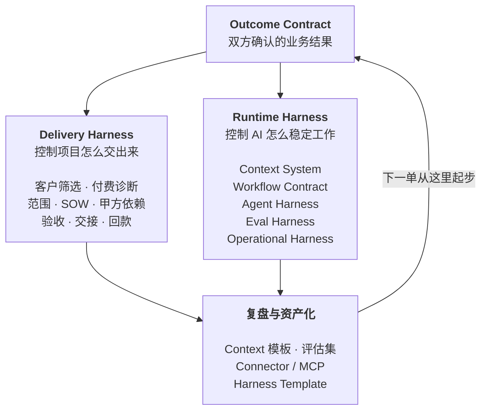

# FDE Handbook

> 中文名《FDE 手册》
>
> 把 AI 装进企业：从需求识别到生产交付
>
> 32 章 + 8 个附录，141 页，作者：空格

🌐 **[在线阅读](https://spacezephyr.github.io/fde-book/)** · 📕 [下载 PDF](FDE-Handbook.pdf) · 📄 [全书单文件 Markdown](FDE-Handbook-%E5%8D%95%E6%96%87%E4%BB%B6.md)

章节源文件全部平铺在仓库根目录，按 `序号-第N章-主题.md` 命名，点开就能读，也可以直接在 GitHub 里搜。

## 这本书想解决什么

市面上关于 FDE（Forward Deployed Engineer）的中文内容已经不少，但大部分停在两个位置。一个是岗位科普，讲 FDE 是什么、薪资多少、怎么转行。另一个是原则总结，讲要深入客户、快速迭代、沉淀复用。

这些都对，但读完仍然回答不了一个问题：星期一早上你坐在客户的会议室里，第一件事该做什么，第一份交付物长什么样，什么条件下才允许上线。

**这本书补的就是这一段。**

它按四个层次往下走：企业到底有哪些 AI 需求，这些需求怎么翻译成可执行的系统，系统怎么被验证和上线，项目怎么被交付并留下可复用的资产。

## 谁该读

| 你是谁 | 你能从这本书拿走什么 |
|---|---|
| 想转型 FDE 的工程师 / 产品经理 | 能力模型、四条转型路径、判断真假 FDE 的六个问题 |
| 正在组建 FDE 团队的 AI 公司 | Pod 配置、客户筛选、SOW 与验收证据的写法 |
| 需要把 AI 落进业务的企业负责人 | 需求五层分类、上线检查清单、什么时候压根不需要 FDE |

## 全书的主轴

整本书只有一个结构：



## 目录

### Part 1 认知篇：FDE 到底负责什么

| 章节 | 标题 | 读完能做什么 | 源文件 |
|---|---|---|---|
| §01 | FDE 的爆发，说明 AI 的瓶颈换了位置 | 判断一个 AI 项目卡在模型还是卡在组织 | [`01-第1章-瓶颈换了位置.md`](01-%E7%AC%AC1%E7%AB%A0-%E7%93%B6%E9%A2%88%E6%8D%A2%E4%BA%86%E4%BD%8D%E7%BD%AE.md) |
| §02 | 顺序：FDE 工作里唯一不能变的东西 | 知道四个依赖段谁先谁后，跳过谁会死在哪 | [`02-第2章-顺序.md`](02-%E7%AC%AC2%E7%AB%A0-%E9%A1%BA%E5%BA%8F.md) |
| §03 | FDE 和它周围的五个岗位 | 说清自己的责任边界 | [`03-第3章-相邻岗位.md`](03-%E7%AC%AC3%E7%AB%A0-%E7%9B%B8%E9%82%BB%E5%B2%97%E4%BD%8D.md) |
| §04 | 六个问题，判断这是不是真 FDE | 识别换皮驻场 | [`04-第4章-六个问题.md`](04-%E7%AC%AC4%E7%AB%A0-%E5%85%AD%E4%B8%AA%E9%97%AE%E9%A2%98.md) |

### Part 2 能力篇：谁能做 FDE

| 章节 | 标题 | 源文件 |
|---|---|---|
| §05 | 能力模型：四个象限，缺哪个都会翻车 | [`05-第5章-能力模型.md`](05-%E7%AC%AC5%E7%AB%A0-%E8%83%BD%E5%8A%9B%E6%A8%A1%E5%9E%8B.md) |
| §06 | 四条转型路径，起点不同，缺的东西也不同 | [`06-第6章-转型路径.md`](06-%E7%AC%AC6%E7%AB%A0-%E8%BD%AC%E5%9E%8B%E8%B7%AF%E5%BE%84.md) |
| §07 | 个人工作方式：FDE 每天在对抗什么 | [`07-第7章-个人工作方式.md`](07-%E7%AC%AC7%E7%AB%A0-%E4%B8%AA%E4%BA%BA%E5%B7%A5%E4%BD%9C%E6%96%B9%E5%BC%8F.md) |
| §08 | 团队：一个 Pod 要几个人 | [`08-第8章-团队配置.md`](08-%E7%AC%AC8%E7%AB%A0-%E5%9B%A2%E9%98%9F%E9%85%8D%E7%BD%AE.md) |

### Part 3 原理篇：FDE 必须理解的底座

| 章节 | 标题 | 源文件 |
|---|---|---|
| §09 | 模型的边界：知道它什么时候会骗你 | [`09-第9章-模型边界.md`](09-%E7%AC%AC9%E7%AB%A0-%E6%A8%A1%E5%9E%8B%E8%BE%B9%E7%95%8C.md) |
| §10 | Context Engineering：决定模型看到什么 | [`10-第10章-上下文工程.md`](10-%E7%AC%AC10%E7%AB%A0-%E4%B8%8A%E4%B8%8B%E6%96%87%E5%B7%A5%E7%A8%8B.md) |
| §11 | Harness Engineering：决定模型怎么持续工作 | [`11-第11章-harness工程.md`](11-%E7%AC%AC11%E7%AB%A0-harness%E5%B7%A5%E7%A8%8B.md) |
| §12 | 企业软件底座：集成、身份、可观测 | [`12-第12章-企业软件底座.md`](12-%E7%AC%AC12%E7%AB%A0-%E4%BC%81%E4%B8%9A%E8%BD%AF%E4%BB%B6%E5%BA%95%E5%BA%A7.md) |

### Part 4 需求篇：企业到底需要什么 AI

| 章节 | 标题 | 源文件 |
|---|---|---|
| §13 | 企业 AI 需求的五层分类 | [`13-第13章-需求五层.md`](13-%E7%AC%AC13%E7%AB%A0-%E9%9C%80%E6%B1%82%E4%BA%94%E5%B1%82.md) |
| §14 | 七类反复出现的企业问题 | [`14-第14章-七类问题.md`](14-%E7%AC%AC14%E7%AB%A0-%E4%B8%83%E7%B1%BB%E9%97%AE%E9%A2%98.md) |
| §15 | 需求筛选：哪些现在不该做 | [`15-第15章-需求筛选.md`](15-%E7%AC%AC15%E7%AB%A0-%E9%9C%80%E6%B1%82%E7%AD%9B%E9%80%89.md) |

### Part 5 实施篇：Runtime Harness

| 章节 | 标题 | 源文件 |
|---|---|---|
| §16 | Outcome Contract：写在代码之前 | [`16-第16章-结果契约.md`](16-%E7%AC%AC16%E7%AB%A0-%E7%BB%93%E6%9E%9C%E5%A5%91%E7%BA%A6.md) |
| §17 | 现场调研与 Context Audit | [`17-第17章-现场调研.md`](17-%E7%AC%AC17%E7%AB%A0-%E7%8E%B0%E5%9C%BA%E8%B0%83%E7%A0%94.md) |
| §18 | Workflow Contract：把流程写成状态机 | [`18-第18章-流程契约.md`](18-%E7%AC%AC18%E7%AB%A0-%E6%B5%81%E7%A8%8B%E5%A5%91%E7%BA%A6.md) |
| §19 | Context System：来源、权威、时效与权限 | [`19-第19章-上下文系统.md`](19-%E7%AC%AC19%E7%AB%A0-%E4%B8%8A%E4%B8%8B%E6%96%87%E7%B3%BB%E7%BB%9F.md) |
| §20 | Agent Harness：工具、状态、失败与接管 | [`20-第20章-agent-harness.md`](20-%E7%AC%AC20%E7%AB%A0-agent-harness.md) |
| §21 | Eval Harness：验证业务状态，不看模型自述 | [`21-第21章-评估.md`](21-%E7%AC%AC21%E7%AB%A0-%E8%AF%84%E4%BC%B0.md) |
| §22 | Operational Harness：从影子运行到有条件自治 | [`22-第22章-上线运营.md`](22-%E7%AC%AC22%E7%AB%A0-%E4%B8%8A%E7%BA%BF%E8%BF%90%E8%90%A5.md) |

### Part 6 交付篇：Delivery Harness

| 章节 | 标题 | 源文件 |
|---|---|---|
| §23 | 客户筛选与付费诊断 | [`23-第23章-客户筛选.md`](23-%E7%AC%AC23%E7%AB%A0-%E5%AE%A2%E6%88%B7%E7%AD%9B%E9%80%89.md) |
| §24 | 范围收缩、报价与 SOW | [`24-第24章-范围与sow.md`](24-%E7%AC%AC24%E7%AB%A0-%E8%8C%83%E5%9B%B4%E4%B8%8Esow.md) |
| §25 | 甲方依赖：项目失败最常见的非技术原因 | [`25-第25章-甲方依赖.md`](25-%E7%AC%AC25%E7%AB%A0-%E7%94%B2%E6%96%B9%E4%BE%9D%E8%B5%96.md) |
| §26 | 变更管理与验收证据 | [`26-第26章-变更与验收.md`](26-%E7%AC%AC26%E7%AB%A0-%E5%8F%98%E6%9B%B4%E4%B8%8E%E9%AA%8C%E6%94%B6.md) |
| §27 | 上线培训、采用率与交接 | [`27-第27章-采用与交接.md`](27-%E7%AC%AC27%E7%AB%A0-%E9%87%87%E7%94%A8%E4%B8%8E%E4%BA%A4%E6%8E%A5.md) |

### Part 7 推演篇：把方法论走一遍

| 章节 | 标题 | 源文件 |
|---|---|---|
| §28 | 推演一：企业知识助手 | [`28-第28章-推演一-知识助手.md`](28-%E7%AC%AC28%E7%AB%A0-%E6%8E%A8%E6%BC%94%E4%B8%80-%E7%9F%A5%E8%AF%86%E5%8A%A9%E6%89%8B.md) |
| §29 | 推演二：客服处理 Agent | [`29-第29章-推演二-客服agent.md`](29-%E7%AC%AC29%E7%AB%A0-%E6%8E%A8%E6%BC%94%E4%BA%8C-%E5%AE%A2%E6%9C%8Dagent.md) |
| §30 | 推演三：跨系统执行 Agent | [`30-第30章-推演三-执行agent.md`](30-%E7%AC%AC30%E7%AB%A0-%E6%8E%A8%E6%BC%94%E4%B8%89-%E6%89%A7%E8%A1%8Cagent.md) |

### Part 8 资产篇：让下一单不从零开始

| 章节 | 标题 | 源文件 |
|---|---|---|
| §31 | 复利循环：把项目变成能力 | [`31-第31章-复利循环.md`](31-%E7%AC%AC31%E7%AB%A0-%E5%A4%8D%E5%88%A9%E5%BE%AA%E7%8E%AF.md) |
| §32 | 什么时候不需要 FDE | [`32-第32章-什么时候不需要FDE.md`](32-%E7%AC%AC32%E7%AB%A0-%E4%BB%80%E4%B9%88%E6%97%B6%E5%80%99%E4%B8%8D%E9%9C%80%E8%A6%81FDE.md) |

### 附录

A 企业 AI 需求诊断表 · B Outcome Contract 模板 · C Context Registry 模板 · D 生产上线检查清单 · E 五层指标体系 · F 偏差分类速查 · G 六个问题：判断真 FDE · H 主要资料来源

全部收在 [`33-附录.md`](33-%E9%99%84%E5%BD%95.md)，是可以直接拿到现场用的表和清单。

## 这本书的依据，以及它的边界

先说清楚这本书是怎么写出来的，免得你把它当成第一手的项目复盘。

它建立在三类材料上：一是 Palantir、OpenAI、AWS、Anthropic 的公开文件和工程博客；二是 MIT NANDA、LinkedIn 等机构的调研数据；三是一线团队在公开渠道写下的交付记录。所有关键数字和判断在正文里都标了出处，你可以自己去核。

书里的方法论是我从这些材料里抽象出来的，逻辑我认为站得住，但它不是我在几十个客户现场亲手验证过的结论。**凡是我的推断，正文里会写成「我认为」「我的判断是」，不会伪装成经验。**

具体的行业案例我也没有编。找不到可靠来源的数字，宁可不写。

## 主要一手资料

- [Palantir S-1](https://www.sec.gov/Archives/edgar/data/1321655/000119312520239121/d904406ds1a.htm)：FDE 作为研发一部分的原始表述
- [Dev versus Delta](https://blog.palantir.com/dev-versus-delta-demystifying-engineering-roles-at-palantir-ad44c2a6e87)：Palantir 的工程角色划分
- [OpenAI Deployment Company](https://openai.com/index/openai-launches-the-deployment-company/)
- [OpenAI Harness Engineering](https://openai.com/index/harness-engineering/)
- [AWS Forward Deployed Engineering for Partners](https://aws.amazon.com/blogs/apn/introducing-forward-deployed-engineering-for-partners-winning-the-future-of-enterprise-ai/)
- [Anthropic: Effective Context Engineering](https://www.anthropic.com/engineering/effective-context-engineering-for-ai-agents)
- [Anthropic: Demystifying Evals for AI Agents](https://www.anthropic.com/engineering/demystifying-evals-for-ai-agents)
- [LinkedIn 劳动力市场报告（2026-01）](https://economicgraph.linkedin.com/content/dam/me/economicgraph/en-us/PDF/linkedIn-labor-market-report-building-a-future-of-work-that-works-jan-2026.pdf)
- [The GenAI Divide: State of AI in Business 2025](https://cloudelligent.com/wp-content/uploads/2026/02/v0.1_State_of_AI_in_Business_2025_Report.pdf)：MIT Media Lab NANDA，95% 项目零回报的原始归因
- [Harness Engineering for Self-Improvement](https://lilianweng.github.io/posts/2026-07-04-harness/)：Lilian Weng 对 harness 的定义与七个可编辑部件
- [Forward Deployed Engineer（维基百科）](https://en.wikipedia.org/wiki/Forward_Deployed_Engineer)：岗位定义与负面评价

## 仓库结构

```
00-首页与大纲.md            全书元信息与大纲
01-第1章-….md ~ 32-….md     32 章正文，平铺在根目录
33-附录.md                  A–H 八份模板与清单
FDE-Handbook.pdf           PDF 成品，141 页 A4
FDE-Handbook-单文件.md      脚本拼出来的单文件版本，不要手改
docs/index.html            网站成品，首页 + 全书阅读器，单文件自包含
tools/build-pdf.js         出 PDF：拼接 → Markdown 转 HTML → 渲染 Mermaid → 打印
tools/build-site.js        出网站：解析章节 → 预渲染 Mermaid 成内联 SVG → 套模板
tools/template.html        网站的版式与样式模板
VERSION                    版本号
```

根目录那些编号 md 是唯一的正本，PDF 和网站都是从它们生成的。

## 自己重新构建

改任意一章之后，跑：

```bash
npm install
npm run build       # 出 PDF
npm run build:site  # 出网站
```

构建依赖本机的 Chrome（默认路径 `/Applications/Google Chrome.app`）。装在别处的话用环境变量指过去：

```bash
CHROME_PATH=/path/to/chrome npm run build
```

两个脚本都在构建阶段把 Mermaid 转成 SVG 内嵌进去，成品不依赖任何外部服务：PDF 里 12 张图，网站里 11 张。

网站输出到 `docs/index.html`，一个文件装下首页和全部 40 篇正文，没有外链的字体、脚本或图片。GitHub Pages 指向 `main` 分支的 `/docs` 目录。

## 许可

内容版权归作者所有。个人学习、内部分享随意，商用或大段转载请先联系。

---

我是空格，持续分享 AI 产品的思考与实践。
