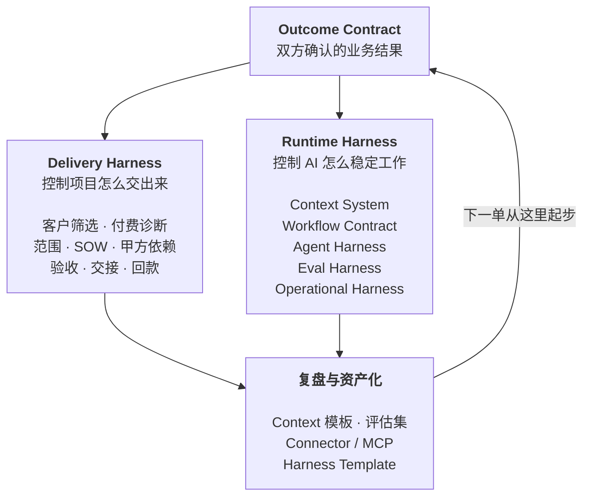

# FDE 空皮书

> 把 AI 装进企业：从需求识别到生产交付
>
> 32 章 + 8 个附录，141 页，作者：空格

🌐 **[在线阅读](https://spacezephyr.github.io/fde-book/)** · 📕 [下载 PDF](FDE空皮书.pdf) · 📄 [全书单文件 Markdown](FDE空皮书-全书合并.md) · 📂 [分章节源文件](chapters/)

## 这本书想解决什么

市面上关于 FDE（Forward Deployed Engineer）的中文内容已经不少，但大部分停在两个位置。一个是岗位科普，讲 FDE 是什么、薪资多少、怎么转行。另一个是原则总结，讲要深入客户、快速迭代、沉淀复用。

这些都对，但读完仍然回答不了一个问题：星期一早上你坐在客户的会议室里，第一件事该做什么，第一份交付物长什么样，什么条件下才允许上线。

**这本书补的就是这一段。**

它按四个层次往下走：企业到底有哪些 AI 需求，这些需求怎么翻译成可执行的系统，系统怎么被验证和上线，项目怎么被交付并留下可复用的资产。

## 谁该读

| 你是谁 | 你能从这本书拿走什么 |
|---|---|
| 想转型 FDE 的工程师 / 产品经理 | 能力模型、四条转型路径、判断真假 FDE 的六个问题 |
| 正在组建 FDE 团队的 AI 公司 | Pod 配置、客户筛选、SOW 与验收证据的写法 |
| 需要把 AI 落进业务的企业负责人 | 需求五层分类、上线检查清单、什么时候压根不需要 FDE |

## 全书的主轴

整本书只有一个结构：



## 目录

### Part 1 认知篇：FDE 到底负责什么

| 章节 | 标题 | 读完能做什么 |
|---|---|---|
| §01 | FDE 的爆发，说明 AI 的瓶颈已经换了位置 | 判断一个 AI 项目卡在模型还是卡在组织 |
| §02 | 顺序：FDE 工作里唯一不能变的东西 | 知道四个依赖段谁先谁后，跳过谁会死在哪 |
| §03 | FDE 和它周围的五个岗位 | 说清自己的责任边界 |
| §04 | 六个问题，判断这是不是真 FDE | 识别换皮驻场 |

### Part 2 能力篇：谁能做 FDE

| 章节 | 标题 |
|---|---|
| §05 | FDE 能力模型：四个象限，缺哪个都会翻车 |
| §06 | 四条转型路径：工程师、产品、咨询、行业专家 |
| §07 | 个人工作方式：FDE 每天在对抗什么 |
| §08 | 团队：一个 Pod 要几个人 |

### Part 3 原理篇：FDE 必须理解的底座

| 章节 | 标题 |
|---|---|
| §09 | 模型的边界：知道它什么时候会骗你 |
| §10 | Context Engineering：决定模型看到什么 |
| §11 | Harness Engineering：决定模型怎么持续工作 |
| §12 | 企业软件底座：集成、身份、权限、可观测性 |

### Part 4 需求篇：企业到底需要什么 AI

| 章节 | 标题 |
|---|---|
| §13 | 企业 AI 需求的五层分类 |
| §14 | 七类反复出现的企业问题 |
| §15 | 需求筛选：哪些需求现在不该做 |

### Part 5 实施篇：Runtime Harness

| 章节 | 标题 |
|---|---|
| §16 | Outcome Contract：写在代码之前 |
| §17 | 现场调研与 Context Audit |
| §18 | Workflow Contract：把流程写成状态机 |
| §19 | Context System：来源、权威、时效与权限 |
| §20 | Agent Harness：工具、状态、失败与接管 |
| §21 | Eval Harness：验证业务状态，不看模型自述 |
| §22 | Operational Harness：从影子运行到有条件自治 |

### Part 6 交付篇：Delivery Harness

| 章节 | 标题 |
|---|---|
| §23 | 客户筛选与付费诊断 |
| §24 | 范围收缩、报价与 SOW |
| §25 | 甲方依赖：项目失败最常见的非技术原因 |
| §26 | 变更管理与验收证据 |
| §27 | 上线培训、采用率与交接 |

### Part 7 推演篇：把方法论走一遍

这三章不是真实客户复盘，是用前六篇方法论对三类典型场景做的推演。用法是模板，不是案例。

| 章节 | 标题 | 核心交付物 |
|---|---|---|
| §28 | 推演一：企业知识助手 | Context Registry |
| §29 | 推演二：客服处理 Agent | Workflow Contract |
| §30 | 推演三：跨系统执行 Agent | Agent Harness |

### Part 8 资产篇：让下一单不从零开始

| 章节 | 标题 |
|---|---|
| §31 | 复利循环：把项目变成能力 |
| §32 | 什么时候不需要 FDE |

### 附录

A 企业 AI 需求诊断表 · B Outcome Contract 模板 · C Context Registry 模板 · D 生产上线检查清单 · E 五层指标体系 · F 偏差分类速查 · G 六个问题：判断真 FDE · H 主要资料来源

## 这本书的依据，以及它的边界

先说清楚这本书是怎么写出来的，免得你把它当成第一手的项目复盘。

它建立在三类材料上：一是 Palantir、OpenAI、AWS、Anthropic 的公开文件和工程博客；二是 MIT NANDA、LinkedIn 等机构的调研数据；三是一线团队在公开渠道写下的交付记录。所有关键数字和判断在正文里都标了出处，你可以自己去核。

书里的方法论是我从这些材料里抽象出来的，逻辑我认为站得住，但它不是我在几十个客户现场亲手验证过的结论。**凡是我的推断，正文里会写成「我认为」「我的判断是」，不会伪装成经验。**

具体的行业案例我也没有编。找不到可靠来源的数字，宁可不写。

## 主要一手资料

- [Palantir S-1](https://www.sec.gov/Archives/edgar/data/1321655/000119312520239121/d904406ds1a.htm)：FDE 作为研发一部分的原始表述
- [Dev versus Delta](https://blog.palantir.com/dev-versus-delta-demystifying-engineering-roles-at-palantir-ad44c2a6e87)：Palantir 的工程角色划分
- [OpenAI Deployment Company](https://openai.com/index/openai-launches-the-deployment-company/)
- [OpenAI Harness Engineering](https://openai.com/index/harness-engineering/)
- [AWS Forward Deployed Engineering for Partners](https://aws.amazon.com/blogs/apn/introducing-forward-deployed-engineering-for-partners-winning-the-future-of-enterprise-ai/)
- [Anthropic: Effective Context Engineering](https://www.anthropic.com/engineering/effective-context-engineering-for-ai-agents)
- [Anthropic: Demystifying Evals for AI Agents](https://www.anthropic.com/engineering/demystifying-evals-for-ai-agents)
- [LinkedIn 劳动力市场报告（2026-01）](https://economicgraph.linkedin.com/content/dam/me/economicgraph/en-us/PDF/linkedIn-labor-market-report-building-a-future-of-work-that-works-jan-2026.pdf)
- [The GenAI Divide: State of AI in Business 2025](https://cloudelligent.com/wp-content/uploads/2026/02/v0.1_State_of_AI_in_Business_2025_Report.pdf)：MIT Media Lab NANDA，95% 项目零回报的原始归因
- [Harness Engineering for Self-Improvement](https://lilianweng.github.io/posts/2026-07-04-harness/)：Lilian Weng 对 harness 的定义与七个可编辑部件
- [Forward Deployed Engineer（维基百科）](https://en.wikipedia.org/wiki/Forward_Deployed_Engineer)：岗位定义与负面评价

## 仓库结构

```
chapters/                  34 个 Markdown 源文件（首页与大纲 + 32 章 + 附录），唯一的正本
FDE空皮书-全书合并.md        脚本拼出来的单文件版本，不要手改
FDE空皮书.pdf               PDF 成品，141 页 A4
docs/index.html            网站成品，首页 + 全书阅读器，单文件自包含
site/template.html         网站的版式与样式模板
build-pdf.js               出 PDF：拼接 → Markdown 转 HTML → 渲染 Mermaid → 打印
build-site.js              出网站：解析章节 → 预渲染 Mermaid 成内联 SVG → 套模板
```

改 `chapters/` 是唯一的入口，PDF 和网站都是从那里生成的。

## 自己重新构建

改 `chapters/` 里的任意一章之后，跑：

```bash
npm install
npm run build       # 出 PDF
npm run build:site  # 出网站
```

构建依赖本机的 Chrome（默认路径 `/Applications/Google Chrome.app`）。装在别处的话用环境变量指过去：

```bash
CHROME_PATH=/path/to/chrome npm run build
```

两个脚本都在构建阶段把 Mermaid 转成 SVG 内嵌进去，成品不依赖任何外部服务：PDF 里 12 张图，网站里 11 张。

网站输出到 `docs/index.html`，一个文件装下首页和全部 40 篇正文，没有外链的字体、脚本或图片。GitHub Pages 直接指向 `main` 分支的 `/docs` 目录。

## 许可

内容版权归作者所有。个人学习、内部分享随意，商用或大段转载请先联系。

---

我是空格，持续分享 AI 产品的思考与实践。
